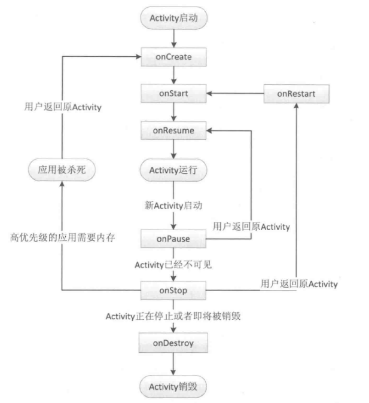
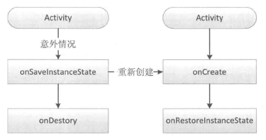

# 生命周期

## 正常情况



针对一个特定的Activity，第一次启动，onCreate -> onStart -> onResume

当Activity切换到桌面时，回调onPause -> onStop

再次回到原Activity，onRestart -> onStart -> onResume

回退键，onPause -> onStop -> onDestroy


整个过程，onCreate和onDestroy配对，标识着Activity的创建和销毁。从Activity可见来说，onStart和onStop配对，随着用户的操作或者设备屏幕的点亮和熄灭。这2个方法会多次调用。从Activity是否在前台来说，onResume和onPause配对。


**假设当前Activity为A，如果这是用户打开一个新ActivityB，那么B的onResume和A的onPause哪个先执行呢?**

从Activity的启动过程来看，我们来看一下系统源码。Activity的启动过程的源码相当复杂，涉及Instrumentation、ActivityThread和ActivityManagerService(下面简称AMS)。这里不详细分析这一过程，简单理解，启动Activity的请求会由Instrumentation来处理，然后它通过Binder向AMS发请求，AMS内部维护着一个ActivityStack并负责栈内的Activity的状态同步，AMS通过ActivityThread去同步Activity的状态从而完成生命周期方法的调用。在ActivityStack中的resumeTopActivityInnerLocked方法中，有这么一段代码：

```
   boolean pausing = mStackSupervisor.pauseBackStacks(userLeaving);  
   if (mResumedActivity != null) {
         pausing = true;
         startPausingLocked(userLeaving, false);
         if (DEBUG_STATES) 
         Slog.d(TAG, "resumeTopActivityLocked: Pausing " + mResumedActivity);
    }
```

从上述代码可以看出，在新Activity启动之前，栈顶的Activity需要先onPause后，新Activity才能启动。最终，在ActivityStackSupervisor中的realStartActivityLocked方法会调用如下代码。

```
app.thread.scheduleLaunchActivity(new Intent(r.intent), r.appToken,
                    System.identityHashCode(r), r.info,
                    new Configuration(mService.mConfiguration), r.compat,
                    app.repProcState, r.icicle, results, newIntents, !andResume,
                    mService.isNextTransitionForward(), profileFile, profileFd,
                    profileAutoStop);
```

我们知道，这个app.thread的类型是IApplicationThread，而IApplicationThread的具体实现是ActivityThread中的ApplicationThread。所以，这段代码实际上调用到了ActivityThread，即ApplicationThread的scheduleLaunchActivity方法，而scheduleLaunchActivity方法最终会完成新的Activity的onCreate、onStart、onResume的调用过程。因此可以得出结论，是**旧Activity先onPause**，然后新Activity再启动。

> 所以onPause和onStop都不能执行耗时的操作

## 异常情况

### 系统配置

默认情况下，如果我们都不做处理，Activity会重新创建




系统会调用`onSaveInstanceState`方法来保存相关状态。这个方法调用的时机在onStop之前，它和onPause没有既定的时序关系。当Activity重新创建后，系统会调用`onRestoreInstanceState`,这个方法的调用时机在onStart之后。

如果我们不想系统因为横竖屏等配置变化，而重新创建Activity，需要在AndroidManifest.xml中添加

**android:configChanges**

则此时会回调Activity的`onConfigurationChanged`方法

------

常见的横竖屏：

1. 不设置Activity的android:configChanges时，切屏会重新调用各个生命周期，**切横屏时会执行一次，切竖屏时会执行两次**
2. 设置Activity的android:configChanges="orientation"时，切屏还是会重新调用各个生命周期，切横、竖屏时只会执行一次
3. 设置Activity的android:configChanges="keyboardHidden|orientation|screenSize"时，切屏不会重新调用各个生命周期，只会执行onConfigurationChanged方法


### 资源不足

当系统内存不足时，系统会按照优先级去杀死目标Activity所在的进程。并在后续通过onSaveInstanceState和onRestoreInstanceState来存储和恢复数据。如果一个进程中没有四大组件时，这个进程将很快被系统杀死。


# 启动模式

默认情况下，当我们多次启动创建同一个activity时，系统会将多个实例放入任务栈中，当我们按返回键时，activity的实例会依次回退。任务栈是一种后进先出的栈结构。Android在设计的时候考虑到这种重复创建的情况，所以提高了启动模式来修改系统的默认行为

## 标准模式standard

标准模式的Activity默认会进入启动它的Activity所属于的任务栈中。

## 栈顶复用SingleTop

如果Activity A已经位于任务栈的栈顶，则Activity A不会重新创建，而是回调`onNewIntent`方法

## 栈内复用SingleTask

这是一种单实例。首先会寻找任务栈S，如果任务栈S存在，且栈中存在实例D，则把D前面的活动全部弹出，并回调onNewIntent，如果不存在实例D，则创建实例D置于栈顶。如果任务栈不存在，则创建任务栈，同时创建实例D放入栈中

## 单实例SingleInstance

假设Activity A是singleInstance，当A启动后，系统会为它创建一个新的任务栈，然后A单独处于新的任务栈中，直到任务栈被系统销毁。加强的singleTask


## 任务栈

**TaskAffinity** 默认情况下，Activity所需的任务栈的名字为应用的包名。

当TaskAffinity和singTask配对时，待启动的Activity会存在TaskAffinity相同的任务栈中

当TaskAffinity和allowTaskReparenting结合时。当启动 Activity 的任务栈接下来转至前台时，Activity 是否能从该任务栈转移至其他任务栈，“true”表示它可以转移，“false”表示它仍须留在启动它的任务栈

# Flag

在intent中定义了很多FLAG，其中几个设定了Activity的启动方式，如果Launch Mode和FLAG冲突，以FLAG设定为准

* FLAG_ACTIVITY_SINGLE_TOP  = singleTop
* FLAG_ACTIVITY_NEW_TASK = singleTask
* FLAG_ACTIVITY_CLEAR_TOP 没有对应的启动模式，如果要启动的活动已经位于栈中，上方的活动出栈，singleTask默认有该标记位