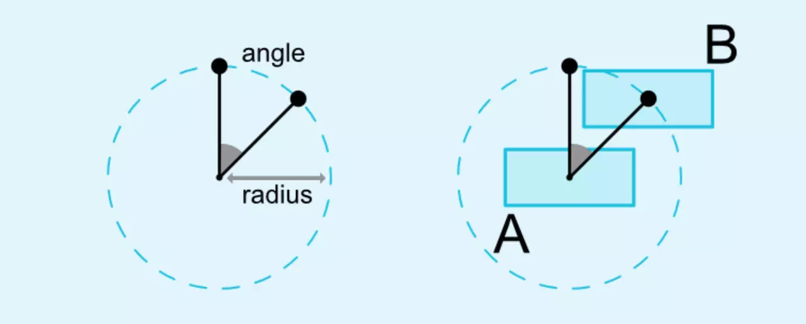
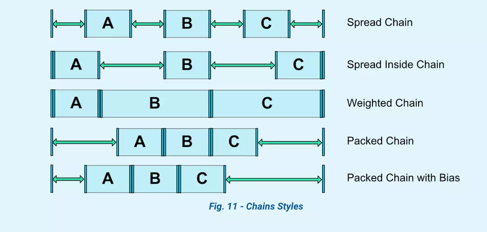

# ConstraintLayout

布局优化的重点之一：扁平化。

**ConstraintLayout**——它的出现是为了解决开发中过于复杂的页面层级嵌套过多的问题——层级过深会增加绘制界面需要的时间，影响用户体验。


## 相对属性

更强大的相对布局

```
app:layout_constraintBottom_toBottomOf="@+id/view"
```

自身的Bottom与view的底部对齐。其他类似

## Margins

用来控制当约束目标可见性为 `GONE` 的时候，设置不同的间距值。

设置`goneMarginStart`

## Bias

使用 bias 可以进行偏移

```
<TextView
            app:layout_constraintLeft_toLeftOf="parent"
            app:layout_constraintRight_toRightOf="parent"
            app:layout_constraintBottom_toBottomOf="parent"
            app:layout_constraintTop_toTopOf="parent"
            app:layout_constraintHorizontal_bias="0.3"/>
```

## 相对圆周定位

提供开发者相对控件的中心一个角度和距离上约束另外一个控件的能力。



```
<Button android:id="@+id/buttonA" ... />
<Button android:id="@+id/buttonB" ...
        app:layout_constraintCircle="@+id/buttonA"
        app:layout_constraintCircleRadius="100dp"
        app:layout_constraintCircleAngle="45" />
```

## 尺寸

0dp来表示 `MATCH_CONSTRAINT`， 意思是根据约束规则指定高宽

## 宽高比例

`layout_constraintDimensionRatio` 限制控件的宽高比，如果要使用宽高比来约束尺寸，则至少要设置宽高其中一个尺寸为`0dp`，然后再设置上 `layout_constraintDimentionRatio` 属性。

```
<Button android:layout_width="wrap_content"
        android:layout_height="0dp"
        app:layout_constraintDimensionRatio="1:1" />
```

## 链条

多个控件相互在同一个方向上双向引用就可以创建一个 Chain.

### Chain Style

以下属性是用来控制 Chain Style 的：

– layout_constraintHorizontal_chainStyle – layout_constraintHorizontal_weight – layout_constraintVertical_chainStyle – layout_constraintVertical_weight

其中 Style 有 4 种:

1. `CHAIN_SPREAD` 这个是默认的 Style， 里面的所有控件会分散开布局
2. Weighted chain，在 `CHAIN_SPREAD` 模式下，如果有些控件的尺寸设置为 `MATCH_CONSTRAINT（0dp）`,则这些控件尺寸会占据所有剩余可用的空间，和 LinearLayout weight 类似。
3. `CHAIN_SPREAD_INSIDE` 和 `CHAIN_SPREAD` 类似，只不过两端的两个控件和父容器直接不占用多余空间，多余空间在控件之间分散
4. `CHAIN_PACKED` 这种模式下，所有的控件都居中聚集在一起，但是可以设置 bias 属性来控制聚集的位置。




## 辅助布局

### Guideline

是约束布局中一个特殊的辅助布局类，可以创建水平或者垂直的参考线，其他的控件可以根据这个参考线来进行布局，它本质是不可见的控件

- orientation:vertical/horizontal
- layout_constraintGuide_begin 指定距离左/上边开始的固定位置
- layout_constraintGuide_end 指定距离右/下边开始的固定位置
- layout_constraintGuide_percent 指定位于布局中所在的百分比


### Group

约束布局用来控制一组控件的可见性。

```
<android.support.constraint.Group
    android:id="@+id/group"
    android:layout_width="wrap_content"
    android:layout_height="wrap_content"
    android:visibility="visible"
    app:constraint_referenced_ids="button4,button9" />
```

### Barrier

Barrier 在约束布局中通过 constraint_referenced_ids 引用多个控件，看作一个整体来添加一个与另外一个控件限制最大宽/高的约束。

```
 <android.support.constraint.Barrier
          android:id="@+id/barrier"
          android:layout_width="wrap_content"
          android:layout_height="wrap_content"
          app:barrierDirection="start"
          app:constraint_referenced_ids="button1,button2" />
```


基于[文章](https://juejin.im/post/5ce3b68b518825336e0a5190)