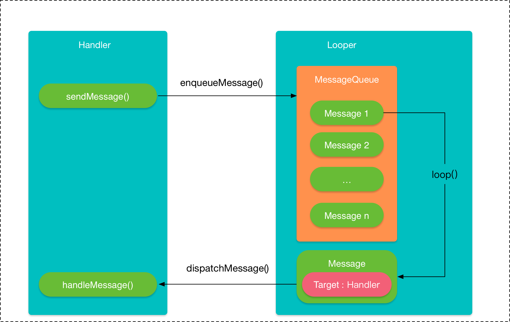

# Handler原理

安卓的消息机制主要是指Handler运行机制。通过Handler可以实现线程间通信。例如有时候需要在子线程中进行耗时操作时，由于安卓开发规定，不能在子线程中更新UI。但是通过handler在子线程发送消息，然后切换到UI线程，接受处理消息，这样就可以访问UI控件了。 

Handler的运行，需要MessageQueue和Looper的支撑。总的架构如下



## 消息队列MessageQueue

Handler的工作主要包含消息的发送和接受。消息的发送可以通过post的一系列方法以及send的一系列方法来实现。最终都是通过sendMessageAtTime方法来实现。

```
public boolean sendMessageAtTime(..){
        MessageQueue queue = mQueue;
        if (queue == null) {
            RuntimeException e = new RuntimeException(
                    this + " sendMessageAtTime() called with no mQueue");
            Log.w("Looper", e.getMessage(), e);
            return false;
        }
        return enqueueMessage(queue, msg, uptimeMillis);
}

private boolean enqueueMessage(MessageQueue queue, Message msg, long uptimeMillis) {
        msg.target = this;//消息中target成员保存了发消息的那个handler对象
        if (mAsynchronous) {
            msg.setAsynchronous(true);
        }
        return queue.enqueueMessage(msg, uptimeMillis);
    }
```

可以看到，handler发送消息调用的是`queue.enqueueMessage`

MessageQueue消息队列，它是通过一个单链表的数据结构来维护消息列表的。它包含两个主要操作:插入和读取，分别对应两个方法:`enqueueMessage`和`next`

------

enqueueMessage的作用是往消息队列中插入一条消息。

```
boolean enqueueMessage(Message msg, long when) {
        if (msg.target == null) {
            throw new IllegalArgumentException("Message must have a target.");
        }
        if (msg.isInUse()) {
            throw new IllegalStateException(msg + " This message is already in use.");
        }

        synchronized (this) {
            if (mQuitting) {
                IllegalStateException e = new IllegalStateException(
                        msg.target + " sending message to a Handler on a dead thread");
                Log.w(TAG, e.getMessage(), e);
                msg.recycle();
                return false;
            }

            msg.markInUse();
            msg.when = when;
            Message p = mMessages;
            boolean needWake;
            if (p == null || when == 0 || when < p.when) {  //插入在队列最前头
                // New head, wake up the event queue if blocked.
                msg.next = p;
                mMessages = msg;
                needWake = mBlocked;
            } else {  //================1=====================
                // Inserted within the middle of the queue.  Usually we don't have to wake
                // up the event queue unless there is a barrier at the head of the queue
                // and the message is the earliest asynchronous message in the queue.
                needWake = mBlocked && p.target == null && msg.isAsynchronous();
                Message prev;  // 开始查找插入的位置，找到第一个节点的时间大于when的，退出循环
                for (;;) {
                    prev = p;
                    p = p.next;
                    if (p == null || when < p.when) {
                        break;
                    }
                    if (needWake && p.isAsynchronous()) {
                        needWake = false;
                    }
                }
                msg.next = p; // invariant: p == prev.next
                prev.next = msg;
            }

            // We can assume mPtr != 0 because mQuitting is false.
            if (needWake) {
                nativeWake(mPtr);
            }
        }
        return true;
    }
```

enqueueMessage里面的核心是一段插入消息的逻辑。当我要插入消息时，它用for去轮询，不断的去跟队列中的消息比较执行时间，然后找到合适的位置插入消息。

------

next的作用是往消息队列中取出一条消息

```
Message next() {
        // Return here if the message loop has already quit and been disposed.
        // This can happen if the application tries to restart a looper after quit
        // which is not supported.
        final long ptr = mPtr;
        if (ptr == 0) {
            return null;
        }

        int pendingIdleHandlerCount = -1; // -1 only during first iteration
        int nextPollTimeoutMillis = 0;
        for (;;) {
            if (nextPollTimeoutMillis != 0) {
                Binder.flushPendingCommands();
            }

            nativePollOnce(ptr, nextPollTimeoutMillis);

            synchronized (this) {
                // Try to retrieve the next message.  Return if found.
                final long now = SystemClock.uptimeMillis();
                Message prevMsg = null;
                Message msg = mMessages;
                if (msg != null && msg.target == null) {
                    // Stalled by a barrier.  Find the next asynchronous message in the queue.
                    do {
                        prevMsg = msg;
                        msg = msg.next;
                    } while (msg != null && !msg.isAsynchronous());
                }
                if (msg != null) {
                    if (now < msg.when) {
                        // Next message is not ready.  Set a timeout to wake up when it is ready.
                        nextPollTimeoutMillis = (int) Math.min(msg.when - now, Integer.MAX_VALUE);
                    } else {
                        // Got a message.
                        mBlocked = false;
                        if (prevMsg != null) {
                            prevMsg.next = msg.next;
                        } else {
                            mMessages = msg.next;
                        }
                        msg.next = null;
                        if (DEBUG) Log.v(TAG, "Returning message: " + msg);
                        msg.markInUse();
                        return msg;
                    }
                } else {
                    // No more messages.
                    nextPollTimeoutMillis = -1;
                }
                ...
            }

            // Reset the idle handler count to 0 so we do not run them again.
            pendingIdleHandlerCount = 0;

            // While calling an idle handler, a new message could have been delivered
            // so go back and look again for a pending message without waiting.
            nextPollTimeoutMillis = 0;
        }
    }
```

next内部也是一个for的死循环，然后通过do-while来找到一条不为null的消息。如果`now < msg.when`条件不成立，就返回这个消息。那么谁来调用next方法呢？答案就是loop

## Looper

Looper在android的消息机制中扮演者消息循环的角色，它的loop方法就好比循环的开关。

```
 /**
     * Run the message queue in this thread. Be sure to call
     * {@link #quit()} to end the loop.
     */
    public static void loop() {
        final Looper me = myLooper();
        if (me == null) {
            throw new RuntimeException("No Looper; Looper.prepare() wasn't called on this thread.");
        }
        final MessageQueue queue = me.mQueue;

        // Make sure the identity of this thread is that of the local process,
        // and keep track of what that identity token actually is.
        Binder.clearCallingIdentity();
        final long ident = Binder.clearCallingIdentity();

        for (;;) {
            Message msg = queue.next(); // might block
            if (msg == null) {
                // No message indicates that the message queue is quitting.
                return;
            }

            ...
            final long end;
            try {
                msg.target.dispatchMessage(msg);
                end = (slowDispatchThresholdMs == 0) ? 0 : SystemClock.uptimeMillis();
            } finally {
                if (traceTag != 0) {
                    Trace.traceEnd(traceTag);
                }
            }
            ...
        }
    }

```

loop方法是个死循环，会一直在运行，唯一跳出循环的方式时next方法返回null。next方法是一个阻塞方法，当没有消息时，会一直阻塞在那里。如果next方法返回了一个消息，`msg.target.dispatchMessage(msg);`发送的消息最终有交给Handler来dispatchMessage处理消息了。需要注意的是，Handler的dispatchMessage方法是在创建Handler时所使用的Looper中执行，这样就实现了线程的切换

## 细节问题

### Looper的初始化

Handler的工作需要Looper，没有Looper的线程会报错，也就是Looper是依赖线程的。如何初始化Looper呢？首先看构造函数

```
private Looper(boolean quitAllowed) {
        mQueue = new MessageQueue(quitAllowed);
        mThread = Thread.currentThread();
    }
```

可以看到构造器时私有的，同时在构造的时候会创建消息队列。Looper是通过prepare来初始化

```
    static final ThreadLocal<Looper> sThreadLocal = new ThreadLocal<Looper>();
    public static void prepare() {
        prepare(true);
    }

    private static void prepare(boolean quitAllowed) {
        if (sThreadLocal.get() != null) {
            throw new RuntimeException("Only one Looper may be created per thread");
        }
        sThreadLocal.set(new Looper(quitAllowed));
    }
```

可以看到**sThreadLocal.set(new Looper(quitAllowed));**通过 set 方法把 Looper值放入调用线程的 sThreadLocal里面并存放起来。同时Looper有**prepareMainLooper**方法为UI主线程创建Looper,同时开启消息循环

```
 public static void main(String[] args) {
        ...
        Process.setArgV0("<pre-initialized>");

        Looper.prepareMainLooper();

        ActivityThread thread = new ActivityThread();
        thread.attach(false);

        if (sMainThreadHandler == null) {
            sMainThreadHandler = thread.getHandler();
        }

        if (false) {
            Looper.myLooper().setMessageLogging(new
                    LogPrinter(Log.DEBUG, "ActivityThread"));
        }

        // End of event ActivityThreadMain.
        Trace.traceEnd(Trace.TRACE_TAG_ACTIVITY_MANAGER);
        Looper.loop();

        throw new RuntimeException("Main thread loop unexpectedly exited");
    }
```

### 生产-消费者

MessageQueue类似一个内存仓库，enqueueMessage扮演着生产者，从内存中存消息，next方法扮演着消费者，从内存中取消息。这就是一个生产者-消费者模型。因为队列是有大小限制的，所以入队跟出队是有特征的

- 出队——当queue为空，队列阻塞，等队列调用enqueueMessage的时候，通知队列，取出消息，停止阻塞。出队列时通过**nativePollOnce(ptr, nextPollTimeoutMillis);**等待nextPollTimeoutMillis时间后再去取下一条消息。
- 入队——队列满时，阻塞，直到用户通过next取出消息。当next调用，通过queue可以进行消息的入队。当有消息插入时，通过**nativeWake(mPtr);**，来让next方法中的**nativePollOnce**阻塞失效，这样就又开始轮询取消息了。


### Message的优化-享元模式

我们不应该用message的构造函数，而是用obtainMessage()方法。因为我们往消息队列中发送的消息，并不会立刻回收，而是等内存不够时候，JVM才会回收。

```
    /**
     * Returns a new {@link android.os.Message Message} from the global message pool. More efficient than
     * creating and allocating new instances. The retrieved message has its handler set to this instance (Message.target == this).
     *  If you don't want that facility, just call Message.obtain() instead.
     */
    public final Message obtainMessage()
    {
        return Message.obtain(this);
    }
```

可以看到它会从消息池中返回一个message。

### 空指针异常

在handler处理完消息，但是页面销毁了，这个时候TextView,ImageView等控件的引用不见了，就会抛出异常。也页面销毁时，应该注意清空消息。

> **handler.removeCallbacksAndMessages(null)**

### 内存泄漏

当使用内部类（包括匿名类）来创建Handler的时候，Handler对象会隐式地持有一个外部类对象（通常是一个Activity）的引用。而Handler通常会伴随着一个耗时的后台线程（例如从网络拉取图片）一起出现，这个后台线程在任务执行完毕（例如图片下载完毕）之后，通过消息机制通知Handler，然后Handler把图片更新到界面。然而，如果用户在网络请求过程中关闭了Activity，正常情况下，Activity不再被使用，它就有可能在GC检查时被回收掉，但由于这时线程尚未执行完，而该线程持有Handler的引用（不然它怎么发消息给Handler？），这个Handler又持有Activity的引用，就导致该Activity无法被回收（即内存泄露），直到网络请求结束（例如图片下载完毕）。

方法：将Handler声明为静态类。**在Java 中，非静态的内部类和匿名内部类都会隐式地持有其外部类的引用，静态的内部类不会持有外部类的引用**

静态类不持有外部类的对象，所以你的Activity可以随意被回收。由于Handler不再持有外部类对象的引用，导致程序不允许你在Handler中操作Activity中的对象了。所以你需要在Handler中增加一个对Activity的弱引用（WeakReference）

```
static class MyHandler extends Handler
    {
        WeakReference<Activity> mWeakReference;
        public MyHandler(Activity activity) 
        {
            mWeakReference=new WeakReference<Activity>(activity);
        }
        @Override
        public void handleMessage(Message msg)
        {
            final Activity activity=mWeakReference.get();
            if(activity!=null)
            {
                if (msg.what == 1)
                {
                    noteBookAdapter.notifyDataSetChanged();
                }
            }
        }
    }

```

### Loop() 死循环为什么没有卡死ActivityThread

看看JNI层的Looper对象的创建过程，即看看它的构造函数是如何实现的，这个Looper类实现在frameworks/base/libs/utils/Looper.cpp文件中

```
Looper::Looper(bool allowNonCallbacks) :
        mAllowNonCallbacks(allowNonCallbacks),
        mResponseIndex(0) {
        int wakeFds[2];
        int result = pipe(wakeFds);
        ......

        mWakeReadPipeFd = wakeFds[0];
        mWakeWritePipeFd = wakeFds[1];
        
            #ifdef LOOPER_USES_EPOLL
        // Allocate the epoll instance and register the wake pipe.
        mEpollFd = epoll_create(EPOLL_SIZE_HINT);
        ......

        struct epoll_event eventItem;
        memset(& eventItem, 0, sizeof(epoll_event)); // zero out unused members of data field union
        eventItem.events = EPOLLIN;
        eventItem.data.fd = mWakeReadPipeFd;
        result = epoll_ctl(mEpollFd, EPOLL_CTL_ADD, mWakeReadPipeFd, & eventItem);
        ......
    #else
        ......
    #endif

        ......
    }
```

它主要就是通过pipe系统调用来创建了一个管道了：

简单来说，管道就是一个文件，在管道的两端，分别是两个打开文件文件描述符，这两个打开文件描述符都是对应同一个文件，其中一个是用来读的，别一个是用来写的，一般的使用方式就是，一个线程通过读文件描述符中来读管道的内容，当管道没有内容时，这个线程就会进入等待状态，而另外一个线程通过写文件描述符来向管道中写入内容，写入内容的时候，如果另一端正有线程正在等待管道中的内容，那么这个线程就会被唤醒。这个等待和唤醒的操作是如何进行的呢。

这里就涉及到**Linux pipe/epoll机制**，简单说就是在主线程的MessageQueue没有消息时，便阻塞在loop的queue.next()中的nativePollOnce()方法里，此时主线程会释放CPU资源进入休眠状态，直到下个消息到达或者有事务发生，通过往pipe管道写端写入数据来唤醒主线程工作。这里采用的epoll机制，是一种**IO多路复用机制**，它能显著减少程序在大量并发连接中只有少量活跃的情况下的系统CPU利用率，可以同时监控多个描述符，当某个描述符就绪(读或写就绪)，则立刻通过回调的方式通知相应程序进行读或写操作，本质同步I/O，即读写是阻塞的。 **所以说，主线程大多数时候都是处于休眠状态，并不会消耗大量CPU资源。**

## IdelHandler

```
public static interface IdleHandler {
        /**
         * Called when the message queue has run out of messages and will now
         * wait for more.  Return true to keep your idle handler active, false
         * to have it removed.  This may be called if there are still messages
         * pending in the queue, but they are all scheduled to be dispatched
         * after the current time.
         */
        boolean queueIdle();
    }
```

注释明确的指出当消息队列空闲时会执行`IdelHandler`的`queueIdle()`方法，该方法返回一个`boolean`值，
如果为`false`则执行完毕之后移除这条消息，
如果为`true`则保留，等到下次空闲时会再次执行，

```
    Message next() {
        final long ptr = mPtr;
        if (ptr == 0) {
            return null;
        }

        int pendingIdleHandlerCount = -1; // -1 only during first iteration
        int nextPollTimeoutMillis = 0;
        for (;;) {
            if (nextPollTimeoutMillis != 0) {
                Binder.flushPendingCommands();
            }

            nativePollOnce(ptr, nextPollTimeoutMillis);

            synchronized (this) {
                final long now = SystemClock.uptimeMillis();
                Message prevMsg = null;
                Message msg = mMessages;
                if (msg != null && msg.target == null) {
                    do {
                        prevMsg = msg;
                        msg = msg.next;
                    } while (msg != null && !msg.isAsynchronous());
                }
                if (msg != null) {
                    if (now < msg.when) {
                        nextPollTimeoutMillis = (int) Math.min(msg.when - now, Integer.MAX_VALUE);
                    } else {
                        
                        mBlocked = false;
                        if (prevMsg != null) {
                            prevMsg.next = msg.next;
                        } else {
                            mMessages = msg.next;
                        }
                        msg.next = null;
                        if (DEBUG) Log.v(TAG, "Returning message: " + msg);
                        msg.markInUse();
                        return msg;
                    }
                } else {
                   
                    nextPollTimeoutMillis = -1;
                }

               
                if (mQuitting) {
                    dispose();
                    return null;
                }

                
                if (pendingIdleHandlerCount < 0
                        && (mMessages == null || now < mMessages.when)) {
                    pendingIdleHandlerCount = mIdleHandlers.size();
                }
                if (pendingIdleHandlerCount <= 0) {
                    // No idle handlers to run.  Loop and wait some more.
                    mBlocked = true;
                    continue;
                }

                if (mPendingIdleHandlers == null) {
                    mPendingIdleHandlers = new IdleHandler[Math.max(pendingIdleHandlerCount, 4)];
                }
                mPendingIdleHandlers = mIdleHandlers.toArray(mPendingIdleHandlers);
            }

            // Run the idle handlers.
            // We only ever reach this code block during the first iteration.
            for (int i = 0; i < pendingIdleHandlerCount; i++) {
                final IdleHandler idler = mPendingIdleHandlers[i];
                mPendingIdleHandlers[i] = null; // release the reference to the handler

                boolean keep = false;
                try {
                    keep = idler.queueIdle();
                } catch (Throwable t) {
                    Log.wtf(TAG, "IdleHandler threw exception", t);
                }

                if (!keep) {
                    synchronized (this) {
                        mIdleHandlers.remove(idler);
                    }
                }
            }

            // Reset the idle handler count to 0 so we do not run them again.
            pendingIdleHandlerCount = 0;

            // While calling an idle handler, a new message could have been delivered
            // so go back and look again for a pending message without waiting.
            nextPollTimeoutMillis = 0;
        }
    }
```

处理完`IdleHandler`后会将`nextPollTimeoutMillis`设置为`0`，也就是不阻塞消息队列， 当然要注意这里执行的代码同样不能太耗时，因为它是同步执行的，如果太耗时肯定会影响后面的`message`执行。
能力大概就是上面讲的这样，那么能力决定用处，用处从本质上讲就是趁着消息队列空闲的时候干点事情，当然具体用处还是要看具体的处理。
要使用`IdleHandler`只需要调用`MessageQueue#addIdleHandler(IdleHandler handler)`方法即可


## 同步屏障

同步屏障，就是阻碍队列中同步消息的屏障，那么它是如何运行的呢？此时需要引进异步消息，在正常时候，我们发送的Message全都是同步消息。发送异步消息有两种方式，下面分别来看一下

第一种发送异步消息的方式，使用Handler包含async参数的构造方法，例如下面这个。

```
public Handler(boolean async) {
    this(null, async);
}
```

只要async参数为true，所有的消息都将是异步消息。

```
Handler mHandler = new Handler(true);
...
Message msg = mHandler.obtainMessage(...);
mHandler.sendMessageAtTime(msg, dueTime);
```

第二种方法，显示设置Message为异步消息

```
Message msg = mHandler.obtainMessage(...);
msg.setAsynchronous(true);
```

### 开启同步屏障

如果相让异步消息起作用，就得开启同步障碍，同步障碍会阻碍同步消息，只允许通过异步消息，如果队列中没有异步消息，此时的loop()方法将被Linux epoll机制所阻塞。

开启同步障碍也很简单，调用MessageQueue#postSyncBarrier()方法即可

```
mHandler.getLooper().getQueue().postSyncBarrier();

private int postSyncBarrier(long when) {
  final int token = mNextBarrierToken++;
  final Message msg = Message.obtain();
  msg.markInUse();
  msg.when = when;
  msg.arg1 = token;

  Message prev = null;
  Message p = mMessages;
  if (when != 0) {
    while (p != null && p.when <= when) {
      prev = p;
      p = p.next;
    }
  }
  if (prev != null) {
    msg.next = p;
    prev.next = msg;
  } else {
    msg.next = p;
    mMessages = msg;
  }
  return token;
}
```

可以看出，在实例化Message对象的时候并没有设置它的target成员变量的值，然后随即就根据执行时间把它放到链表的某个位置了，实际上就是链表的开始位置。也就是说，当在消息队列中放入一个target为空的Message的时候，当前Handler的这一套消息机制就开启了同步阻断。

```
for (;;) {
  nativePollOnce(ptr, nextPollTimeoutMillis);

  synchronized (this) {
    final long now = SystemClock.uptimeMillis();
    Message prevMsg = null;
    Message msg = mMessages;

    // 如果当前开启了同步障碍
    if (msg != null && msg.target == null) {
      // 处理同步障碍，获取队列中的下一个异步消息
      do {
        prevMsg = msg;
        msg = msg.next；

        // 如果这个消息是同步的，那么继续向下找异步的
      } while (msg != null && !msg.isAsynchronous());
    }

    if (msg != null) {
      if (now < msg.when) {
        // 如果当前消息的执行时间没到，让它沉睡到下个消息的执行时间
        nextPollTimeoutMillis = msg.when - now;
      } else {
        ...
        return msg; // 执行时间到了，执行它
      }
    } else {
      // 当前没有任何消息需执行，一直沉睡
      nextPollTimeoutMillis = -1;
    }
  }
}
```

可以看出来，当开启了同步障碍时，Looper在获取下一个要执行的消息时，会在链表中寻找第一个要执行的异步消息，如果没有找到异步消息，就让当前线程沉睡。

> nativeWake()方法和nativePollOnce()方法采用了Linux的epoll机制，其中nativePollOnce()的第二个值，当它是-1时会一直沉睡，直到被主动唤醒为止，当它是0时不会沉睡，当它是大于0的值时会沉睡传入的值那么多的毫秒时间。epoll机制实质上是让CPU沉睡，来保障当前线程一直在运行而不中断或者卡死，这也是Looper#loop()死循环为什么不会导致住县城ANR的根本原因。

### 应用

同步障碍有什么用呢？在我们日常的应用层开发中极少用到它，读了framework的代码后我们会发现，在ViewRootImpl.java中有使用它：

```
void scheduleTraversals() {
  if (!mTraversalScheduled) {
    mTraversalScheduled = true;
    // 开启当前Handler的同步屏障
    mTraversalBarrier = mHandler.getLooper().getQueue().postSyncBarrier();
    // 发送一条异步消息
    mChoreographer.postCallback(..., mTraversalRunnable, null);
    if (!mUnbufferedInputDispatch) {
      cheduleConsumeBatchedInput();
    }
    
    notifyRendererOfFramePending();
    pokeDrawLockIfNeeded();
  }
}
```

实际上，这里的Handler使用的是主线程的Looper，因此这里会阻断主线程Looper的其他同步消息，在ViewRootImpl和Choreographer中多次使用到了异步消息，以完成View的整个绘制流程。

当我们点击页面的某个控件时，希望瞬间得到它的回应，而不是卡在那里，最起码有个圈圈在转也行。当我们点击某个按钮，此时开启了一个Activity，如果队列中此时有很多消息在排队等候呢？那么这个Activity的测量、布局和绘制就得一直等到所有消息被处理完成才能执行，此时我们会看到页面一直黑着或者一直白着，反正不是我们想要的效果，因此如果这个消息队列有一个优先级的特点，那么不久可以解决这个问题了吗？


## 简单自定义Handler

Handler原理的组成离不开以下几个重要角色：Message，Looper，Handler，MessageQueue。我们也可以通过自定义方式来简单实现handler。

首先，定义消息的主体Message。它需要包含int型成员what来区分消息，同时包含Object对象表示要传递的内容。最重要的是，消息最终还是需要原来的handler去处理，所以它还有成员target

```
public class Message{
   public int what;
   public Object obj;
   public Handler target;
}
```

然后是Handler。Handler的运行，需要MessageQueue和Looper的支撑。它的主要两个方法sendMessage，以及抽象方法handleMessage。而sendMessage调用的是enqueueMessage。而enqueueMessage调用的就是消息队列的MessageQueue#enqueueMessage

```
public class Handler{
    public Looper mLooper；
    public MessageQueue mQueue；
    public void sendMessage(Message msg){  enqueueMessage(msgs); }
    public abstract void handleMessage(Message msg);
    public void enqueueMessage(Message msg){
       msg.target = this;
       mQueue.enqueueMessage(msg);
    }
}
```

接着来定义Looper。Looper需要与线程挂钩，且是唯一，同时MessageQueue也是唯一的。可以有很多的handler，但是只有一个Looper。学习源码的方式.私有化构造方法

```
public class Looper{
   static final ThreadLocal<Looper> sThreadLocal = new ThreadLocal<Looper>();
   public MessageQueue mQueue;
   public Thread mThread;
   private Looper(){
        mQueue = new MessageQueue();
        mThread = Thread.currentThread();
   }
   
   public static void prepare(){
       if(sThreadLocal.get()!=null){
          throw new RuntimeException(";;;;");
       }
       sThreadLocal.set(new Looper())
   }
   
   public static Looper myLooper(){
       return sThreadLocal.get();
   }
}
```

上面说了Handler的运行，需要MessageQueue和Looper的支撑，所以在Handler的构造方法里

```
public Handler(){
   mLooper = Looper.myLooper();
   mQueue = mLooper.mQueue;
}
```

接着是Loop的loop方法

```
public static void loop(){
    final Looper me = myLooper();
    final MessageQueue queue = me.mQueue;
    for(;;){
       Message msg = queue.next();
       if(msg!=null){
           msg.target.handleMessage(msg);
       }
    }
}
```

最后是MessageQueue。它有添加消息和获取消息两个方法

```
public class MessageQueue{
    public Message next(){...};
    public void enqueueMessage(Message msg);
}
```

它是个生产消费者模型，可以直接用阻塞队列来实现

```
public class MessageQueue{
    public BlockingQueue<Message> queue;
    
    public MessageQueue(){
       queue = new ArrayBlockingQueue<>(10);
    }
    
    public Message next(){
        Message msg = null;
        msg = queue.take();
        return msg;
    }
    
    public void enqueueMessage(Message msg){
        queue.put(msg);
    }
}
```

