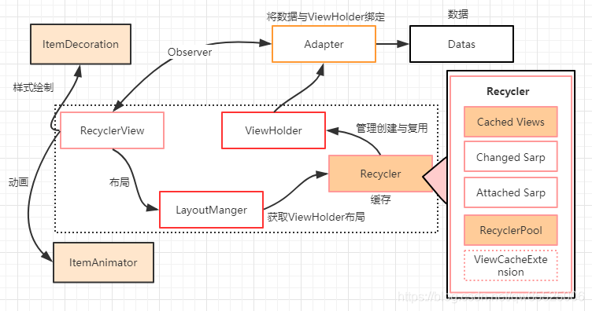
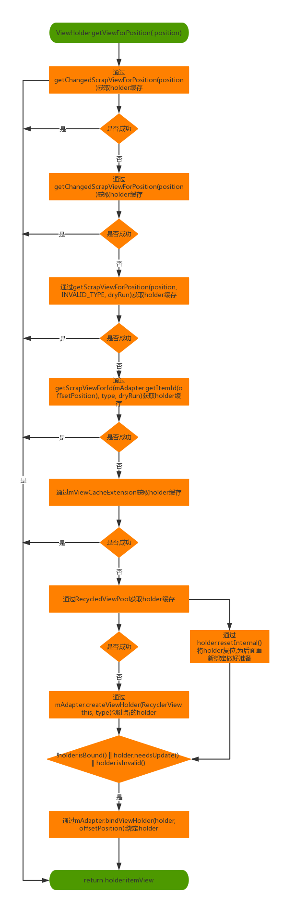

# RecyclerView

recyclerView是最常用的列表组件

RecyclerView 包含了很多东西，比如 ItemDecoration，ItemAnimator，LayoutManger，`Recycler`，ViewHolder，Adapter。

`Recycler` 主要是负责 ViewHolder 的`创建`与`复用(缓存的管理)`

## 缓存机制

ListView的缓存只有两级

ListView里有一个内部类RecycleBin，它有两个对象来管理缓存 

1. Active View 缓存在屏幕内的ItemView
2. Scrap View 缓存在屏幕外的ItemView。屏幕外的所有数据进入屏幕的时候都要走一遍getView方法

RecycleView的缓存有四级

1. mAttachedScrap和mChangedScrap。这是优先级最高的缓存，`RecyclerView`在获取`ViewHolder`时,优先会到这两个缓存来找。其中`mAttachedScrap`存储的是当前还在屏幕中的`ViewHolder`，`mChangedScrap`存储的是数据被更新的`ViewHolder`,比如说调用了`Adapter`的`notifyItemChanged`方法
2. mCachedViewScrap 默认大小为2，通常用来存储预取的`ViewHolder`
3. ViewCacheExtension  自定义缓存,通常用不到
4. RecycledViewPool 根据`ViewType`来缓存`ViewHolder`，每个`ViewType`的数组大小为5，可以动态的改变。

ViewHolder的 `isInvalid`、`isRemoved`、`isBound`、`isTmpDetached`、`isScrap` 和 `isUpdated` 这几个方法：

| 方法名        | 对应的Flag                                            | 含义或者状态设置的时机                                       |
| ------------- | ----------------------------------------------------- | ------------------------------------------------------------ |
| `isInvalid`   | FLAG_INVALID                                          | 表示当前ViewHolder是否已经失效。通常来说，在3种情况下会出现这种情况：1.调用了Adapter的notifyDataSetChanged方法； 2. 手动调用RecyclerView的invalidateItemDecorations方法； 3. 调用RecyclerView的setAdapter方法或者swapAdapter方法。 |
| isRemoved     | FLAG_REMOVED                                          | 表示当前的ViewHolder是否被移除。通常来说，数据源被移除了部分数据，然后调用Adapter的notifyItemRemoved方法。 |
| `isBound`     | FLAG_BOUND                                            | 表示当前ViewHolder是否已经调用了onBindViewHolder。           |
| isTmpDetached | FLAG_TMP_DETACHED                                     | 表示当前的ItemView是否从RecyclerView(即父View)detach掉。通常来说有两种情况下会出现这种情况：1.手动了RecyclerView的detachView相关方法；2. 在从mHideViews里面获取ViewHolder,会先detach掉这个ViewHolder关联的ItemView |
| isScrap       | 无Flag来表示该状态，用mScrapContainer是否为null来判断 | 表示是否在mAttachedScrap或者mChangedScrap数组里面，进而表示当前ViewHolder是否被废弃。 |
| `isUpdated`   | FLAG_UPDATE                                           | 表示当前ViewHolder是否已经更新。通常来说，在3种情况下会出现情况：1.isInvalid方法存在的三种情况；2.调用了Adapter的onBindViewHolder方法；3. 调用了Adapter的notifyItemChanged方法 |

https://www.jianshu.com/p/aeb9ccf6a5a4