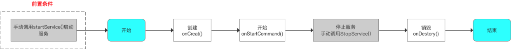
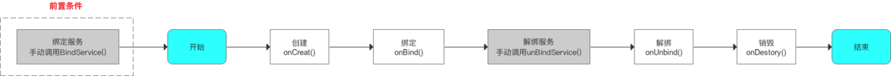
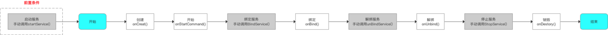

# Service

Service属于Android中的计算型组件，提供需要在后台长期运行的服务。

Service的启动方式由两种，StartService和BindService。他们的生命周期也不一样


## 生命周期

### startService



注意

- 那么onCreate只会调用一次，即使一个service被startService多次启动
- onStartCommand会被调用多次=startService的次数
- 调用者退出后service仍存在
- 不需要与activity通信

### BindService



**BindService开启的Service，调用者退出后，Service随着调用者销毁而结束**。


### StartService，BindService一起时




startService  BindService 一起的时候，要调用stopService，unBindService才会结束服务

1. startService-> BindService-> unBinderService

```
2019-06-18 11:18:50.907 25761-25761/com.auditory.myapplication D/tag: onCreate
2019-06-18 11:18:50.909 25761-25761/com.auditory.myapplication D/tag: onStartCommand
2019-06-18 11:18:50.911 25761-25761/com.auditory.myapplication D/tag: onBind
2019-06-18 11:18:50.913 25761-25761/com.auditory.myapplication D/tag: connected
2019-06-18 11:18:54.920 25761-25761/com.auditory.myapplication D/tag: unbind
```

service并没有调用onDestroy

2. startService-> BindService-> stopService

```
2019-06-18 11:26:35.356 26159-26159/com.auditory.myapplication D/tag: onCreate
2019-06-18 11:26:35.358 26159-26159/com.auditory.myapplication D/tag: onStartCommand
2019-06-18 11:26:35.361 26159-26159/com.auditory.myapplication D/tag: onBind
2019-06-18 11:26:35.362 26159-26159/com.auditory.myapplication D/tag: connected
```

结果service既没有unbind，也没有onDestroy

3. startService-> BindService-> unBinderService->stopService

```
2019-06-18 11:28:15.580 26288-26288/com.auditory.myapplication D/tag: onCreate
2019-06-18 11:28:15.585 26288-26288/com.auditory.myapplication D/tag: onStartCommand
2019-06-18 11:28:15.587 26288-26288/com.auditory.myapplication D/tag: onBind
2019-06-18 11:28:15.589 26288-26288/com.auditory.myapplication D/tag: connected
2019-06-18 11:28:17.687 26288-26288/com.auditory.myapplication D/tag: unbind
2019-06-18 11:28:17.688 26288-26288/com.auditory.myapplication D/tag: onDestory
```

完整的周期

## 通信

我们在普通服务里是用startService()方法来启动Service这个服务的，之后服务会一直处于运行状态，但具体运行的是什么逻辑，活动控制不了，活动并不知道服务到底做了什么，完成的如何。但是在很多场景下，活动是需要和服务进行交互的，比如音乐播放界面，用户可以根据播放进度条掌握播放的进度，用户也可以自己根据歌词的进度选择调整整首歌的进度。就要选择服务的另外一种类型——可交互的后台服务。以最常见的后台下载，前台显示的操作为例。实现这个功能的思路是创建一个专门的**Binder类**来对下载进行管理

```
public class MyService extends Service {
 
    public MyService() {
    }
 
    private DownloadBinder mBinder = new DownloadBinder();
 
    class DownloadBinder extends Binder {
 
        public void startDownload() {
            Log.d("MyService", "startDownload executed");
        }//在服务中自定义startDownload()方法，待会活动中调用此方法
 
        public int getProgress() {
            Log.d("MyService", "getProgress executed");
            return 0;
        }//在服务中自定义getProgress()方法，待会活动中调用此方法
 
    }
 
    @Override
    public IBinder onBind(Intent intent) {
        return mBinder;
    }//普通服务的不同之处，onBind()方法不在打酱油，而是会返回一个实例
--------------------- 
```

然后在onServiceConnected时候，**获取binder对象**:downloadBinder = service;

```
 private ServiceConnection connection = new ServiceConnection() {
		//可交互的后台服务与普通服务的不同之处，就在于这个connection建立起了两者的联系
        @Override
        public void onServiceDisconnected(ComponentName name) {
        }
 
        @Override
        public void onServiceConnected(ComponentName name, IBinder service) {
            downloadBinder = (MyService.DownloadBinder) service;
            downloadBinder.startDownload();
            downloadBinder.getProgress();
        }//onServiceConnected()方法关键，在这里实现对服务的方法的调用
    };
    
   Intent bindIntent = new Intent(this, MyService.class);
   bindService(bindIntent, connection, BIND_AUTO_CREATE); // 绑定服务和活动，之后活动就可以去调服务的方法了

```

**android service被关闭后，自动重启**

每次调用startService(Intent)的时候，都会调用该Service对象的`onStartCommand(Intent,int,int)`方法,这个方法return 一个int值,return 的值有四种:

- START_STICKY：如果service进程被kill掉，保留service的状态为开始状态，但不保留递送的intent对象。随后系统会尝试重新创建service，由于服务状态为开始状态，所以创建服务后一定会调用onStartCommand(Intent,int,int)方法。如果在此期间没有任何启动命令被传递到service，那么参数Intent将为null。
- START_NOT_STICKY：“非粘性的”。使用这个返回值时，如果在执行完onStartCommand后，服务被异常kill掉，**系统不会自动重启该服务**。
- START_REDELIVER_INTENT：重传Intent。使用这个返回值时，如果在执行完onStartCommand后，服务被异常kill掉，系统会自动重启该服务，并将Intent的值传入
- START_STICKY_COMPATIBILITY：START_STICKY的兼容版本，但不保证服务被kill后一定能重启。

## 补充

service是否正在运行

```
public static boolean isServiceRunning(Context context, String className) {
        ActivityManager activityManager = (ActivityManager) context
                .getSystemService(Context.ACTIVITY_SERVICE);
        List<ActivityManager.RunningServiceInfo> serviceList = activityManager
                .getRunningServices(Integer.MAX_VALUE);

        if (!(serviceList.size() > 0)) {
            return false;
        }

        for (int i = 0; i < serviceList.size(); i++) {
            RunningServiceInfo serviceInfo = serviceList.get(i);
            ComponentName serviceName = serviceInfo.service;

            if (serviceName.getClassName().equals(className)) {
                return true;
            }
        }
        return false;
    }
```

