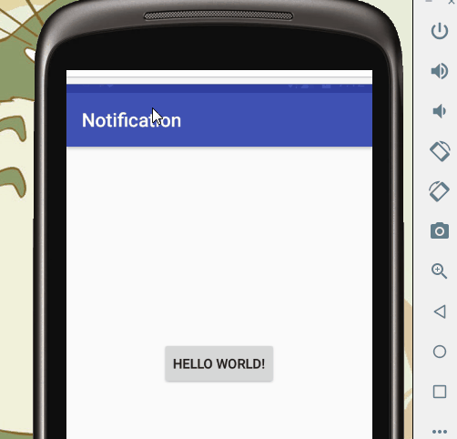
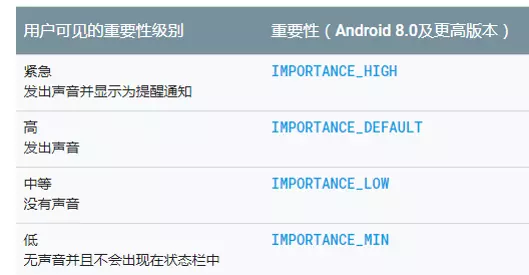

# 通知栏

我们需要发布一个通知，首先需要发布者然后就是发布的内容。通知消息的发布者就是 `NotificationManager`和 通知消息`Notification`

### NotificationManager 

状态栏通知的管理类，负责发通知、清楚通知等

```
NotificationManager nm = (NotificationManager) context.getSystemService(Context.NOTIFICATION_SERVICE);
```

通过notify发送通知。第一个参数ID。同样ID的通知会替换旧通知

```
manager.notify(1, notification);
```


### Notification

状态栏通知对象，可以设置icon、文字、提示声音、振动等等参数。

通过建造者模式来创建通知。为了兼容低版本，v4 Support Library中提供了
NotificationCompat.Builder()这个替代方法。它与Notification.Builder()类似，二者没有太大区别

```
var notificationBuilder =  NotificationCompat.Builder(this)
                .setContentTitle("活动")
                .setContentText("您有一项新活动")
                .setSmallIcon(R.mipmap.ic_launcher)
var notification = notificationBuilder.build();
```

其中setSmallIcon必须配置，否则抛出异常。

其他

- setContentTitle 标题
- setContentText 详细信息
- setAutoCancel(boolean) 是否点击通知自动取消
- setOngoing(boolean) 设置是否不能消除该通知; 利用它设置他为一个正在进行的通知。他们通常是用来表示一个后台任务,用户积极参与(如播放音乐)或以某种方式正在等待,因此占用设备(如一个文件下载,同步操作,主动网络连接)
- setWhen() 时间，如果不设置，则默认显示当前的系统时间
- setContentIntent(pendingIntent) 设置意图
- setPriority(Notification.PRIORITY_DEFAULT) 设置该通知优先级
- setUsesChronometer 是否显示时间计时
- setProgress(intmax, int progress, boolean indeterminate) 设置进度, indeterminate 表示是否是不明确进度的进度条。可以通过setProgress(0,0,false)移除进度条
- setContentIntent(PendingIntent intent) 功能：设置通知栏点击意图。
- addAction 向通知添加操作，操作通常与通知的content相连被系统作为按钮来显示。在系统的content下方显示图片与title，点击这个图片或者title就会触发设置的intent
- setLargeIcon(BitmapFactory.decodeResource(getResources(),R.drawable.wechat));
- setDefaults 向通知添加声音、闪灯和震动效果，最简单、最一致的方式是使用当前的用户默认设置，使用defaults属性
  - Notification.DEFAULT_VISIBLE *//添加默认震动提醒 需要VIBRATE permission*
  - Notification.DEFAULT_SOUND *//添加默认声音提醒*
  - Notification.DEFAULT_LIGHTS *//添加默认三色灯提醒*
  - Notification.DEFAULT_ALL *//添加默认以上三种全部提醒* 
- setStyle 设置风格

#### 多种样式

###### bigTextStyle

```
 private void bigTextStyle(){
        NotificationCompat.Builder builder = new NotificationCompat.Builder(this);
        builder.setContentTitle("BigTextStyle");
        builder.setContentText("BigTextStyle演示示例");
        builder.setSmallIcon(R.mipmap.ic_launcher);
        builder.setLargeIcon(BitmapFactory.decodeResource(getResources(),R.drawable.notification));
        android.support.v4.app.NotificationCompat.BigTextStyle style = new android.support.v4.app.NotificationCompat.BigTextStyle();
        style.bigText("这里是点击通知后要显示的正文，可以换行可以显示很长");
        style.setBigContentTitle("点击后的标题");
        //SummaryText没什么用 可以不设置
        style.setSummaryText("末尾只一行的文字内容");
        builder.setStyle(style);
        builder.setAutoCancel(true);
        Intent intent = new Intent(this,SettingsActivity.class);
        PendingIntent pIntent = PendingIntent.getActivity(this,1,intent,0);
        builder.setContentIntent(pIntent);
        builder.setDefaults(NotificationCompat.DEFAULT_ALL);
        Notification notification = builder.build();
        manger.notify(TYPE_BigText,notification);
    }
```

###### BigPictureStyle

```
public void bigPictureStyle(){
        NotificationCompat.Builder builder = new NotificationCompat.Builder(this);
        builder.setContentTitle("BigPictureStyle");
        builder.setContentText("BigPicture演示示例");
        builder.setSmallIcon(R.mipmap.ic_launcher);
        builder.setDefaults(NotificationCompat.DEFAULT_ALL);
        builder.setLargeIcon(BitmapFactory.decodeResource(getResources(),R.drawable.notification));
        android.support.v4.app.NotificationCompat.BigPictureStyle style = new android.support.v4.app.NotificationCompat.BigPictureStyle();
        style.setBigContentTitle("BigContentTitle");
        style.setSummaryText("SummaryText");
        style.bigPicture(BitmapFactory.decodeResource(getResources(),R.drawable.small));
        builder.setStyle(style);
        builder.setAutoCancel(true);
        Intent intent = new Intent(this,ImageActivity.class);
        PendingIntent pIntent = PendingIntent.getActivity(this,1,intent,0);
        //设置点击大图后跳转
        builder.setContentIntent(pIntent);
        Notification notification = builder.build();
        manger.notify(TYPE_BigPicture,notification);
    }

```

###### InboxStyle

与bigTextStyle类似，点击前显示普通通知样式，点击后展开

```
 public void inBoxStyle(){
        NotificationCompat.Builder builder = new NotificationCompat.Builder(this);
        builder.setContentTitle("InboxStyle");
        builder.setContentText("InboxStyle演示示例");
        builder.setSmallIcon(R.mipmap.ic_launcher);
        builder.setLargeIcon(BitmapFactory.decodeResource(getResources(),R.drawable.notification));
        android.support.v4.app.NotificationCompat.InboxStyle style = new android.support.v4.app.NotificationCompat.InboxStyle();
        style.setBigContentTitle("BigContentTitle")
                .addLine("第一行，第一行，第一行，第一行，第一行，第一行，第一行")
                .addLine("第二行")
                .addLine("第三行")
                .addLine("第四行")
                .addLine("第五行")
                .setSummaryText("SummaryText");
        builder.setStyle(style);
        builder.setAutoCancel(true);
        Intent intent = new Intent(this,SettingsActivity.class);
        PendingIntent pIntent = PendingIntent.getActivity(this,1,intent,0);
        builder.setContentIntent(pIntent);
        builder.setDefaults(NotificationCompat.DEFAULT_ALL);
        Notification notification = builder.build();
        manger.notify(TYPE_Inbox,notification);
    }

```




###### MediaStyle

```
    private void mediaStyle(){
        NotificationCompat.Builder builder = new NotificationCompat.Builder(this);
        builder.setContentTitle("MediaStyle");
        builder.setContentText("Song Title");
        builder.setSmallIcon(R.mipmap.ic_launcher);
        builder.setLargeIcon(BitmapFactory.decodeResource(getResources(),R.drawable.notification));
        builder.setDefaults(NotificationCompat.DEFAULT_ALL);
        Intent intent = new Intent(this,ImageActivity.class);
        PendingIntent pIntent = PendingIntent.getActivity(this,1,intent,0);
        builder.setContentIntent(pIntent);
        //第一个参数是图标资源id 第二个是图标显示的名称，第三个图标点击要启动的PendingIntent
        builder.addAction(R.drawable.ic_previous_white,"",null);
        builder.addAction(R.drawable.ic_stop_white,"",null);
        builder.addAction(R.drawable.ic_play_arrow_white_18dp,"",pIntent);
        builder.addAction(R.drawable.ic_next_white,"",null);
        NotificationCompat.MediaStyle style = new NotificationCompat.MediaStyle();
        style.setMediaSession(new MediaSessionCompat(this,"MediaSession",
                new ComponentName(MainActivity.this,Intent.ACTION_MEDIA_BUTTON),null).getSessionToken());
        //CancelButton在5.0以下的机器有效
        style.setCancelButtonIntent(pIntent);
        style.setShowCancelButton(true);
        //设置要现实在通知右方的图标 最多三个
        style.setShowActionsInCompactView(2,3);
        builder.setStyle(style);
        builder.setShowWhen(false);
        Notification notification = builder.build();
        manger.notify(TYPE_Media,notification);
    }
```


### pendingIntent

pendingIntent是一种特殊的Intent。主要的区别在于Intent的执行立刻的，而pendingIntent的执行不是立刻的。pendingIntent执行的操作实质上是参数传进来的Intent的操作，但是使用pendingIntent的目的在于它所包含的Intent的操作的执行是需要满足某些条件的。

主要的使用的地方和例子：通知Notificatio的发送，短消息SmsManager的发送和警报器AlarmManager的执行等等。

intent英文意思是意图，pending表示即将发生或来临的事情。 
PendingIntent这个类用于处理即将发生的事情。比如在通知Notification中用于跳转页面，但不是马上跳转

PendingIntent 可以看作是对intent的包装，通常通过getActivity,getBroadcast ,getService来得到pendingintent的实例

```
public static PendingIntent getActivity(Context context, int requestCode,
            Intent intent, @Flags int flags)
```


PendingIntent的flag：

- FLAG_CANCEL_CURRENT：如果要创建的PendingIntent已经存在了，那么在创建新的PendingIntent之前，原先已经存在的PendingIntent中的intent将不能使用
- FLAG_NO_CREATE：如果要创建的PendingIntent尚未存在，则不创建新的PendingIntent，直接返回null
- FLAG_ONE_SHOT：相同的PendingIntent只能使用一次，且遇到相同的PendingIntent时不会去更新PendingIntent中封装的Intent的extra部分的内容
- FLAG_UPDATE_CURRENT：如果要创建的PendingIntent已经存在了，那么在保留原先PendingIntent的同时，将原先PendingIntent封装的Intent中的extra部分替换为现在新创建的PendingIntent的intent中extra的内容


### 自定义视图RemoteView

通过RemoteViews来创建视图

```
RemoteViews mRemoteViews = new RemoteViews(String packageName, int layoutId);
```

设置的图片属性

```
mRemoteViews.setImageViewResource(int viewId, int srcId);
```

设置点击意图：

```
mRemoteViews.setOnClickPendingIntent(int viewId,PendingIntent pendingIntent);
```

设置文字

```
mRemoteViews.setTextViewText(R.id.tv_custom_song_singer, "周杰伦");
```

builder 关联

```
builder.setCustomContentView()
```


### 浮动通知

以横幅的形式 在屏幕顶端悬浮显示。通过setFullScreenIntent()设置

5.0以上。


## 通知渠道

android 8.0开始引入了渠道组的概念，app可以对通知类型进行细分，比如划分为：广告消息，私聊消息，群聊消息等。

**8.0如果没有设置setChannelId(id)，通知栏会不显示**

步骤：

1. 通过构造方法`NotificationChannel(channelId, channelName, importance)`创建一个NotificationChannel对象

2. 通过createNotificationChannel ( )来注册NotificationChannel一个对象

   创建通知渠道需要三个参数

   - channelId 通知渠道的ID 可以是任意的字符串，全局唯一就可以
   - channelName 通知渠道的名称，这个是用户可见的，开发者需要认真规划的命名
   - importance 通知渠道的重要等级，有一下几个等级，不过这个用户都是可以手动修改的




示例

```
NotificationManager notificationManager =
            (NotificationManager) getSystemService(Context.NOTIFICATION_SERVICE);
String channelId = "some_channel_id";
CharSequence channelName = "Some Channel";
int importance = NotificationManager.IMPORTANCE_LOW;
NotificationChannel notificationChannel = new NotificationChannel(channelId, channelName, importance);
notificationManager.createNotificationChannel(notificationChannel);
```

3. 在创建通知的时候，需要比之前多**传一个渠道channelId**

   ```
   val builder = NotificationCompat.Builder(context,channelId)
   ```

   

### 前台服务

前台服务是那些被认为用户知道（用户所认可的）且在系统内存不足的时候不允许系统杀死的服务。前台服务必须给状态栏提供一个通知，它被放到正在运行(Ongoing)标题之下，这就意味着通知只有在这个服务被终止或从前台主动移除通知后才能被解除

- 所谓的前台Service就是状态栏显示的Notification
- 前台Service比后台Service的系统优先级更高、更不易被系统杀死
- 前台Service会一直有一个正在运行的图标在系统的状态栏显示，下拉状态栏后可以看到更加详细的信息
- 前台服务只有在服务被终止或主动移除通知后才能被移除
- 一般用于音乐播放器相关的功能

###### 创建前台服务

- 调用 startForegroundService(8.0添加) 或 startService 启动一个 Service
- 在 Service 的 onCreate 或 onStartCommand 中构建 Notification
- 然后调用 startForeground 方法即让 Service 以前台服务方式运行
- 在 Service 的 onDestory 中调用 stopForeground 方法停止正在运行的前台服务


示例

```
if (Build.VERSION.SDK_INT >= Build.VERSION_CODES.O) {
    //即使应用在后台运行，系统也允许其调用startForegroundService()函数将启动一个前台服务
    //但应用必须在创建服务后的5秒内调用该服务的startForeground()函数，否则将报ANR错误
    startForegroundService(new Intent(this, ForegroundService.class));
} else {
    startService(new Intent(this, ForegroundService.class));
}
```

前台服务的定义：

```
public class ForegroundService extends Service {

private static final int ID = 1112;

@Override
public IBinder onBind(Intent intent) {
    return null;
}

@Override
public void onCreate() {
    super.onCreate();

    if (Build.VERSION.SDK_INT >= Build.VERSION_CODES.JELLY_BEAN) {
        Intent intent = new Intent(MainActivity.BROADCAST_ACTION);
        intent.putExtra("data", "【我是前台服务】");
        PendingIntent pendingIntent = PendingIntent.getBroadcast(this, ID, intent, 0);

        NotificationCompat.Builder mBuilder = new NotificationCompat.Builder(this, MainActivity.CHANNEL_ID)
            .setSmallIcon(R.drawable.icon)
            .setContentTitle("标题")
            .setContentText("我是前台服务")
            .setContentIntent(pendingIntent);
        startForeground(ID, mBuilder.build());
    }
}

@Override
public void onDestroy() {
    //从前台状态中移除此服务，如果需要更多内存，则允许它被杀死。但这不会stop服务运行，只是 takes it out of 前台状态
    stopForeground(true);
    super.onDestroy();
}
}
```