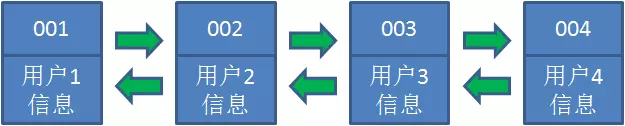
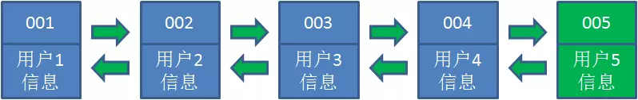
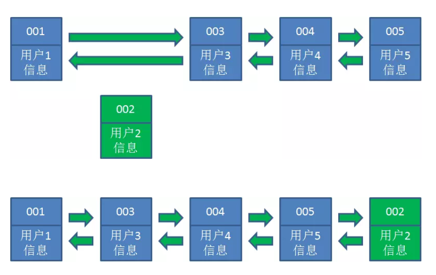
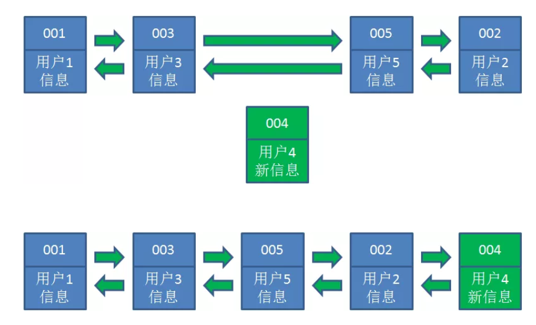
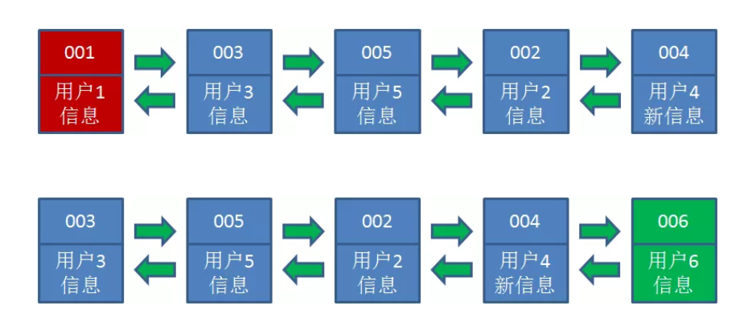

# Lru算法

Lru全程Least Recently Used，也就是最近最少使用的意思，是一种内存管理算法。

Lru算法基于一种假设，长期不被使用的数据，在未来被用到的几率也不大。因此，当数据所占内存达到一定阈值时，我们要移除掉最近最少被使用的数据。

在Lru算法中，使用了一种有趣的数据结构，叫做**哈希链表**

## 哈希链表

我们都知道，哈希表是由若干个Key-Value所组成。在“逻辑”上，这些Key-Value是无所谓排列顺序的，谁先谁后都一样。


在哈希链表当中，这些Key-Value不再是彼此无关的存在，而是被一个链条串了起来。每一个Key-Value都具有它的前驱Key-Value、后继Key-Value，就像双向链表中的节点一样。

这样一来，原本无序的哈希表拥有了固定的排列顺序。


## 基本思路

让我们以用户信息的需求为例，来演示一下LRU算法的基本思路：

1. 假设我们使用哈希链表来缓存用户信息，目前缓存了4个用户，这4个用户是按照时间顺序依次从链表右端插入的。



2. 此时，业务方访问用户5，由于哈希链表中没有用户5的数据，我们从数据库中读取出来，插入到缓存当中。这时候，链表中最右端是最新访问到的用户5，最左端是最近最少访问的用户1。



3. 接下来，业务方访问用户2，哈希链表中存在用户2的数据，我们怎么做呢？我们把用户2从它的前驱节点和后继节点之间移除，重新插入到链表最右端。这时候，链表中最右端变成了最新访问到的用户2，最左端仍然是最近最少访问的用户1。



4. 接下来，业务方请求修改用户4的信息。同样道理，我们把用户4从原来的位置移动到链表最右侧，并把用户信息的值更新。这时候，链表中最右端是最新访问到的用户4，最左端仍然是最近最少访问的用户1。

   

5. 后来业务方换口味了，访问用户6，用户6在缓存里没有，需要插入到哈希链表。假设这时候缓存容量已经达到上限，必须先删除最近最少访问的数据，那么位于哈希链表最左端的用户1就会被删除掉，然后再把用户6插入到最右端。



就是LRU算法的基本思路。虽然Java中LinkedHashMap已经对哈希链表做了很好的实现。


# LruCache

LruCache是一个泛型类，它内部采用一个**LinkedHashMap**以**强引用**的方式存储外界的缓存对象，其提供`get`和`put`方法来完成缓存的获取和添加操作，当缓存满时，LruCache会移除较早使用的缓存对象，然后在添加新的缓存对象。

另外LruCache是**线程安全**的，下面是它的定义

```
public class LruCache<K,V>{
    private final LinkedHashMap<K,V> map;
}
```

只需要提供缓存的总容量大小，并重写sizeOf方法即可。

```
int maxMemory = (int)(Runtime.getRuntime().maxMemory()/1024);
int cachesize = maxMemory/8;
mMemoryCache = new LruCache(String,Bitmap)(cacheSize){
    protected int sizeOf(String key,Bitmap bitmap){
        return bitmap.getRowBytes()*bitmap.getHeight()/1024;
    }
}
```

sizeOf方法是计算缓存对象的大小。一些特殊情况下，还需要重写LruCache的`entryRemoved`，Lru移除旧缓存时会回调该方法。可以在`entryRemoved`中完成资源回收

除了创建外，还有缓存的获取和添加

```
mMemoryCache.get(key);
mMemoryCache.put(key,bitmap);
```

LruCache还可以支持删除操作，通过remove方法即可删除一个指定的缓存对象。

