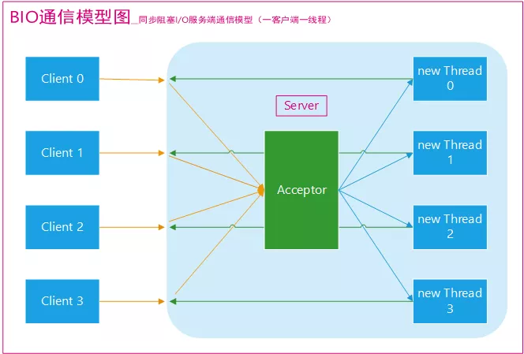
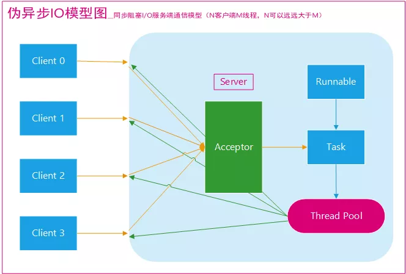
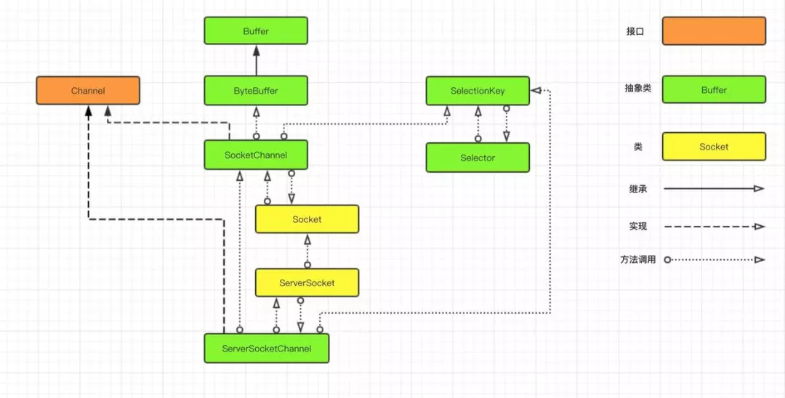

# IO工作方式

在计算机中，IO 传输数据有三种工作方式，分别是 **BIO、NIO、AIO**。

在讲解 **BIO、NIO、AIO** 之前，我们先来回顾一下这几个概念：**同步与异步，阻塞与非阻塞**。

**同步与异步的区别**

- 同步就是发起一个请求后，接受者未处理完请求之前，不返回结果。
- 异步就是发起一个请求后，立刻得到接受者的回应表示已接收到请求，但是接受者并没有处理完，接受者通常依靠事件回调等机制来通知请求者其处理结果。

**阻塞和非阻塞的区别**

- 阻塞就是请求者发起一个请求，一直等待其请求结果返回，也就是当前线程会被挂起，无法从事其他任务，只有当条件就绪才能继续。
- 非阻塞就是请求者发起一个请求，不用一直等着结果返回，可以先去干其他事情，当条件就绪的时候，就自动回来。

而我们要讲的 **BIO、NIO、AIO** 就是**同步与异步、阻塞与非阻塞**的组合。

- BIO：同步阻塞 IO；
- NIO：同步非阻塞 IO；
- AIO：异步非阻塞 IO;

## BIO

BIO 俗称同步阻塞 IO，一种非常传统的 IO 模型，比如我们上面所举的那个程序例子，就是一个典型的**同步阻塞 IO **的工作方式。



采用 BIO 通信模型的服务端，通常由一个独立的 **Acceptor** 线程负责监听客户端的连接。

我们一般在服务端通过`while(true)`循环中会调用`accept()`方法等待监听客户端的连接，一旦接收到一个连接请求，就可以建立通信套接字进行读写操作，此时不能再接收其他客户端连接请求，只能等待同当前连接的客户端的操作执行完成， 不过可以通过多线程来支持多个客户端的连接。

这就是典型的**一请求一应答**通信模型 。

如果出现 100、1000、甚至 10000 个用户同时访问服务器，这个时候，如果使用这种模型，那么服务端也会创建与之相同的线程数量，**线程数急剧膨胀可能会导致线程堆栈溢出、创建新线程失败等问题，最终导致进程宕机或者僵死，不能对外提供服务**。

当然，我们可以通过使用 Java 中 ThreadPoolExecutor 线程池机制来改善，让线程的创建和回收成本相对较低，保证了系统有限的资源的控制，**实现了 N （客户端请求数量）大于 M （处理客户端请求的线程数量）的伪异步 I/O 模型。**


## 伪异步BIO

为了解决同步阻塞 I/O 面临的一个链路需要一个线程处理的问题，后来有人对它的线程模型进行了优化，后端通过一个线程池来处理多个客户端的请求接入，形成客户端个数 M：线程池最大线程数 N 的比例关系，其中 M 可以远远大于 N，通过线程池可以灵活地调配线程资源，设置线程的最大值，防止由于海量并发接入导致资源耗尽。

伪异步 IO 模型图，如下图：



采用线程池和任务队列可以实现一种叫做伪异步的 I/O 通信框架，当有新的客户端接入时，将客户端的 Socket 封装成一个 Task 投递到后端的线程池中进行处理。

Java 的线程池维护一个消息队列和 N 个活跃线程，对消息队列中的任务进行处理。

```
ServerSocket s = new ServerSocket(8080);
ExecutorService service = Executors.newFixedThreadPool(5);
while (true){
  Socket socket = s.accept();
  service.execute(new Runnable() {
     @Override
     public void run() {
        BufferedReader reader = null;
        PrintWriter writer = null;

        reader = new BufferedReader(new InputStreamReader(socket.getInputStream()));
        String str = reader.readLine();
        Log.d("tag","服务端收到："+str);
        writer = new PrintWriter(new OutputStreamWriter(socket.getOutputStream(),true));
        writer.println("服务端返回:"+str);
           }
      });
}
```


## NIO

NIO 中的 N 可以理解为 **Non-blocking**，一种同步非阻塞的 I/O 模型，在 Java 1.4 中引入，对应的在`java.nio`包下。

NIO 新增了 **Channel、Selector、Buffer** 等抽象概念，支持面向缓冲、基于通道的 I/O 操作方法。

NIO 提供了与传统 BIO 模型中的 `Socket` 和 `ServerSocket` 相对应的 `SocketChannel` 和 `ServerSocketChannel` 两种不同的套接字通道实现。

NIO 这两种通道都支持**阻塞和非阻塞**两种模式。阻塞模式使用就像传统中的支持一样，比较简单，但是性能和可靠性都不好；**非阻塞模式正好与之相反**。

对于低负载、低并发的应用程序，可以使用同步阻塞 I/O 来提升开发效率和更好的维护性；对于高负载、高并发的（**网络**）应用，应使用 NIO 的非阻塞模式来开发。

我们先看一下 NIO 涉及到的核心关联类图，如下



上图中有三个关键类：**Channel 、Selector 和 Buffer**，它们是 NIO 中的核心概念。

- **Channel：可以理解为通道；**
- **Selector：可以理解为选择器；**
- **Buffer：可以理解为数据缓冲流；**

我们还是用前面的城市交通工具来继续形容 NIO 的工作方式，这里的 **Channel** 要比 **Socket** 更加具体，它可以比作为某种具体的交通工具，如汽车或是高铁、飞机等，而 **Selector** 可以比作为一个车站的车辆运行调度系统，它将负责监控每辆车的当前运行状态：是已经出站还是在路上等等，也就是说它可以轮询每个 **Channel** 的状态。

还有一个 **Buffer** 类，你可以将它看作为 IO 中 **Stream**，但是它比 IO 中的 **Stream** 更加具体化，我们可以将它比作为车上的座位，**Channel** 如果是汽车的话，那么 **Buffer** 就是汽车上的座位，**Channel** 如果是高铁上，那么 **Buffer** 就是高铁上的座位，它始终是一个具体的概念，这一点与 **Stream** 不同。

**Socket 中的 Stream** 只能代表是一个座位，至于是什么座位由你自己去想象，也就是说你在上车之前并不知道这个车上是否还有没有座位，也不知道上的是什么车，因为你并不能选择，这些信息都已经被封装在了运输工具（**Socket**）里面了。

NIO 引入了 **Channel、Buffer 和 Selector** 就是想把 IO 传输过程中涉及到的**信息具体化**，让程序员有机会去控制它们。

当我们进行传统的网络 IO 操作时，比如调用 write() 往 Socket 中的 SendQ 队列写数据时，当一次写的数据超过 SendQ 长度时，操作系统会按照 SendQ 的长度进行分割的，这个过程中需要将用户空间数据和内核地址空间进行切换，而这个切换不是程序员可以控制的，由底层操作系统来帮我们处理。

而在 Buffer 中，我们可以控制 Buffer 的 capacity（容量），并且是否扩容以及如何扩容都可以控制。

```
ServerSocketChannel ssc = ServerSocketChannel.open();//打开服务器套接字通道
ssc.configureBlocking(true); //配置为非阻塞
ssc.bind(new InetSocketAddress(8080));//监听8080端口

Selector selector = Selector.open(); //找到选择器
ssc.register(selector,SelectionKey.OP_ACCEPT); //让selector监听通道中的接受事件
while(true){
  int readyChannels = selector.select();//查询就绪的通道数量，为0跳过
  if(readyChannels == 0) continue;
  Set<SelectionKey> selectedkeys = selectors.selectedKeys();//获取所有key
  Iterator<SelectionKey> iterator = selectedkeys.iterator();
  while(iterator.hasNext()){
     SelectionKey key = iterator.next();
     if(!key.isValid()){ continue;}
    
     if(key.isAcceptable()){//通道接受就绪
       ServerSocketChannel sschannel = key.channel();
       SocketChannel clientchannel = sschannel.accept();
       clientchannel.configureBlocking(false);
       clientchannel.register(selector,SelectionKey.OP_READ);//将通道注册到选择器中并监听通道中的读事件
       Log.d("tag",clientchannel.getRemoteAddress());
     }
     
     else if(key.isReadable()){
       ByteBuffer bf = ByteBuffer.allocate(1024);
       SocketChannel sschannel = key.channel();//获取通道
       int numRead = sschannel.read(bf);//读取数据到缓冲区
       bf.flip();
       String result = new String(bf.array(),0,numRead);
       Log.d("tag",result);
       sschannel.register(selector,SelectionKey.OP_WRITE);//将通道注册到选择器中并监听通道中的写事件
     }
     
     else if(key.isWriteable()){
       ByteBuffer bf = ByteBuffer.allocate(1024);
       SocketChannel sschannel = key.channel();//获取通道
       bf.put("server send".getBytes());
       bf.flip();
       sschannel.write(bf);
       sschannel.register(selector,SelectionKey.OP_READ);
       sschannel.close();
     }
     
     iterator.remove();//丢弃
  }
}
```

**Selector** 被称为**选择器** ，当然你也可以翻译为**多路复用器** 。它是 Java NIO 核心组件中的一个，用于检查一个或多个 **Channel**（通道）的状态是否处于**连接就绪**、**接受就绪**、**可读就绪**、**可写就绪**。

如此可以实现单线程管理多个 **channels**，也就是可以管理多个网络连接，


**使用 Selector 的好处在于：** 相比传统方式使用多个线程来管理 IO，Selector 使用了更少的线程就可以处理通道了，并且实现网络高效传输！

虽然 java 中的 nio 传输比较快，为什么大家都不愿意用 JDK 原生 NIO 进行开发呢？

从上面的代码中大家都可以看出来，除了编程复杂、编程模型难之外，还有几个让人诟病的问题：

- **JDK 的 NIO 底层由 epoll 实现，该实现饱受诟病的空轮询 bug 会导致 cpu 飙升 100%！**
- **项目庞大之后，自行实现的 NIO 很容易出现各类 bug，维护成本较高！**

## AIO

最后就是 AIO 了，全称 Asynchronous I/O，可以理解为异步 IO，也被称为 NIO 2，在 Java 7 中引入了 NIO 的改进版 NIO 2，它是异步非阻塞的 IO 模型，也就是我们现在所说的 AIO。

异步 IO 是**基于事件和回调机制**实现的，也就是应用操作之后会直接返回，不会堵塞在那里，当后台处理完成，操作系统会通知相应的线程进行后续的操作。

```
//打开一个客户端通道
AsynchronousSocketChannel channel = AsynchronousSocketChannel.open();
//与服务器建立连接
channel.connect(new InetSocketAddress("127.0.0.1",8080));

Thread.sleep(1000);

channel.write(ByteBuffer.wrap("hello,客户端".getBytes())).get();

ByteBuffer buff = ByteBuffer.allocate(1024);
channel.read(buff).get();
buff.flip()
String result = Charset.defaultCharset().newDecoder().decode(buff).toString();
Log.d("tag",result);

```

服务端示例：

```
public class AioServer {
    AsynchronousServerSocketChannel serverChannel;
    public void listen() throws IOException {
        serverChannel = AsynchronousServerSocketChannel.open();//打开服务端通道
        serverChannel.bind(new InetSocketAddress(8080));//监听通道
        serverChannel.accept(this, new CompletionHandler<AsynchronousSocketChannel, AioServer>() {
            @Override
            public void completed(AsynchronousSocketChannel client, AioServer attachment) {
                if (client.isOpen()){
                    final ByteBuffer buffer = ByteBuffer.allocate(1024);
                    client.read(buffer, client, new CompletionHandler<Integer, AsynchronousSocketChannel>() {
                        @Override
                        public void completed(Integer result, AsynchronousSocketChannel attachment) {
                            buffer.flip();
                            String content = Charset.defaultCharset().newDecoder().decode(buffer).toString();
                            Log.d("tag","服务端收到客户端信息"+content);
                            ByteBuffer writeBuffer = ByteBuffer.allocate(1024);
                            writeBuffer.put("server send".getBytes());
                            writeBuffer.flip();
                            attachment.write(writeBuffer.get());
                        }

                        @Override
                        public void failed(Throwable exc, AsynchronousSocketChannel attachment) {
                            attachment.close();
                        }
                    });
                }
                //当有新客户接入的时候，直接调用accept，递归执行，保证多个客户端都可以阻塞
                attachment.serverChannel.accept(attachment,this);
            }

            @Override
            public void failed(Throwable exc, AioServer attachment) {

            }
        });
    }
}
new AioServer().listen();

```

[参考IO](https://mp.weixin.qq.com/s/O07Hs0anT4cRYYx-eqIesg)


## epoll

epoll用来替换select，epoll是linux内核为处理大量文件描述符而做了改进的poll，是linux多路复用IO接口select/poll的增强版本，它能显著提高程序在大量并发连接中，只有少量活跃的情况下的系统CPU利用率，epoll内部用于保存事件的数据类型是红黑树，查找速度快。