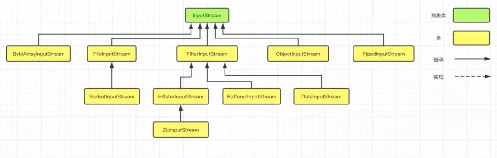
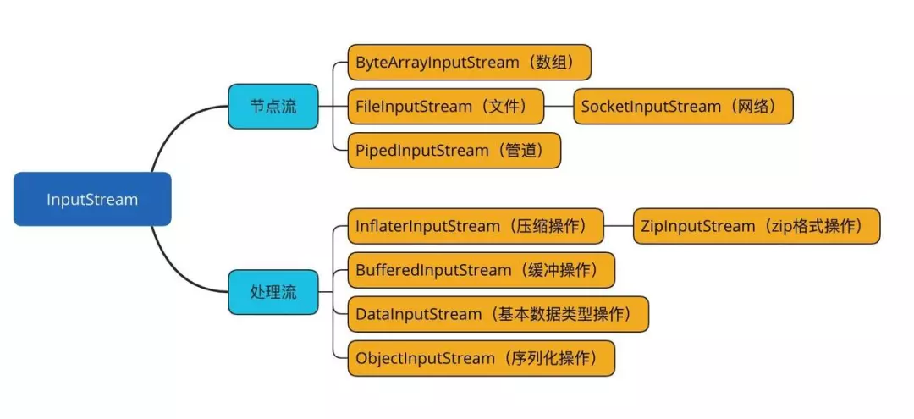
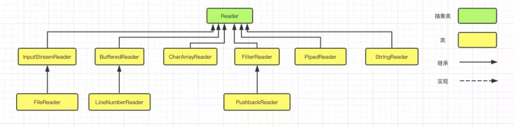
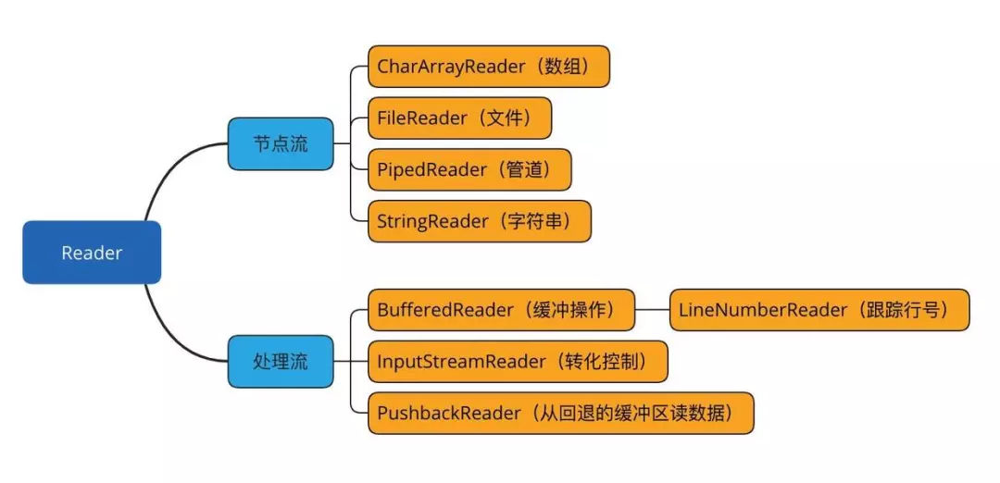
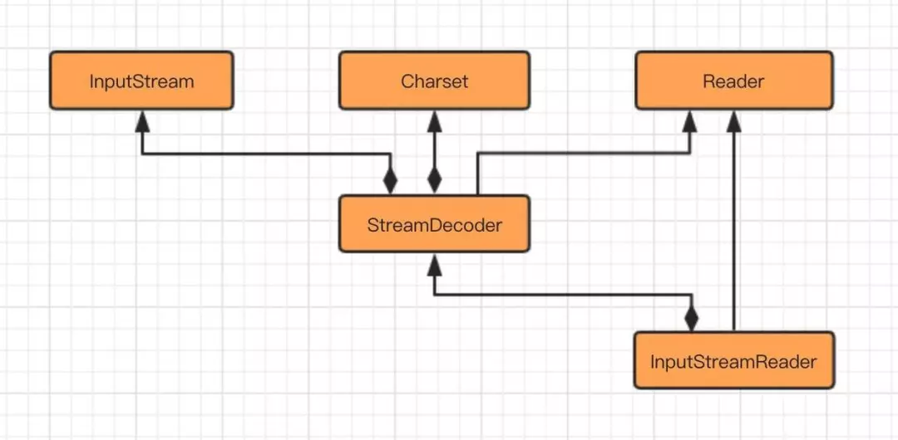

# IO流

无论是从磁盘中读写文件，还是在网络中传输数据，可以说 I/O 主要为处理**人机交互**、**机与机交互**中获取和交换信息提供的一套解决方案。

 Java 的 IO 体系中，类将近有 80 个，位于`java.io`包下，感觉很复杂，但是这些类大致可以分成四组：

- **基于字节操作的 I/O 接口：InputStream 和 OutputStream**
- **基于字符操作的 I/O 接口：Writer 和 Reader**
- **基于磁盘操作的 I/O 接口：File**
- **基于网络操作的 I/O 接口：Socket**

前两组主要从**传输数据的数据格式**不同，进行分组；后两组主要从**传输数据的方式**不同，进行分组。

虽然 Socket 类并不在`java.io`包下，但是我们仍然把它们划分在一起，因为 I/O 的核心问题，要么是数据格式影响 I/O 操作，要么是传输方式影响 I/O 操作，**也就是将什么样的数据写到什么地方的问题**，I/O 只是人与机器或者机器与机器交互的手段，除了在它们能够完成这个交互功能外，我们关注的就是如何提高它的运行效率了，而**数据格式**和**传输方式**是影响效率最关键的因素。


## 字节流

基于字节的输入和输出操作接口分别是：InputStream 和 OutputStream 

InputStream输入流的类继承关系



根据数据节点类型和处理方式，分别可以划分出了若干个子类，如下图



OutputStream 输出流的类层次结构也是类似


## 字符流

**不管是磁盘还是网络传输，最小的存储单元都是字节，而不是字符**，所以 I/O 操作的都是字节而不是字符，但是为什么要有操作字符的 I/O 接口呢？

这是因为我们的程序中通常操作的数据都是以字符形式，**为了程序操作更方便而提供一个直接写字符的 I/O 接口，仅此而已。**

基于字符的输入和输出操作接口分别是：Reader 和 Writer ，下图是字符的 I/O 操作接口涉及到的类结构图。

字符输入流的类继承类关系



同样，输入流根据数据节点类型和处理方式，分别可以划分出了若干个子类，如下图：



不管是 Reader 还是 Writer 类，它们都只定义了读取或写入数据字符的方式，也就是说要么是读要么是写，但是并没有规定数据要写到哪去，写到哪去就是我们后面要讨论的基于磁盘或网络的工作机制。


## 字节流，字符流的转化

刚刚我们说到，不管是磁盘还是网络传输，最小的存储单元都是字节，而不是字符，设计字符的原因是为了程序操作更方便，那么怎么将字符转化成字节或者将字节转化成字符呢？

**InputStreamReader 和 OutputStreamWriter 就是转化桥梁。**

输入流字符解码相关类结构的转化过程如下图所示：



从图上可以看到，InputStreamReader 类是字节到字符的转化桥梁， 其中`StreamDecoder`指的是一个**解码**操作类，`Charset`指的是字符集。

InputStream 到 Reader 的过程需要指定编码字符集，否则将采用操作系统默认字符集，很可能会出现乱码问题，StreamDecoder 则是完成字节到字符的解码的实现类。

打开源码部分，**InputStream 到 Reader 转化过程**，如下图

```
public class InputStreamReader extends Reader {

    private final StreamDecoder sd;

    /**
     * Creates an InputStreamReader that uses the default charset.
     * @param  in   An InputStream
     */
    public InputStreamReader(InputStream in) {
        super(in);
        try {
            sd = StreamDecoder.forInputStreamReader(in, this, (String)null); 
            // ## check lock object
        } catch (UnsupportedEncodingException e) {
            // The default encoding should always be available
            throw new Error(e);
        }
    }
}
```

输出流 类似

