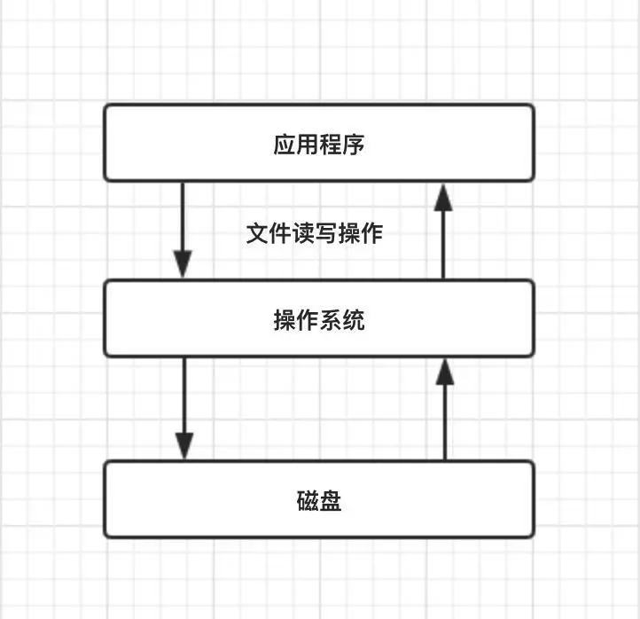

# 文件IO

我们知道数据在磁盘的唯一最小描述就是文件，也就是说上层应用程序只能通过文件来操作磁盘上的数据，文件也是操作系统和磁盘驱动器交互的一个最小单元。



**在 Java I/O 体系中，File 类是唯一代表磁盘文件本身的对象**。

File 类定义了一些与平台无关的方法来操作文件，包括检查一个**文件是否存在、创建、删除文件、重命名文件、判断文件的读写权限是否存在、设置和查询文件的最近修改时间**等等操作。

值得注意的是 Java 中通常的 File 并不代表一个真实存在的文件对象，当你通过指定一个路径描述符时，它就会返回一个代表这个路径相关联的一个**虚拟对象**，这个可能是一个真实存在的文件或者是一个包含多个文件的目录。

例如，读取一个文件内容，程序如下：

```
StringBuffer stb = new StringBuffer();
char[] buf = new char[1024];
FileReader f = new FileReader("filename");
while(f.read(buf)>0){
   stb.append(buf);
}
str.toString();
```

当我们传入一个指定的文件名来创建 File 对象，通过 FileReader 来读取文件内容时，会自动创建一个`FileInputStream`对象来读取文件内容，也就是我们上文中所说的字节流来读取文件

```
public FileReader(String filename){
   super(new FileInputStream(filename));
}
```

紧接着，会创建一个文件描述符`FileDescriptor`的对象，其实这个对象就是真正代表一个存在的文件对象的描述。可以通过`FileInputStream`对象调用`getFD()`方法获取真正与底层操作系统关联的文件描述

