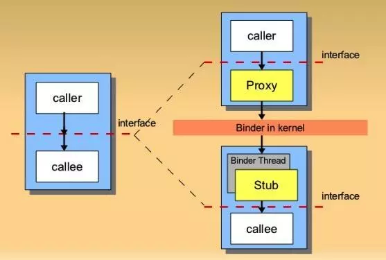
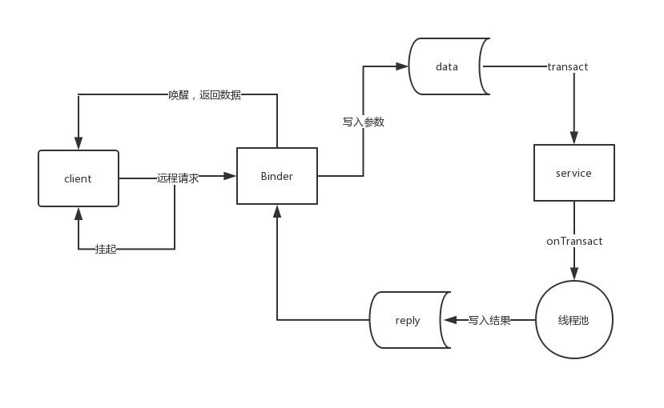

# AIDL

AIDL：全称是Android Interface Definition Language(Android接口定义语言)。它主要用在Android**进程间通信**中，Android中有一种进程间通信方式是Binder，AIDL就是帮我们自动生成了Binder相关代码，不需要我们自己去手动书写复杂的Binder类，我们只需要在AIDL接口文件中书写自己的调用远程服务的业务方法就可以了，大大简化了开发过程。

## 基本使用

以简单的从服务端获取字符串的功能为示例。首先创建服务端，可以通过New->New Module,选择`Phone & Tablet Module`,创建一个服务端

### 服务端

1. 定义aidl文件。先创建AIDL文件夹，`new->Folder->AIDL Folder`。接着，创建aidl文件，`new->AIDL->AIDL file`

   ```
   // IMyAidlInterface.aidl
   package com.example.serve;
   
   interface IMyAidlInterface {
       /**
        * Demonstrates some basic types that you can use as parameters
        * and return values in AIDL.
        */
        String getString();
   }
   
   ```

2. build->make module;AS会在`build/generated/source/aidl/debug/`下生产IMyAidlInterface.java文件

3. 创建service,重写onBind方法

   ```
   public class MyService extends Service {
   
       @Override
       public void onCreate() {
           super.onCreate();
       }
   
       @Override
       public int onStartCommand(Intent intent, int flags, int startId) {
           return super.onStartCommand(intent, flags, startId);
       }
   
       @Override
       public IBinder onBind(Intent intent) {
           return new MyBind();
       }
   
       class MyBind extends IMyAidlInterface.Stub{
           @Override
           public String getString() throws RemoteException {
               return "来自服务端的字符串";
           }
       }
   }
   ```

4. 在manifest.xml中注册service

   ```
           <service android:name=".MyService">
               <intent-filter>
                   <action android:name="com.example.service.MyService"/>
               </intent-filter>
           </service>
   ```

5. 运行module

### 客户端

1. 将服务端整个aidl包拷贝过来，路径要一直，因为客户端要反序列化服务端中的AIDL接口相关的所有类

2. 与远端服务建立连接

   ```
       private ServiceConnection connection = new ServiceConnection() {
           @Override
           public void onServiceConnected(ComponentName name, IBinder service) {
               myAidlInterface = IMyAidlInterface.Stub.asInterface(service);
   
               try {
                   button.setText(myAidlInterface.getString());
               } catch (RemoteException e) {
                   e.printStackTrace();
               }
           }
   
           @Override
           public void onServiceDisconnected(ComponentName name) {
               myAidlInterface = null;
           }
       };
   ```

3. 启动service

   ```
   Intent intent = new Intent();
   intent.setAction("com.example.service.MyService");
   intent.setPackage("com.example.serve2");
   bindService(intent,connection,BIND_AUTO_CREATE);
   ```

   

## 支持的类型

在aidl中，并不是所有的数据类型都可以使用。支持的有：

- 基本数据类型
- String 和 CharSequence
- List:只支持arraylist，里面每个元素都要被AIDL所支持
- Map:只支持HashMap，而且里面的每个key和value都必须是AIDL所支持的类型
- Parcelable：所有实现了Parcelable接口的对象
- AIDL：所有的AIDL接口自身也可以在AIDL中使用

其中自定义的Parcelable对象和AIDL对象必须要显示import进来。如果AIDL文件中用到了自定义的Parcelable对象，那么必须新建一个同名的AIDL文件，并声明为parcelable类型

```
// Book.aidl
package com.example.server;
parcelable Book;
```

除此之外,AIDL中除了基本数据类型，其他数据类型参数必须加上方向: **in，out或者inout**

不支持声明静态常量。


## 原理

首先看生成的java文件

```
public interface IMyAidlInterface extends android.os.IInterface {

    public static abstract class Stub extends android.os.Binder implements com.example.serve.IMyAidlInterface {
        private static final java.lang.String DESCRIPTOR = "com.example.serve.IMyAidlInterface";

        public Stub() {
            this.attachInterface(this, DESCRIPTOR);
        }


        public static com.example.serve.IMyAidlInterface asInterface(android.os.IBinder obj) {
            if ((obj == null)) {
                return null;
            }
            android.os.IInterface iin = obj.queryLocalInterface(DESCRIPTOR);
            //判断是否在同一个进程，如果不在同一进程 创建Proxy
            if (((iin != null) && (iin instanceof com.example.serve.IMyAidlInterface))) {
                return ((com.example.serve.IMyAidlInterface) iin);
            }
            return new com.example.serve.IMyAidlInterface.Stub.Proxy(obj);
        }

        @Override
        public android.os.IBinder asBinder() {
            return this;
        }

        @Override
        public boolean onTransact(int code, android.os.Parcel data, android.os.Parcel reply, int flags) throws android.os.RemoteException {
            switch (code) {
                case INTERFACE_TRANSACTION: {
                    reply.writeString(DESCRIPTOR);
                    return true;
                }
                case TRANSACTION_getString: {
                    data.enforceInterface(DESCRIPTOR);
                    java.lang.String _result = this.getString();
                    reply.writeNoException();
                    reply.writeString(_result);
                    return true;
                }
            }
            return super.onTransact(code, data, reply, flags);
        }

        private static class Proxy implements com.example.serve.IMyAidlInterface {
            private android.os.IBinder mRemote;

            Proxy(android.os.IBinder remote) {
                mRemote = remote;
            }

            @Override
            public android.os.IBinder asBinder() {
                return mRemote;
            }

            public java.lang.String getInterfaceDescriptor() {
                return DESCRIPTOR;
            }

            @Override
            public java.lang.String getString() throws android.os.RemoteException {
                android.os.Parcel _data = android.os.Parcel.obtain();
                android.os.Parcel _reply = android.os.Parcel.obtain();
                java.lang.String _result;
                try {
                    _data.writeInterfaceToken(DESCRIPTOR);
                    mRemote.transact(Stub.TRANSACTION_getString, _data, _reply, 0);
                    _reply.readException();
                    _result = _reply.readString();
                } finally {
                    _reply.recycle();
                    _data.recycle();
                }
                return _result;
            }
        }

        static final int TRANSACTION_getString = (android.os.IBinder.FIRST_CALL_TRANSACTION + 0);
    }

    public java.lang.String getString() throws android.os.RemoteException;
}
```

这个接口的**核心是它的内部类Stub和Stub的内部代理类Proxy**。

- Stub：它继承于Binder，同样也实现了我们定义的IMyAidlInterface接口，读取Proxy传递过来的参数，并写入返回给Proxy的值。
- Proxy：它是Stub的内部类，实现了我们定义的IMyAidlInterface接口，写入传递给Stub的参数，读取Stub返回的值。它本身是私有的，通过Stub的asInterface() 方法暴露自己给外部使用。

**Stub跟服务端交互，Proxy跟客户端交互**。



- DESCRIPTOR  binder的标识
- asInterface——用于将服务端的binder对象转换成客户端所需的AIDL接口对象，实际上拿到的是Proxy
- asBinder——当前binder对象。
- onTransact——方法是运行在服务端的Binder线程中的，当客户端发起远程请求后，在底层封装后会交由此方法来处理。通过code来区分客户端请求的方法，注意一点的是，如果该方法返回false的换，客户端的请求就会失败。一般可以用来做权限控制
- Proxy  getString——方法运行在客户端。当客户端运行此方法，首先创建该方法所需的对象，把该方法的参数写入_data中，接着调用transact方法发起RPC请求，当前线程挂起。然后服务端的onTransact方法就会被 调起，直到RPC过程返回后，当前线程继续执行，并从reply取出返回值（如果有的话），并返回结果



## 死亡代理

通过Binder的**isBinderAlive**也可以判断Binder是否死亡。另外，binder提供了两个很重要的方法linkToDeath和unlinkToDeath。我们给binder设置一个死亡代理。

当binder死亡后，我们就会收到通知。这个时候可以重新发起连接请求从而恢复连接。

声明一个DeathRecipient对象，内部只有一个方法binderDied

```
private IBinder.DeathRecipient mDeathRecipient = new IBinder.DeathRecipient(){
    public void binderDied(){
        mInterfacee.asBinder().unlinkToDeath(mDeathRecipient,0);
    }
}
```

设置死亡代理

```
binder.linkToDeath(mDeathRecipient,0);//第二个参数为标志位
```

