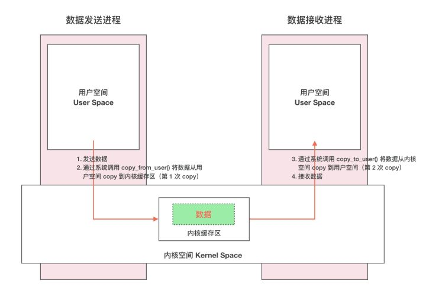

# Binder

Binder是Android平台独有的一种跨进程通信的方式，从底层来说，Binder是一种虚拟的物理设备，它的设备驱动是/dev/binder，从framework层来说，是serviceManager连接各种manager的桥梁，从应用层来说，Binder是客户端和服务端进行通信的桥梁，当 bindService的时候，服务端就会返回一个包含了服务端业务调用的Binder对象，通过这个Binder对象，客户端就可以获取服务端提供的服务（包含普通服务和基于AIDL的服务）或者数据。

## 传统IPC

### 进程隔离

简单的说就是操作系统中，进程与进程间内存是不共享的。两个进程就像两个平行的世界，A 进程没法直接访问 B 进程的数据，这就是进程隔离的通俗解释。A 进程和 B 进程之间要进行数据交互就得采用特殊的通信机制：进程间通信（IPC）

### 进程空间

操作系统的核心是内核，独立于普通的应用程序，可以访问受保护的内存空间，也可以访问底层硬件设备的权限。为了保护用户进程不能直接操作内核，保证内核的安全，**操作系统从逻辑上将虚拟空间划分为用户空间（User Space）和内核空间（Kernel Space）**。针对 Linux 操作系统而言，将最高的 1GB 字节供内核使用，称为内核空间；较低的 3GB 字节供各进程使用，称为用户空间。


### 系统调度

虽然从逻辑上进行了用户空间和内核空间的划分，但不可避免的用户空间需要访问内核资源，比如文件操作、访问网络等等。为了突破隔离限制，就需要借助**系统调用**来实现。系统调用是用户空间访问内核空间的唯一方式，保证了所有的资源访问都是在内核的控制下进行的，避免了用户程序对系统资源的越权访问，提升了系统安全性和稳定性

系统调用主要通过如下两个函数来实现：

```
copy_from_user() //将数据从用户空间拷贝到内核空间
copy_to_user()   //将数据从内核空间拷贝到用户空间
```

### 通信流程

通常的做法是消息发送方将要发送的数据存放在内存缓存区中，通过系统调用进入内核态。然后内核程序在内核空间分配内存，开辟一块内核缓存区，调用 copy*from*user() 函数将数据从用户空间的内存缓存区拷贝到内核空间的内核缓存区中。同样的，接收方进程在接收数据时在自己的用户空间开辟一块内存缓存区，然后内核程序调用 copy*to*user() 函数将数据从内核缓存区拷贝到接收进程的内存缓存区。这样数据发送方进程和数据接收方进程就完成了一次数据传输，我们称完成了一次进程间通信。如下图



这种传统的 IPC 通信方式有两个问题：

1. 性能低下，一次数据传递需要经历：内存缓存区 --> 内核缓存区 --> 内存缓存区，需要 2 次数据拷贝；
2. 接收数据的缓存区由数据接收进程提供，但是接收进程并不知道需要多大的空间来存放将要传递过来的数据，因此只能开辟尽可能大的内存空间或者先调用 API 接收消息头来获取消息体的大小，这两种做法不是浪费空间就是浪费时间。

## Binder原理

首先，要提到Linux 下的另一个概念：**内存映射**

内存映射通过 mmap() 来实现，mmap() 是操作系统中一种内存映射的方法。内存映射简单的讲就是将用户空间的一块内存区域映射到内核空间。映射关系建立后，用户对这块内存区域的修改可以直接反应到内核空间；反之内核空间对这段区域的修改也能直接反应到用户空间。

内存映射能减少数据拷贝次数，实现用户空间和内核空间的高效互动。两个空间各自的修改能直接反映在映射的内存区域，从而被对方空间及时感知。也正因为如此，内存映射能够提供对进程间通信的支持。

Binder IPC 正是基于内存映射（mmap）来实现的，但是 mmap() 通常是用在有物理介质的文件系统上的。

而 Binder 并不存在物理介质，因此 Binder 驱动使用 mmap() 并不是为了在物理介质和用户空间之间建立映射，而是用来在内核空间创建数据接收的缓存空间。

一次完整的 Binder IPC 通信过程通常是这样：

1. 首先 Binder 驱动在内核空间创建一个数据接收缓存区；
2. 接着在内核空间开辟一块内核缓存区，建立**内核缓存区**和**内核中数据接收缓存区**之间的映射关系，以及**内核中数据接收缓存区**和**接收进程用户空间地址**的映射关系；
3. 发送方进程通过系统调用 copy*from*user() 将数据 copy 到内核中的**内核缓存区**，由于内核缓存区和接收进程的用户空间存在内存映射，因此也就相当于把数据发送到了接收进程的用户空间，这样便完成了一次进程间的通信。

如下图：


**Binder 是基于 C/S 架构的。由一系列的组件组成，包括 Client、Server、ServiceManager、Binder 驱动。**

其中 Client、Server、Service Manager 运行在用户空间，Binder 驱动运行在内核空间。其中 Service Manager 和 Binder 驱动由系统提供，而 Client、Server 由应用程序来实现。Client、Server 和 ServiceManager 均是通过系统调用 open、mmap 和 ioctl 来访问设备文件 /dev/binder，从而实现与 Binder 驱动的交互来间接的实现跨进程通信

Client、Server、ServiceManager、Binder 驱动这几个组件在通信过程中扮演的角色就如同互联网中服务器（Server）、客户端（Client）、DNS域名服务器（ServiceManager）以及路由器（Binder 驱动）之前的关系。


整个流程也十分简单，如下所示：

1. Server进程向ServiceManager中注册Binder
2. Client进程向ServiceManager获取服务。
3. 在 Binder 驱动的帮助下从 ServiceManager 中获取到对 Binder 实体的引用，通过这个引用就能实现和 Server 进程的通信


[binder](https://github.com/xiangjiana/Android-MS/blob/master/android/binder2.md)


## 总结

- 高性能：从数据拷贝次数来看Binder只需要进行**一次内存拷贝**，服务端将内存空间**映射**到内核空间去，然后客户端将内容直接拷贝到该区域去；而管道、消息队列、Socket都需要两次，共享内存不需要拷贝，Binder的性能仅次于共享内存。
- 稳定性：上面说到共享内存的性能优于Binder，那为什么不适用共享内存呢，因为共享内存需要处理并发同步问题，控制负责，容易出现死锁和资源竞争，稳定性较差。而Binder**基于C/S架构**，客户端与服务端彼此独立，稳定性较好。
- 安全性：我们知道Android为**每个应用分配了UID**，用来作为鉴别进程的重要标志，Android内部也依赖这个UID进行权限管理，包括6.0以前的固定权限和6.0以后的动态权限，传统IPC只能由用户在数据包里填入UID/PID，这个标记完全 是在用户空间控制的，没有放在内核空间，因此有被恶意篡改的可能，因此Binder的安全性更高。