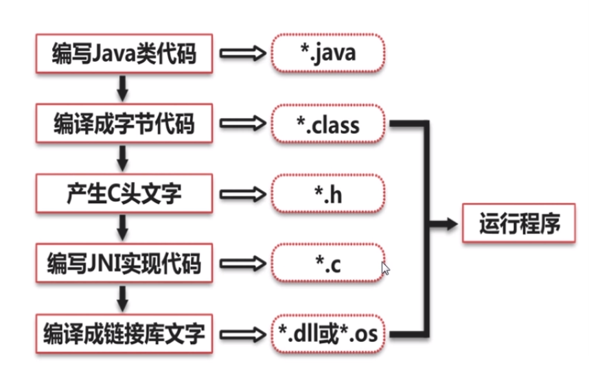
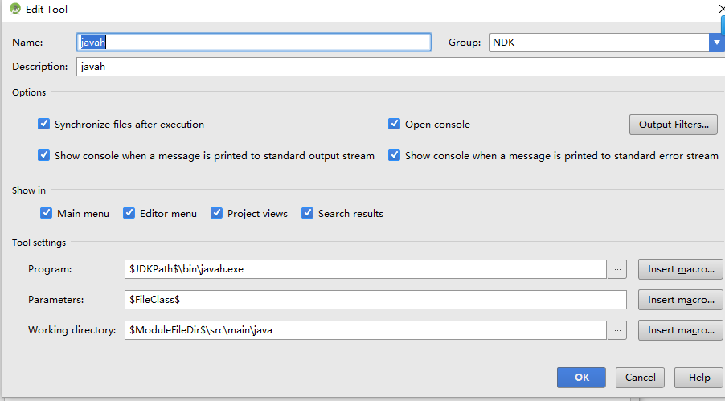

# JNI



## 静态注册，实现HelloWorld

1. 在Java层声明 native方法->sayHello

   ```
   package com.example.sample.jni;
   public class HelloFun {
   
       static {
           System.loadLibrary("hello");
       }
   
       public static native String native_init();
       
   }
   ```

2. 通过javah生成c头文件

   > javah  com.example.sample.jni.HelloFun

    可以看到生成了com_example_sample_jni_HelloFun.h.。具体内容如下

   ```
   /* DO NOT EDIT THIS FILE - it is machine generated */
   #include <jni.h>
   /* Header for class com_example_sample_jni_HelloFun */
   
   #ifndef _Included_com_example_sample_jni_HelloFun
   #define _Included_com_example_sample_jni_HelloFun
   #ifdef __cplusplus
   extern "C" {
   #endif
   /*
    * Class:     com_example_sample_jni_HelloFun
    * Method:    native_init
    * Signature: ()Ljava/lang/String;
    */
   JNIEXPORT jstring JNICALL Java_com_example_sample_jni_HelloFun_native_1init
     (JNIEnv *, jclass);
   
   #ifdef __cplusplus
   }
   #endif
   #endif
   ```

   Jni方法`Java_com_example_sample_jni_HelloFun_native_1init`,以Java开头说明是Java平台中调用JNI方法，后面的`com_example_sample_jni_HelloFun_native_1init`指的是包名+类名+方法名的格式，原本在Java中以**点.**进行分割变成了**下划线_**。另外原来的方法`native_init`中带有下划线，jni中变成了`native_1init`

3. 将.h文件拷贝到main/cpp/目录下，同时新建HelloFun.c，编写c的实现代码。将.h里的方法声明拷贝进来，同时include改头文件

   ```
   #include "com_example_cmakestudy_HelloFun.h"
   
   JNIEXPORT jstring JNICALL Java_com_example_sample_jni_HelloFun_native_1init
     (JNIEnv *env, jclass jcls){
       char *str = "Hello World, Jni";
       return (*env)->NewStringUTF(env,str);
   }
   ```

4. 在app 目录下新建CMakeLists.txt。内容如下

   ```
   cmake_minimum_required(VERSION 3.4.1)
   
   add_library(hello 
               SHARED 
               src/main/cpp/HelloFun.c)
   
   target_link_libraries(hello)
   ```

5. build.gradle中配置编译externalNativeBuild

   ```
   android{
     defaultConfig {
         externalNativeBuild{
               cmake{
                   abiFilters 'arm64-v8a','armeabi-v7a','x86','x86_64'
                   arguments "-DANDROID_STL=c++_shared"
               }
           }
     }
   
     externalNativeBuild {
           cmake {
               path 'CMakeLists.txt'
           }
       }
   }
   ```

6. make project；可以看到在app的build/intermediates/cmake/目录下四个平台架构下生成libhello.so。也就是System.loadLibrary的.so文件

### javah配置

通过配置android studio的External Tools 可以一键配置javah 来生成所需的头文件




静态注册编写不方便，JNI 方法名字必须遵循规则且名字很长。

程序运行效率低，因为初次调用native函数时需要根据函数名在JNI层中搜索对应的本地函数，然后建立对应关系，这个过程比较耗时。

## 动态注册

JNI中有一种结构来记录java的native方法和JNI方法的关联关系。它就是JNINativeMethod

```
typedef struct {
    const char* name;
    const char* signature;
    void*       fnPtr;
} JNINativeMethod;
```

name为java中的native方法，signature为该方法的签名，而fnPtr是jni中的函数。

利用`RegisterNatives`方法来注册java方法与JNI函数的一一对应。

在调用System.loadLibrary函数后会调用JNI_OnLoad函数。


1. java中注册native方法

   ```
   public class DynamicRegister {
   
       public native String dynamicFun();
   }
   ```

2. 在cpp目录创建个DynamicRegister.c，然后编写jni方法

   ```
   #include <jni.h>
   
   jstring nativeFun(JNIEnv *env,jclass clz){
       return (*env)->NewStringUTF(env,"this is dynamic register");
   }
   ```

3. 定义JNINativeMethod数组

   ```
   static JNINativeMethod methods[] = {
        {"dynamicFun","()Ljava/lang/String;",(void*)nativeFun}
   };
   ```

4. JNI_OnLoad函数

   ```
   static const char* clzname = "com/example/sample/jni/DynamicRegister";
   jint JNI_OnLoad(JavaVM *vm, void *reserved){
       JNIEnv *env = NULL;
   
       //获取JNIEnv版本
       int r = (*vm)->GetEnv(vm,(void**)&env,JNI_VERSION_1_6);
       if(r!=JNI_OK){
           return -1;
       }
   
       //指定类的路径，通过FindClass方法来找到对应的类
       jclass cl = (*env)->FindClass(env,clzname);
       //注册
       r = (*env)->RegisterNatives(env,cl,methods,1);
       if(r != JNI_OK){
           return -1;
       }
       return JNI_VERSION_1_6;
   }
   ```

5. 编译生成动态库，跟静态注册方法类似，然后`System.loadLibrary(...)`

结论：可以看到java首先执行静态代码块，其中在加载动态库的时候，自动调用JNI_OnLoad函数，建立native函数和c中的函数映射关系，最后进入main函数


## SO库加载

Java api提供以下两个接口加载一个so库

* System.loadLibrary:传进去的参数为so库名称，表示的so库文件，位于apk压缩文件中的libs目录，最后复制到apk安装目录下
* System.load:传进去的参数：so库在磁盘中的完整路径，加载一个自定义外部so库文件

这两个方式，实际最后都调用`nativeLoad`这个native方法去加载so库，这个方法的参数fileName：so库在磁盘中的完整路径名。

