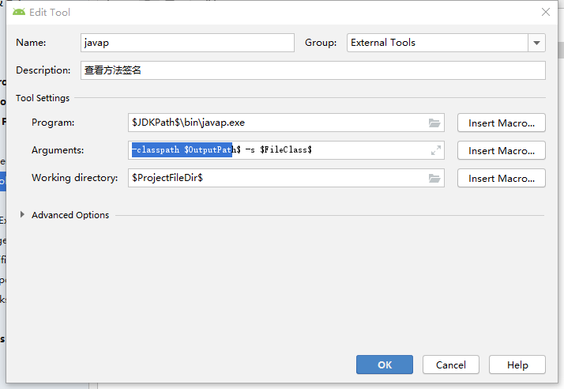

# 类型

java方法的数据类型和native函数的数据类型存在着对应关系

## 基本数据类型

| Java    | Native   | Signature |
| ------- | -------- | --------- |
| byte    | jbyte    | B         |
| char    | jchar    | C         |
| double  | jdouble  | D         |
| float   | jfloat   | F         |
| int     | jint     | I         |
| short   | jshort   | S         |
| long    | jlong    | J         |
| boolean | jboolean | Z         |
| void    | void     | V         |

可以看到除了void，基本数据类型只要在前面加字母j即可

## 引用数据类型

| Java      | Native       | Signature         |
| --------- | ------------ | ----------------- |
| 所有对象  | jobject      | L+classname+；    |
| Class     | jclass       | Ljava/lang/Class; |
| String    | jstring      | Ljava/lang/String |
| byte[]    | jbyteArray   | [B                |
| char[]    | jcharArray   | [C                |
| double[]  | jdoubleArray | [D                |
| float[]   | jfloatArray  | [F                |
| int[]     | jintArray    | [I                |
| short[]   | jshortArray  | [S                |
| long[]    | jlongArray   | [L                |
| boolean[] | jboolean     | [Z                |

## 方法签名

在Jni中仅仅通过方法名是无法找到java中对应的具体方法的，Jni为了解决这一问题就将参数类型和返回值类型组合在一起作为方法签名。通过方法签名和方法名就可以找到对应的java方法

格式

> (参数签名格式...)返回值签名格式

也可以通过javac 编译成字节码`javac x.java`

然后在通过`javap -s -p xx.class`

也可以对javap进行如下配置

