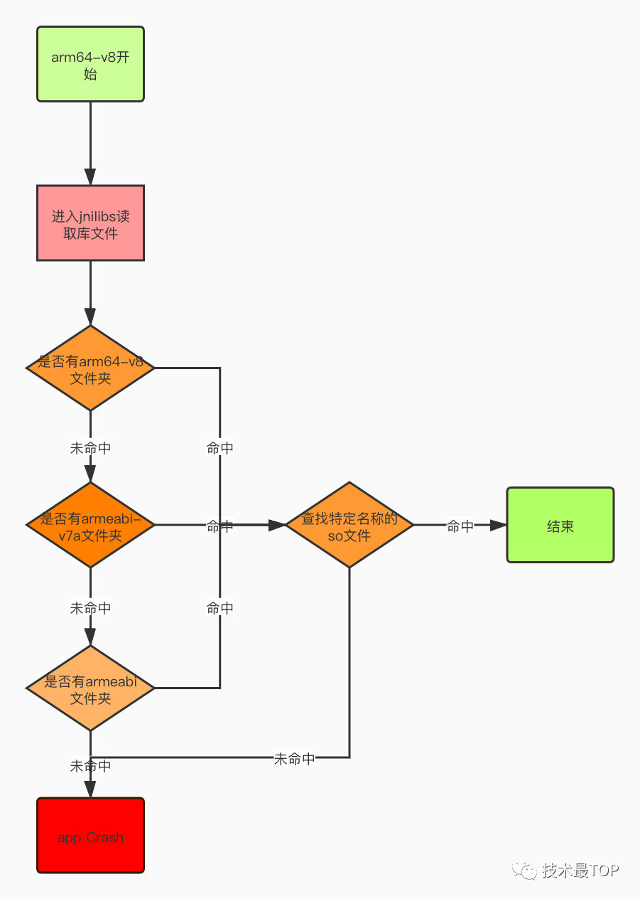

# NDK

## 什么场景可以使用ndk

1. 对代码的保护，java层代码很容易被反编译
2. 在ndk中调用第三方C/C++库，因为大部分开源库都是用C/C++代码写的
3. 便于移植，用C/C++写的库可以在其他的嵌入式平台上再次使用


## 什么是交叉编译

就是在一个平台上生成另一个平台上可执行的代码。手机是基于arm平台架构的，但是所运行的电脑都是基于x86平台架构的。x86平台编译的代码如何在arm平台去执行呢？因为 他们是两个完全不同的平台，指令集不一样，这种情况下 我们需要借助交叉编译的工具


## 什么是abi

应用程序二进制接口，定义了二进制文件如何运行在相应的系统平台中，可使用的指令集，内存对齐到可用的系统函数库。android系统上，每一个CPU架构对应了一个abi

1. armeabi
2. armeabi-v7a
3. x86
4. mips
5. arm64-v8a  主流
6. mips64
7. x86_64

默认情况下，为了使app有好的兼容性，会默认支持所有的架构，但是相应的apk size会疯狂的增大。怎么办呢？abifilters为我们提供了 解决方案，abifilters为我们提供了选择适配指定cpu架构的能力。

```
defaultConfig{

    ndk{
         abiFilters 'arm64-v8a','x86_64'
    }
}
```

**总的来说，就是一个Android设备可以支持多种ABI,设备主ABI和辅助ABI,以arm64-v8a为主ABI的设备，辅助ABI为armeabi-v7a和armeabi，以armeabi-v7a为主ABI的设备，辅助ABI为armeabi。**

另外，**x86 架构的手机都会包含由 Intel 提供的称为 Houdini 的指令集动态转码工具，实现对 arm .so 的兼容，也就是说有适配armeabi平台的APP是可以跑在x86手机上的。**


对于一个cpu是arm64-v8a架构的手机，它运行app时，进入jnilibs去读取库文件时，先看有没有arm64-v8a文件夹，如果没有该文件夹，去找armeabi-v7a文件夹，如果没有，再去找armeabi文件夹，如果连这个文件夹也没有，就抛出异常；

如果有arm64-v8a文件夹，那么就去找特定名称的.so文件，注意：如果没有找到想要的`.so`文件，不会再往下（armeabi-v7a文件夹）找了，而是直接抛出异常。



## JNI是什么

java代码使用native世界代码的桥梁

[官方JNI介绍](https://docs.oracle.com/en/java/javase/13/docs/specs/jni/index.html)


## 什么是链接库

​    静态库是一堆cpp文件，每次都需要编译才能运行，在自己的代码中用到哪个，就从这一堆cpp中取出自己需要的进行编译；

​	动态库是将一堆cpp文件都编译好了，运行的时候不会对cpp进行重新编译，当需要到库中的某个函数时，就会将库加载进来，不需要时就不用加载，前提，这个库必须存在


**静态库 libxxx.a**

**在程序编译的时候,将库编译进可执行程序中, 运行的时候不需要外部函数库**

**动态库 libxxx.so**

**在程序运行的时候,将库加载到程序中,运行的时候需要外部函数库**


### 静态库生成

1. 库函数hello.c

   ```
   #include "stdio.h"
   
   int hello(void){
   
       printf("hello lib");  
   　　return 0;
   }
   ```

2. 头文件 hello.h

   ```
   #ifndef __HELLO_H
   #define __HELLO_H
   
   int hello(void);
   
   #endif
   ```

3. 编译静态库

   1. 将hello.c生成hello.o文件，通过命令`gcc -c hello.c`
   2. 将.o文件打包成静态库 生成 libhello.a库文件。`ar -cr libhello.a hello.o`

4. 使用静态库,因为静态库是在编译的时候一起打包进程序的,所以如果编译的时候没有静态库文件,则无法编译。 写一个main函数来调用库函数

   ```
   main.c
   
   #include "hello.h"    //引入库函数的头文件,这样才能找到函数声明
   
   int main(){
     
     hello();        //调用库函数
     return 1;
   }
   ```

   正常编译的时候是没办法通过的. 因为编译器找不到 hello() 的实现代码，会无法找到hello函数。

   所以需要在编译时加入库引用

   ```
   gcc main.c -L. -lhello -o a.out
   ```

   **-L<路径> 引用自定义库的路径**,如果调用系统库就不用-L  '**.**'表示当前文件夹 

   -lxxxx 这里libhello.a 只要写hello 就可以　　 //小写的L

   生成的a.out可以直接执行


### 编译动态库

同样的hello.c 源码

1. 生成.o文件

   ```
   gcc -c -fpic hello.c //如果这里没有加-fpic 下一步就会提示你重新用 -fpic编译
   ```

2. 编译成动态库

   ```
   gcc -shared -fpic -o libhello.so hello.o
   ```

   -shared 是生成动态库

   -fpic 生成位置无关代码,默认加

3. 生成out执行文件

   ```
   gcc main.c -L. -lhello -o a.out
   ```

   

在读取共享库libhello.so的时候出错,没有找到该文件

因为动态库程序会默认在 /lib  或者 /usr/lib的路径下寻找, 所以将.so 文件拷贝到 /usr/lib/文件夹下面


## 编译方式

ndk 开发有两种编译方式，一种是通过 ndk-build 来构建；

一种是通过 CMake 构建原生库。通过 CMake 构建原生库是 Google 新提出来的方式，比较方便、强大；

通过 cmake 进行ndk开发首先有个要求，需要 Android Studio 的版本是2.2以上版本（包含2.2） ，Gradle 的版本需要升到2.2.0及以上。

需要在SDK Manager中下载三个工具:CMake,NDK,LLDB