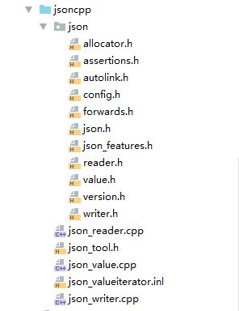
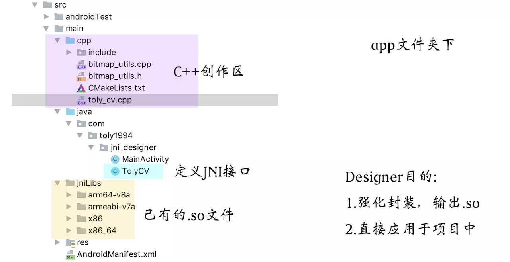

## 编译Json库

参照[关于在Android中使用CMake你所需要了解的一切二](https://juejin.im/post/5bb0276be51d450ea52fdb54)


###### 步骤

1. 在main/cpp目录下新建目录jsoncpp,同时将库文件的include下的json文件夹拷贝过来
2. 再将库src下的文件都拷过来。



3. 其他类似。定义cpp文件,照搬别人的实现

   ```
   /*
    * Class:     com_example_cmakestudy_HelloFun
    * Method:    outputJsonCode
    * Signature: (Ljava/lang/String;Ljava/lang/String;Ljava/lang/String;Ljava/lang/String;)Ljava/lang/String;
    */
   JNIEXPORT jstring JNICALL Java_com_example_cmakestudy_HelloFun_outputJsonCode
           (JNIEnv *env, jclass jcls, jstring name, jstring age, jstring sex, jstring type){
   
       Json::Value root;
       const char *envname = env->GetStringUTFChars(name,NULL);
       const char *envage = env->GetStringUTFChars(age,NULL);
       const char *envsex = env->GetStringUTFChars(sex,NULL);
       const char *envtype = env->GetStringUTFChars(type,NULL);
   
       root["name"]=envname;
       root["age"]=envage;
       root["sex"]=envsex;
       root["type"]=envtype;
   
       env->ReleaseStringUTFChars(name,envname);
       env->ReleaseStringUTFChars(age,envage);
       env->ReleaseStringUTFChars(sex,envsex);
       env->ReleaseStringUTFChars(type,envtype);
   
       return env->NewStringUTF(root.toStyledString().c_str());
   }
   
   /*
    * Class:     com_example_cmakestudy_HelloFun
    * Method:    parseJsonCode
    * Signature: (Ljava/lang/String;)Ljava/lang/String;
    */
   JNIEXPORT jstring JNICALL Java_com_example_cmakestudy_HelloFun_parseJsonCode
           (JNIEnv *env, jclass jcls, jstring jjson){
       const char *json_str = env->GetStringUTFChars(jjson, NULL);
       std::string out_str;
   
       Json::CharReaderBuilder b;
       Json::CharReader *reader(b.newCharReader());
       Json::Value root;
       JSONCPP_STRING errs;
       bool ok = reader->parse(json_str, json_str + std::strlen(json_str), &root, &errs);
       if (ok && errs.size() == 0) {
           std::string name = root["name"].asString();
           std::string age = root["age"].asString();
           std::string sex = root["sex"].asString();
           std::string type = root["type"].asString();
           out_str = "name: " + name + "\nage: " + age + "\nsex:" + sex + "\ntype: " + type + "\n";
       }
       env->ReleaseStringUTFChars(jjson, json_str);
       return env->NewStringUTF(out_str.c_str());
   }
   ```

   在C的定义中,env是一个两级指针,而在C++的定义中,env是个一级指针

   > C 语法：jsize len = (*env)->GetArrayLength(env,array);
   > C++ 语法：jsize len =env->GetArrayLength(array);

4. CMakeLists.txt

   ```
   cmake_minimum_required(VERSION 3.4.1)
   
   project(jniTest)
   
   aux_source_directory(src/main/cpp/jsoncpp/ JSON_LIST)
   
   add_library(hello SHARED
           src/main/cpp/HelloFun.cpp
           ${JSON_LIST})
   
   
   target_link_libraries(hello
           log)
   ```


## 链接so库

通常有一些很大型的第三方开源项目，如opencv，FFmpeg等。通过对他们进行编译，然后可以拿到so动态库。

有了他们的so文件，我们可以调用他们提供的函数来定制自己的需求。




###### 

这里 使用的是编译完成的[ogg](https://github.com/xiph/ogg)库 ——>**libogg.so**

步骤:

1. 将动态库拷贝到jniLibs目录下

2. 将ogg库里的include目录下的ogg文件夹 拷贝到工程的cpp目录下。同时对ogg.h中的稍作修改，将os_types.h的typedef的部分内容拷到ogg.h中。

3. 定义自己的jni文件,这里只调用ogg.h中的`ogg_stream_init`函数。

   ```
   JNIEXPORT void JNICALL Java_com_example_ndktest_HelloFun_init
           (JNIEnv *env, jclass jcls){
      
      ogg_stream_state *os = NULL;
      os = static_cast<ogg_stream_state *>(_ogg_malloc(sizeof(ogg_stream_state)));
      int result = ogg_stream_init(os,10);
      if (result<0){
          __android_log_print(ANDROID_LOG_INFO,"JNICALL","FAILED");
          return;
      }
      __android_log_print(ANDROID_LOG_INFO,"JNICALL","SUCCESS");
   }
   ```

   

4. 配置CMakeLists.txt。这里把CMakeLists放在app目录下，跟src同级目录

   ```
   #添加动态链接库
   add_library(lib_ogg SHARED IMPORTED)
   set_target_properties(lib_ogg PROPERTIES IMPORTED_LOCATION
           ${CMAKE_SOURCE_DIR}/src/main/jniLibs/${ANDROID_ABI}/libogg.so)
           
   # 这里libogg.so必须是全路径 否则会报错 xxxx missing and no known rule to make it        
   
   add_library(hello
               SHARED
               src/main/cpp/HelloFun.cpp)
   
   target_link_libraries(hello
           log
           lib_ogg)
   ```


基本就完成了对第三方so库的链接调用