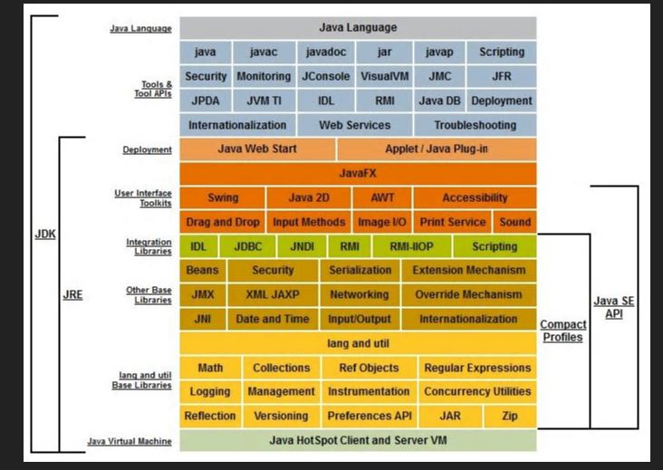
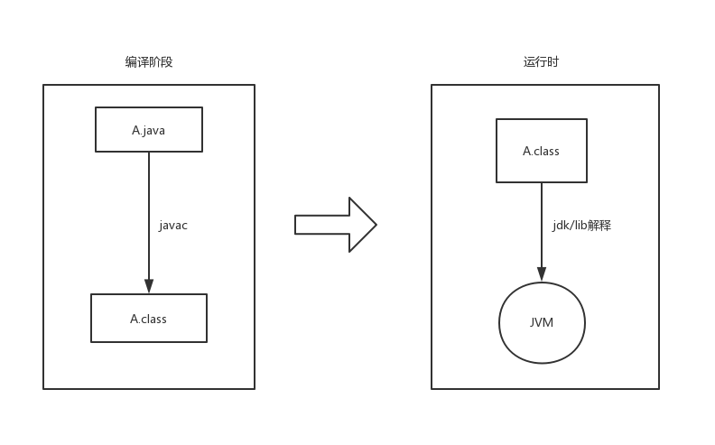

# JDK

JDK是Java 开发工具包,是整个 Java 开发的核心，包含了JAVA虚拟机，JAVA API类库，还集成了 jre 和一些好用的小工具，有`javac.exe`,`javap.exe`。可以在`java/jdk/bin/`目录下查看。

**JRE**——Java 运行时环境。它主要包含两个部分，**jvm 的标准实现和 Java 的一些基本类库**。

**JVM**——我们耳熟能详的 Java 虚拟机。它只认识 xxx.class 这种类型的文件，它能够将 class 文件中的字节码指令进行识别并调用操作系统向上的 API 完成动作。所以说，jvm 是 Java 能够跨平台的核心。



## Java虚拟机执行流程

虚拟机执行分为两个部分，分别是**编译时环境**和**运行时环境**。

1. java文件经过javac工具编译生成class文件，这个class文件由java虚拟机处理。
2. JVM不能单独搞定class的执行，解释class的时候JVM需要调用解释所需要的类库lib，在JDK下面的的jre目录里面有两个文件夹bin和lib。lib中是jvm工作所需要的类库，而jvm和 lib和起来就称为jre。**JVM+Lib=JRE**。

任何语言只要可以被编译称**class**文件，就可以被java虚拟机识别并执行



## 字节码

Java之所以可以“一次编译，到处运行”，

一是因为JVM针对各种操作系统、平台都进行了定制

二是因为无论在什么平台，都可以编译生成固定格式的字节码（.class文件）供JVM使用。

因此，也可以看出字节码对于Java生态的重要性。之所以被称之为字节码，是因为字节码文件由十六进制值组成，而JVM以两个十六进制值为一组，即以字节为单位进行读取


## Javap

是jdk自带的反解析工具。它的作用就是根据class字节码文件，反解析出当前类对应的code区（汇编指令）、本地变量表、异常表和代码行偏移量映射表、常量池等等信息。
当然这些信息中，有些信息（如本地变量表、指令和代码行偏移量映射表、常量池中方法的参数名称等等）需要在使用javac编译成class文件时，指定参数才能输出，比如，你直接javac xx.java，就不会在生成对应的局部变量表等信息，如果你使用javac -g xx.java就可以生成所有相关信息了。如果你使用的eclipse，则默认情况下，eclipse在编译时会帮你生成局部变量表、指令和代码行偏移量映射表等信息的。
通过反编译生成的汇编代码，我们可以深入的了解java代码的工作机制。

```kotlin
 -help  --help  -?        输出此用法消息
 -version                 版本信息，其实是当前javap所在jdk的版本信息，不是class在哪个jdk下生成的。
 -v  -verbose             输出附加信息（包括行号、本地变量表，反汇编等详细信息）
 -l                         输出行号和本地变量表
 -public                    仅显示公共类和成员
 -protected               显示受保护的/公共类和成员
 -package                 显示程序包/受保护的/公共类 和成员 (默认)
 -p  -private             显示所有类和成员
 -c                       对代码进行反汇编
 -s                       输出内部类型签名
 -sysinfo                 显示正在处理的类的系统信息 (路径, 大小, 日期, MD5 散列)
 -constants               显示静态最终常量
 -classpath <path>        指定查找用户类文件的位置
 -bootclasspath <path>    覆盖引导类文件的位置
```

另外通过`jclasslib`工具也可以看到上面这些信息