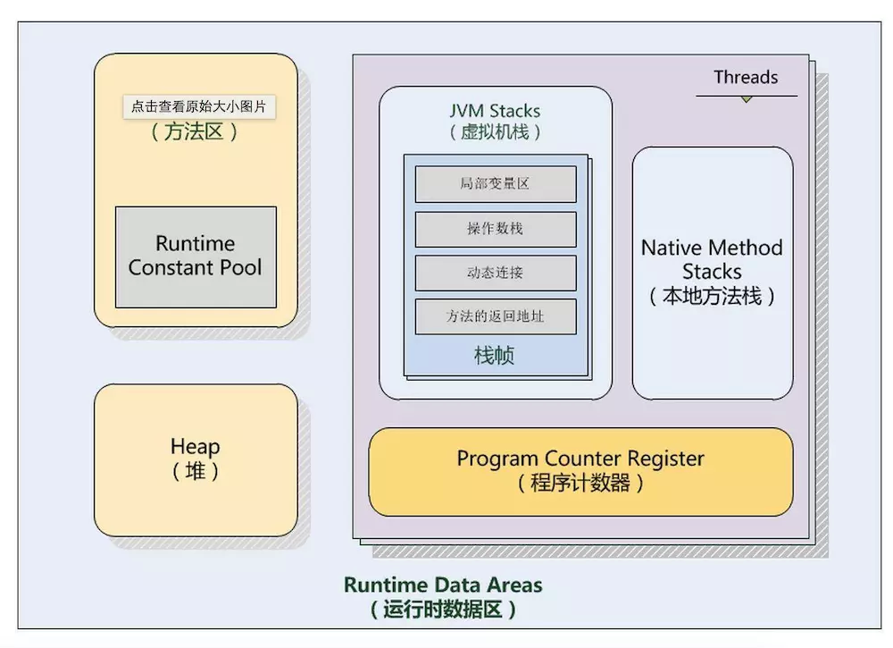

# Java运行时数据区

Java虚拟机在执行Java程序的过程中会将其管理的内存划分为不同的数据区域

## 介绍

### 程序计数器

用来确定下一条指令的地址。java虚拟机的多线程是通过轮流切换并分配处理器执行时间的方式来实现的，在一个确定的时刻只有一个处理器执行一条线程中的指令。为了在线程切换后能争取恢复到正确的执行位置，每个线程都有一个独立的程序计数器。因此程序计数器是线程私有的。

并且是唯一没有规定任何OOM情况的数据区域

### 虚拟机栈

它的生命周期与线程相同，与线程是同时创建的。每个方法被执行的时候都会创建一个栈帧，把栈帧压入栈，当方法正常返回或者抛出未捕获的异常时，栈帧就会出栈。

一个Java虚拟机栈包含了很多个栈帧。**一个栈帧用来存储局部变量表，操作数栈，动态链接，方法返回值等信息**

* 局部变量表：包含了方法执行过程中的所有变量。局部变量数组所需要的空间在编译期间完成分配，在方法运行期间不会改变局部变量数组的大小。
* 返回值：如果有返回值的话，压入调用者栈帧中的操作数栈中，并且把PC的值指向 方法调用指令 后面的一条指令地址。
* 操作数栈：操作变量的内存模型。操作数栈的最大深度在编译的时候已经确定（写入方法区code属性的max_stacks项中）。操作数栈的的元素可以是任意Java类型，包括long和double，32位数据占用栈空间为1，64位数据占用2。方法刚开始执行的时候，栈是空的，当方法执行过程中，各种字节码指令往栈中存取数据。
* 动态链接：每个栈帧都持有在运行时常量池中该栈帧所属方法的引用，持有这个引用是为了支持方法调用过程中的动态链接。

如果线程请求分配的栈容量超过Java虚拟机所允许的最大容量，则会抛出`StackOverflowError`

如果虚拟机动态扩展后，还是无法申请足够的内存，或者在创建新线程时，没有足够的内存创建虚拟机栈，也会抛出OOM异常

### 本地方法栈

虚拟机可能用到C来实现Native语言。它与虚拟机栈基本类似，也会抛出StackOverflowError和OOM

### 堆

几乎所有对象实例都在这里分配内存。存放new生成的对象和数组

是虚拟机管理的内存中最大的一块

是所有线程共享的区域

### 方法区

用于存储已被虚拟机加载的类信息、常量、静态变量、即时编译后的代码等数据。是线程共享的

#### 运行时常量池

Class文件不仅包含类的版本，接口，字段和方法等信息，还包含常量池，它用来存放编译时期生成的字面量和符号引用，这些内容会在类加载后存放在方法区的运行时常量池

