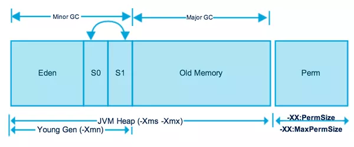

# 垃圾收集算法

在垃圾被标记后，GC会对垃圾进行收集，收集有很多算法

## 标记清除

标记清除算法分为两个阶段，标记阶段和清除阶段。

标记阶段任务是标记出所有需要回收的对象

清除阶段就是清除被标记对象的空间

缺点：效率低，容易产生碎片

## 复制算法

为了解决标记清除算法效率不高的问题，产生了复制算法

把内存区域分为两块相等的区域。每次只使用一个区域，在垃圾收集时，遍历当前使用的区域，把存货的对象复制到另外一个区域，最终将当前使用的区域进行回收。

缺点: 可用内存空间少；存活对象多的话，效率低下

## 标记整理算法

标记存活对象，并整理到内存的一端，然后对边界之外的内存进行回收

缺点: 内存利用率高；存活对象多并且分散的时候，移动次数多，效率低下

广泛用于老年代

## 分代算法

结合不同的收集算法来处理不同的空间。

Java堆基于分代的概念分为新生代，老年代。

新生代再细分为eden空间，from Survivor，To Survivor，比例默认为8：1：1

### 新生代

使用复制清除算法（Copinng算法），原因是年轻代每次GC都要回收大部分对象。新生代里面分成一份较大的Eden空间和两份较小的Survivor空间。每次只使用Eden和其中一块Survivor空间，然后垃圾回收的时候，把存活对象放到未使用的Survivor（划分出from、to）空间中，清空Eden和刚才使用过的Survivor空间。

内存不足时发生Minor GC

有两种情况，Minor GC存活的对象不会复制到另一个survivor去

一是分代年龄超过了阈值，直接移动到老年代

二是To survivor空间达到了阈值

### 老年代

用于存放经过几次Minor GC之后依旧存活的对象。当老年代的空间不足时，会触发Major GC/Full GC，速度一般比Minor GC慢10倍以上。会采用 标记压缩或者标记清除算法

