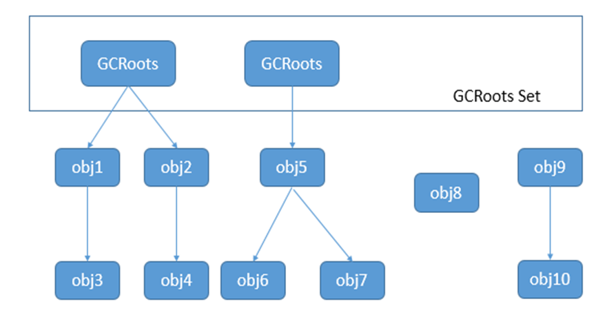

# 垃圾标记

垃圾收集器，通常被称作GC。GC要区分存活的对象和死亡的对象，并对垃圾进行回收。如何标记出垃圾呢？

分别有两种算法

* 引用计数法
* 根搜索算法

## 引用

java将引用分为强引用，软引用，弱引用和虚引用

1. 强引用 ——当我们新建一个对象时就创建了一个具有强引用的对象，如果一个对象具有强引用，垃圾收集器就绝不会回收它。Java虚拟机宁愿抛出OOM异常，使程序异常终止，也不会回收具有强引用的对象来解决内存不足的问题
2. 软引用SoftReference——如果一个对象只具有软引用，当内存不够时，会回收这些对象的内存，回收后如果还是没有足够的内存，就抛出OOM异常。
3. 弱引用WeakReference——比软引用具有更短的生命周期，垃圾收集器一旦发现了只具有弱引用的对象，不管当前内存是否足够，都会回收它的内存
4. 虚引用PhantomReference——如果一个对象仅持有虚引用，这就和没有任何引用一样，在任何时候都可能被垃圾收集器回收。一个只具有虚引用的对象，被垃圾收集器回收时就会收到一个系统通知，这也是虚引用的主要作用。

## 引用计数法

基本思想是每个对象都有一个引用技术器，被引用+1，引用失效-1，当为0是，该对象不能使用。但是无法解决相互引用的问题

## 根搜索算法

选定一些对象作为GC Roots，以这些Roots的对象作为起始点，向下搜索，搜索所走过的路径称为**引用链**，当一个对象到GC Roots没有任何引用链（即GC Roots到对象不可达）时，则证明此对象是不可用的

如何选取GCRoots对象呢？在Java语言中，可以作为GCRoots的对象包括下面几种：

1. 虚拟机栈（栈帧中的局部变量区，也叫做局部变量表）中引用的对象
2. 方法区中的类静态属性引用的对象
3. 方法区中常量引用的对象
4. 本地方法栈中JNI(Native方法)引用的对象

