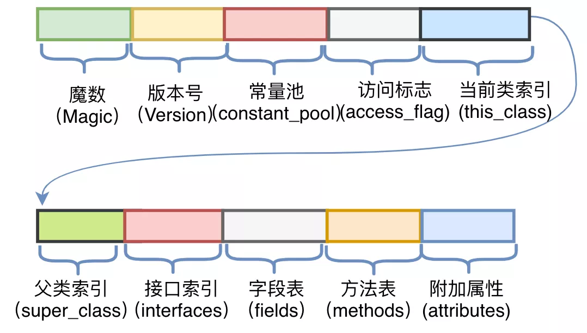

JVM对于字节码是有规范要求的，那么看似杂乱的十六进制符合什么结构呢？JVM规范要求每一个字节码文件都要由十部分按照固定的顺序组成

1. 魔数，固定值为：0xCAFEBABE，表示为java的class文件
2. 版本号  jdk的版本 例如1.8.0
3. 常量池。常量池中存储两类常量：字面量与符号引用。字面量为代码中声明为Final的常量值，符号引用如类和接口的全局限定名、字段的名称和描述符、方法的名称和描述符
4. 访问标志，描述该Class是类还是接口，以及是否被Public、Abstract、Final等修饰符修饰
5. 当前类名。描述的是当前类的全限定名。这两个字节保存的值为常量池中的索引值，根据索引值就能在常量池中找到这个类的全限定名
6. 父类名称。描述父类的全限定名，同上，保存的也是常量池中的索引值
7. 接口索引。描述了该类或父类实现的接口数量
8. 字段表。字段表用于描述类和接口中声明的变量，包含类级别的变量以及实例变量，但是不包含方法内部声明的局部变量
9. 方法表
10. 附加属性

参考：[字节码增强](https://mp.weixin.qq.com/s/CH9D-E7fxuu462Q2S3t0AA)

https://www.jianshu.com/p/2c106b682cfb?utm_source=desktop&utm_medium=timeline