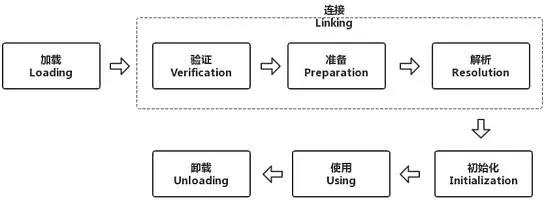

# 生命周期

Java类的生命周期就是指一个class文件从加载到卸载的全过程。一个java类的完整的生命周期会经历**加载、连接、初始化、使用、和卸载**五个阶段，当然也有在加载或者连接之后没有被初始化就直接被使用的情况

## 加载

“加载”是“类加载”过程的一个阶段，在加载阶段，虚拟机会找到需要加载的类并把**类的信息加载到jvm的方法区中**，然后在堆区中实例化一个java.lang.Class对象，作为方法区中这个类的信息的入口。

## 连接

 连接阶段比较复杂，一般会跟加载阶段和初始化阶段交叉进行，这个阶段的主要任务就是做一些加载后的验证工作以及一些初始化前的准备工作，可以细分为三个步骤：验证、准备和解析

1. **验证：**当一个类被加载之后，必须要验证一下这个类是否合法

2. **准备**：准备阶段的工作就是为类的静态变量分配内存并设为jvm默认的初值，对于非静态的变量，则不会为它们分配内存

3. **解析**：**这一阶段的任务就是把常量池中的符号引用转换为直接引用**

   比如我们要在内存中找一个类里面的一个叫做show的方法，显然是找不到。但是在解析阶段，jvm就会把show这个名字转换为指向方法区的的一块内存地址，比如c17164，通过c17164就可以找到show这个方法具体分配在内存的哪一个区域了。这里show就是符号引用，而c17164就是直接引用。**在解析阶段，jvm会将所有的类或接口名、字段名、方法名转换为具体的内存地址。**

## 初始化

类初始化阶段是类加载过程的最后一步，在准备阶段，变量已经赋过一次系统要求的初始值（零值），而在初始化阶段，则根据程序员通过程序制定的主观计划去初始化类变量和其他资源，或者更直接地说：`初始化阶段是执行类构造器<clinit>()方法的过程`。