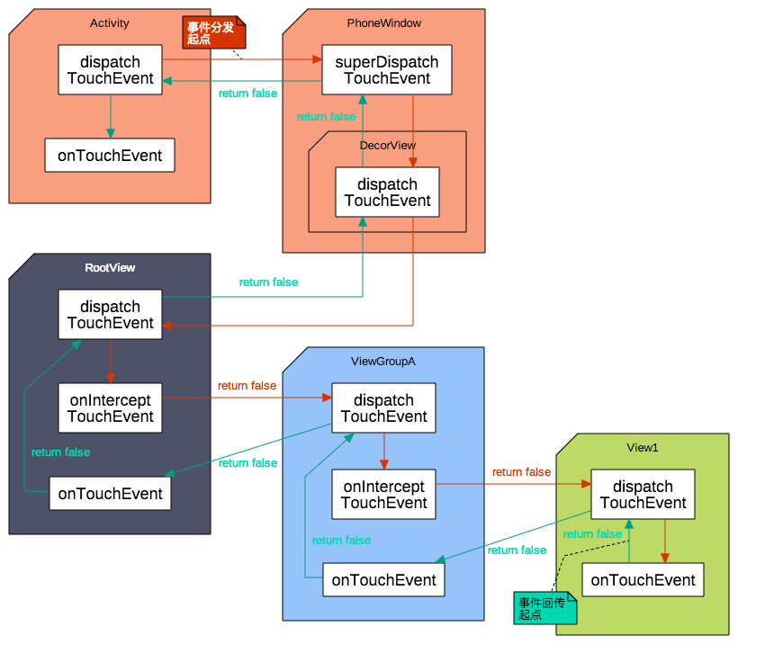

# MotionEvent

在手指接触屏幕时，会产生一系列事件，常见的有

- ACTION_DOWN —— 刚接触屏幕

- ACTION_MOVE —— 屏幕上移动

- ACTION_UP —— 离开屏幕

- ACTION_CANCEL

  只有父View 回收事件处理权的时候,ChildView 才会收到一个ACTION_CANCEL 事件.

  例如，上层 View 是一个 RecyclerView，它收到了一个 ACTION_DOWN 事件，由于这个可能是点击事件，所以它先传递给对应 ItemView，询问 ItemView 是否需要这个事件，然而接下来又传递过来了一个 ACTION_MOVE 事件，且移动的方向和 RecyclerView 的可滑动方向一致，所以 RecyclerView 判断这个事件是滚动事件，于是要收回事件处理权，这时候对应的 ItemView 会收到一个 ACTION_CANCEL ，并且不会再收到后续事件。

通过MotionEvent，我们可以得到点击事件发生的x和y坐标。系统提供了两组方法**getX/getY**和**getRawX/getRawY**


- getX 获取点击事件距离控件左边的距离
- getRawX 相对屏幕原点x轴方向上的距离


## 事件分发

**安卓上面的View是树形结构的，View可能会重叠在一起，当我们点击的地方有多个View都可以响应的时候，这个点击事件应该给谁呢？为了解决这一个问题，就有了事件分发机制。**

点击事件的分发过程由三个很重要的方法来共同完成

- public boolean dispatchTouchEvent(MotionEvent ev) 

  用来进行事件的分发。如果事件能够传递到该View，则此方法一定会调用。返回结果受当前onTouchEvent和下级的dispatchTouchEvent方法影响，表示是否消耗当前事件

- public  boolean onInterceptTouchEvent(MotionEvent ev)

  判断是否拦截事件。如果拦截了当前事件，那么同一序列中，此方法不再被调用。

- public boolean onTouchEvent(MotionEvent ev)

  用来处理点击事件。返回表示是否消耗，如果不消耗，则在同一序列中，当前View无法再接受到事件

三个方法的关系，伪代码如下

```
public boolean dispatchTouchEvent(MotionEvent ev) {
    boolean consume = false;
    if(onInterceptTouchEvent(ev)){
        consume = onTouchEvent(ev);
    }else{
        consume = child.dispatchTouchEvent(ev);
    }
    return consume;
}
```

关于事件分发的机制，这里有一些比较重要的结论：

1. 某个view一旦拦截，那么它的拦截方法不会再被调用。同一序列的事件均由该view处理
2. 某个view一旦开始处理，那么ACTION_DOWN事件必须消耗，否则同一事件序列里的其他事件将由父容器来处理了。
3. view没有拦截方法，传递到view,那么onTouchEvent必会调用
4. view的onTouchEvent默认会消耗事件，除非他是不可点击的clickable和longclickable均为false
5. view的enable属性不影响onTouchEvent默认返回
6. 通过requestDisallowInterceptTouchEvent可以在子元素中干预父元素的分发过程，但是ACTION_DOWN事件除外
7. View的事件的调度顺序是 onTouchListener > onTouchEvent > onLongClickListener > onClickListener 
8. ViewGroup默认不拦截任何事件


###  requestDisallowInterceptTouchEvent

事件从ViewGroup向子View分发的过程中，需要走一个判断，如果这个判断语句没有过，那么事件将被父布局给拦截掉，这个判断语句是：

> if(disallowIntercept || !onInterceptTouchEvent(ev))

其中disallowIntercept这个标志表示是否禁用事件拦截功能，默认情况都是false，所以一般情况下，是否拦截事件就得看后面的!onInterceptTouchEvent(ev) 这个语句的正负值了，假设我们把这里的onInterceptTouchEvent(ev) 重写并始终返回为true，那么子view将会永远得不到事件的分发，所有的事件都会被ViewGroup拦截。

根据源码，事件传递过来后，先进入父布局的disPatchTouchEvent()方法，第一个Action(ACTION_DOWN)的时候，首先调用了onInterceptTouchEvent方法，这个时候，还是返回的是false，所以事件被传递到了子View中，子View接收到后，第一时间将父布局的disallowIntercept 设置为true，所以当本次touch事件之后的action再次进入到父布局disPatchTouchEvent的时候，条件语句**if(disallowIntercept || !onInterceptTouchEvent(ev))** 始终为true，并且将忽略到面!onInterceptTouchEvent(ev) 的判断，导致之后的一切action都将被分发到子View中，除非在之后子View的onTouchEvent中将该disallowIntercept重新设置为false。

**用法简述**

首先ViewGroup要不拦截down事件，子View在处理down时，调用

```
parent.requestDisallowInterceptTouchEvent(true)
```

则ViewGroup即使拦截了Move事件，Move事件也会被子view处理

### 系统流程

我们的View是树形结构的，基于这样的结构，我们的事件可以进行有序的分发。事件收集之后最先传递给 Activity， 然后依次向下传递，大致如下

```
Activity －> PhoneWindow －> DecorView －> ViewGroup －> ... －> View
```

如果最后分发到View，如果这个View也没有处理事件怎么办，就这样让事件浪费掉？

当然不会啦，如果没有任何View消费掉事件，那么这个事件会按照反方向回传，最终传回给Activity，如果最后 Activity 也没有处理，本次事件才会被抛弃:

```
Activity <－ PhoneWindow <－ DecorView <－ ViewGroup <－ ... <－ View
```

View的事件分发机制实际上就是一个非常经典的`责任链模式`。




## 事件冲突

事件冲突分为3种场景

1. 外部滑动和内部滑动方向不一致
2. 外部滑动和内部滑动方向不一致
3. 上面两种嵌套

### 解决方式

页面中只要内外两层同时可以滑动，这个时候就会产生滑动冲突，有两种固定的思路来解决。

#### 外部拦截法

指点击事件都先经过父容器的拦截处理，如果父容器需要就拦截，如果不需要就不拦截。这样就可以解决滑动冲突了。这种方法比较符合点击事件的分发机制。外部拦截需要重写父容器的onInterceptTouchEvent方法。

```
public boolean onInterceptTouchEvent(MotionEvent ev){
    boolean intercepted = true;
    int x = ev.getX();
    int y = ev.getY();
    switch (ev.getAction()){
        case ACTION_DOWN:
           intercepted = false;
           break;
        case ACTION_MOVE:
           if(父容器需要){
               intercepted = true；
           }else{
               intercepted = false;
           }
           break;
        case ACTION_UP:
           intercepted = false;
           break;
    }
    return intercepted;
}
```

ACTION_DOWN这个事件，父容器必须返回false。因为父容器一旦拦截了ACTION_DOWN，后续的ACTION_MOVE，ACTION_UP都会直接交给父容器处理。这个时候没法再传递给子元素了；


#### 内部拦截法

指父容器不拦截任何事件，所有的事件都传递给子元素。如果子元素需要就直接消耗掉，否则都交由父容器处理。需要配合requestDisallowInterceptTouchEvent才能工作。

```
public boolean dispatchTouchEvent(MotionEvent ev){
    int x = ev.getX();
    int y = ev.getY();
    switch (ev.getAction()){
        case ACTION_DOWN:
           parent.requestDisallowInterceptTouchEvent(true);
           break;
        case ACTION_MOVE:
           if(父容器需要){
               parent.requestDisallowInterceptTouchEvent(false);
           }
           break;
        case ACTION_UP:
           break;
    }
    return super.dispatchTouchEvent(ev);
}
```

除了子元素需要做处理以外，父元素也要默认拦截除了ACTION_DOWN以外的其他事件，这样当子元素调用parent.requestDisallowInterceptTouchEvent(false)时，父元素才能继续拦截所需事件

```
public boolean onInterceptTouchEvent(MotionEvent ev){
    if(ev.getAction() == ACTION_DOWN){
        return false;
    }else{
        return true;
    }
}
```


