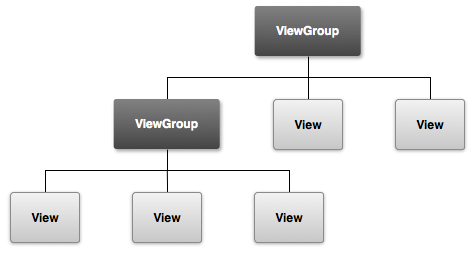

# View

在Android的视图控件中，不管是文本控件TextView或者按钮Button,还是复杂的RelativeLayout和列表ListView，他们的共同基类都是View。

```
public class LinearLayout extends ViewGroup{...}
public class RelativeLayout extends ViewGroup{...}
```

可以看到这些容器都继承自ViewGroup，再看ViewGroup类

```
public abstract class ViewGroup extends View implements ViewParent, ViewManager{...}
```

可以看到ViewGroup也是继承自View。那么ViewGroup为什么可以添加子控件呢？因为它实现了ViewManager接口

```
public interface ViewManager
{
    public void addView(View view, ViewGroup.LayoutParams params);
    public void updateViewLayout(View view, ViewGroup.LayoutParams params);
    public void removeView(View view);
}
```

由此构成了控件树



这种设计模式来自**组合模式**，类似文件和文件夹的关系


## LayoutParams

LayoutParams继承于`Android.View.ViewGroup.LayoutParams`相当于一个Layout的信息包，它**封装了Layout的位置、高、宽等信息**。假设在屏幕上一块区域是由一个Layout占领的，如果将一个View添加到一个Layout中，最好告诉Layout用户期望的布局方式，也就是将一个认可的LayoutParams传递进去。LayoutParams携带了子控件针对父控件的信息，告诉父控件如何放置自己。简单示例如下

```
TextView textView = new TextView(context);
ViewGroup.LayoutParams layoutParams = new ViewGroup.LayoutParams(ViewGroup.LayoutParams.MATCH_PARENT, ViewGroup.LayoutParams.MATCH_PARENT);
layoutParams.width=100;
layoutParams.height=200;
textView.setLayoutParams(layoutParams);
```

大多数ViewGroup具有为children设置外边距的能力，所以他们不是ViewGroup.LayoutParams的直接子类，而是MarginLayoutParams的子类。可以查看LinearLayout.LayoutParams的源代码

```
public static class LayoutParams extends ViewGroup.MarginLayoutParams { ...}
```

###### getLayoutParams()

因为LayoutParams跟封闭的ViewGroup直接相关，getLayoutParams可能返回一个null值。

**必须牢记，只有当View依附到ViewGroup时才能使用。尤其不能在View的构造函数中使用。**

示例如下

```
<LinearLayout xmlns:android="http://schemas.android.com/apk/res/android"
   android:id="@+id/outer_layout"
   android:layout_width="match_parent"
   android:layout_height="match_parent"
   android:orientation="vertical">
      <FrameLayout
           android:id="@+id/inner_layout"
          android:layout_width="match_parent"
          android:layout_height="50dp"
          android:layout_gravity="right"/>
</LinearLayout>
```

正确的用法

```
FrameLayout innerLayout = (FrameLayout)findViewById(R.id.inner_layout);
LinearLayout.LayoutParams par = (LinearLayout.LayoutParams) innerLayout.getLayoutParams();
```

错误的用法

```
FrameLayout innerLayout = (FrameLayout)findViewById(R.id.inner_layout);
FrameLayout.LayoutParams par = (FrameLayout.LayoutParams) innerLayout.getLayoutParams();
```

## 绘制

View是Android在视觉上的呈现。在界面上，安卓提供了一套GUI库，但是我们开发者并不满足系统的GUI库。我们需要通过自定义View来定制自己的空间。所以我们需要了解View的工作原理，比如View的**测量，布局和绘制**流程。

在ActivityThread中，当Activity对象被创建完毕后，会将DecorView添加到PhoneWindow中，同时创建ViewRootImpl对象，并将ViewRootImpl对象和DecorView建立连接。

WindowManagerGlobal的addView方法内:

```
ViewRootImpl root;
root = new ViewRootImpl(view.getContext(),display);
...
root.setView(view,wparams,panelParentView);
```

其中，ViewRootImpl是视图层次结构的顶部，实现视图跟WindowManager之间的协议。

```
 * The top of a view hierarchy, implementing the needed protocol between View
 * and the WindowManager.  This is for the most part an internal implementation
 * detail of {@link WindowManagerGlobal}.
public final class ViewRootImpl implements ViewParent,
        View.AttachInfo.Callbacks, ThreadedRenderer.DrawCallbacks{...}
```


**View的绘制流程是从ViewRootImpl的`performTraversals`方法开始的,经过measure，layout和draw三个过程将一个View绘制出来**。measure测量View的宽高，layout用来确定View在父容器中的位置，而draw则负责将View绘制在屏幕上。

`performTraversals`依次调用

1. `performMeasure`
2. `performLayout`
3. `performDraw`

```
    private void performMeasure(int childWidthMeasureSpec, int childHeightMeasureSpec) {
        if (mView == null) {
            return;
        }
        Trace.traceBegin(Trace.TRACE_TAG_VIEW, "measure");
        try {
            mView.measure(childWidthMeasureSpec, childHeightMeasureSpec);
        } finally {
            Trace.traceEnd(Trace.TRACE_TAG_VIEW);
        }
    }
```

`performMeasure方法`会调用作为根视图**DecorView的measure来遍历视图树**，在measure方法中会调用onMeasure对所有的子元素进行measure。这个时候measure流程就从父容器传递到子元素中了，这样就完成了measure过程。

同理`performLayout`和`performDraw`，只是draw方法是通过`dispatchDraw`方法来实现。