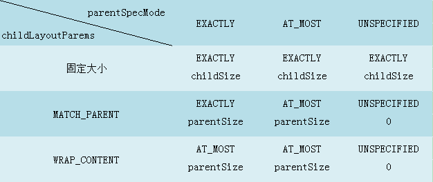
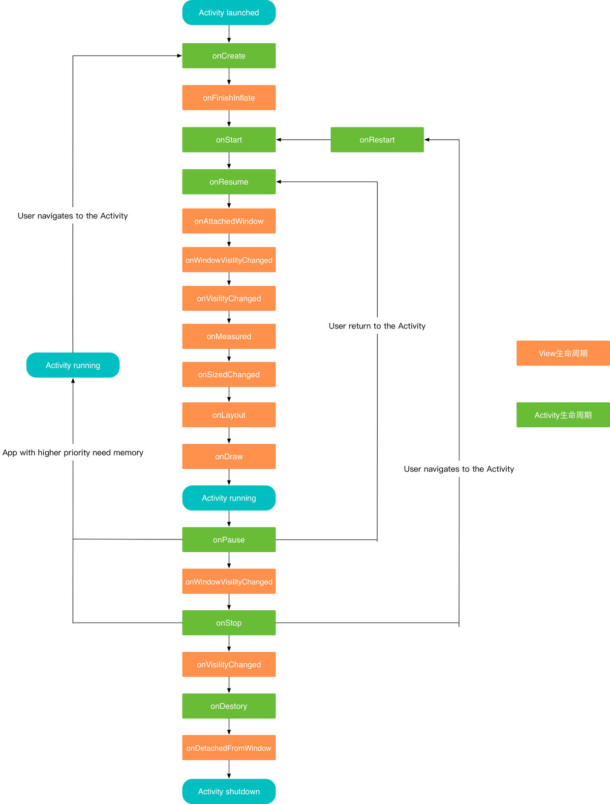

# onMeasure

## MeasureSpec测量规格

MeasureSpec在很大程度上决定了一个View的尺寸规格，它还受父容器的影响。系统会将view的LayoutParams根据父容器所时间的规则转换为对应的MeasureSpec，然后再根据这个measureSpec来测算出view的宽高。

MeasureSpec代表一个32位int值，高2位代表SpecMode，低30位代表SpecSize。SpecMode为测量模式，SpecSize指某种测量模式下的规格大小。

```
        /** @hide */
        @IntDef({UNSPECIFIED, EXACTLY, AT_MOST})
        @Retention(RetentionPolicy.SOURCE)
        public @interface MeasureSpecMode {}
        
        private static final int MODE_SHIFT = 30;
        public static final int UNSPECIFIED = 0 << MODE_SHIFT;

        public static final int EXACTLY     = 1 << MODE_SHIFT;

        public static final int AT_MOST     = 2 << MODE_SHIFT;
```

SpecMode有三类

- UNSPECIFIED**未指定模式**——不对view有任何限制，要多大给多大。如：ListView，ScrollView
- EXACTLY**精确模式**——父容器已经测量出View的精确大小，这个时候View的最终大小就是SpecSize指定的值。类似于数值或者LayoutParams的match_parent。
- AT_MOST**最大模式**——指定了一个可用的大小，即SpecSize，View的大小不能大于这个值。

它的几个重要方法

| 方法                                                         | 说明                   |
| ------------------------------------------------------------ | ---------------------- |
| **public** **static** **int** makeMeasureSpec(**int** size, **int** mode) | 根据size，mode生成spec |
| **public** **static** **int** getMode(**int** measureSpec)   | 根据spec获取mode       |
| **public** **static** **int** getSize(**int** measureSpec)   | 根据spec获取size       |


## View大小的测量过程

系统会将LayoutParams,即layout_width,layout_height在父容器的约束下转换成对应的MeasureSpec,从而确定View的测量后的宽高。

对于普通View来说，View的测量过程是由ViewGroup传递过来的，先看一看ViewGroup的`measureChildWithMargins`方法

```
 protected void measureChildWithMargins(View child,
            int parentWidthMeasureSpec, int widthUsed,
            int parentHeightMeasureSpec, int heightUsed) {
        final MarginLayoutParams lp = (MarginLayoutParams) child.getLayoutParams();

        final int childWidthMeasureSpec = getChildMeasureSpec(parentWidthMeasureSpec,
                mPaddingLeft + mPaddingRight + lp.leftMargin + lp.rightMargin
                        + widthUsed, lp.width);
        final int childHeightMeasureSpec = getChildMeasureSpec(parentHeightMeasureSpec,
                mPaddingTop + mPaddingBottom + lp.topMargin + lp.bottomMargin
                        + heightUsed, lp.height);

        child.measure(childWidthMeasureSpec, childHeightMeasureSpec);
    }

```

在调用`child.measure`前,会先通过`getChildMeasureSpec`来得到子元素的规格。很显然子元素的规格与`parentWidthMeasureSpec`以及`child.getLayoutParams()`有关。当然还有view的margin和padding。

接着我们看下`getChildMeasureSpec`方法

```
public static int getChildMeasureSpec(int spec, int padding, int childDimension) {
        int specMode = MeasureSpec.getMode(spec);
        int specSize = MeasureSpec.getSize(spec);

        int size = Math.max(0, specSize - padding);

        int resultSize = 0;
        int resultMode = 0;

        switch (specMode) {
     
        case MeasureSpec.EXACTLY:
            if (childDimension >= 0) {
                resultSize = childDimension;
                resultMode = MeasureSpec.EXACTLY;
            } else if (childDimension == LayoutParams.MATCH_PARENT) {
                resultSize = size;
                resultMode = MeasureSpec.EXACTLY;
            } else if (childDimension == LayoutParams.WRAP_CONTENT) 
                resultSize = size;
                resultMode = MeasureSpec.AT_MOST;
            }
            break;

        case MeasureSpec.AT_MOST:
            if (childDimension >= 0) {
                resultSize = childDimension;
                resultMode = MeasureSpec.EXACTLY;
            } else if (childDimension == LayoutParams.MATCH_PARENT) {
                resultSize = size;
                resultMode = MeasureSpec.AT_MOST;
            } else if (childDimension == LayoutParams.WRAP_CONTENT) {
                resultSize = size;
                resultMode = MeasureSpec.AT_MOST;
            }
            break;


        case MeasureSpec.UNSPECIFIED:
            if (childDimension >= 0) {
                resultSize = childDimension;
                resultMode = MeasureSpec.EXACTLY;
            } else if (childDimension == LayoutParams.MATCH_PARENT) {
                resultSize = View.sUseZeroUnspecifiedMeasureSpec ? 0 : size;
                resultMode = MeasureSpec.UNSPECIFIED;
            } else if (childDimension == LayoutParams.WRAP_CONTENT) {
                resultSize = View.sUseZeroUnspecifiedMeasureSpec ? 0 : size;
                resultMode = MeasureSpec.UNSPECIFIED;
            }
            break;
        }
        return MeasureSpec.makeMeasureSpec(resultSize, resultMode);
    }
```

从getChildMeasureSpec可以看出这个parent的measureSpec和子元素的layoutParams共同生成了子元素的measureSpec。可以得到这样一个规则表



简单来说:

1. child是固定dp的,那么child的大小就是这固定的值
2. child宽高是match_parent。
   - 如果父容器是精准模式Exactly,那么child也是精准模式，大小为parent的剩余空间。
   - 如果父容器是是AT_MOST,那么child也是AT_MOST,大小不超过parent的剩余空间
3. child宽高是wrap_content,那么child的mode就是最大化AT_MOST,并且不超过父容器的剩余空间。
   比如说如下CustomView只是继承自view,什么都没添加,那么肯定是占满整个屏幕。而如果是TextView则肯定不会,因为TextView在onMeasure肯定在AT_MOST的情况下修改了宽高值。所以自定义View的时候，需要在模式为AT_MOST的情况,告诉viewgroup自身的大小


## resloveSize

直接继承View时，自己去计算view的大小，然后通过`resolveSize`,再考虑下父控件给的尺寸大小，合成下结果,最后再保存**setMeasuredDimension**

```
public static int resolveSize(int size, int measureSpec) {
        return resolveSizeAndState(size, measureSpec, 0) & MEASURED_SIZE_MASK;
    }

    /**
     * Utility to reconcile a desired size and state, with constraints imposed
     * by a MeasureSpec. Will take the desired size, unless a different size
     * is imposed by the constraints. The returned value is a compound integer,
     * with the resolved size in the {@link #MEASURED_SIZE_MASK} bits and
     * optionally the bit {@link #MEASURED_STATE_TOO_SMALL} set if the
     * resulting size is smaller than the size the view wants to be.
     *
     * @param size How big the view wants to be.
     * @param measureSpec Constraints imposed by the parent.
     * @param childMeasuredState Size information bit mask for the view's
     *                           children.
     * @return Size information bit mask as defined by
     *         {@link #MEASURED_SIZE_MASK} and
     *         {@link #MEASURED_STATE_TOO_SMALL}.
     */
    public static int resolveSizeAndState(int size, int measureSpec, int childMeasuredState) {
        final int specMode = MeasureSpec.getMode(measureSpec);
        final int specSize = MeasureSpec.getSize(measureSpec);
        final int result;
        switch (specMode) {
            case MeasureSpec.AT_MOST:
                if (specSize < size) {
               //当specMode为AT_MOST，并且父控件指定的尺寸specSize小于View自己想要的尺寸时，
                //我们就会用掩码MEASURED_STATE_TOO_SMALL向量算结果加入尺寸太小的标记
                //这样其父ViewGroup就可以通过该标记其给子View的尺寸太小了，
                //然后可能分配更大一点的尺寸给子View
                    result = specSize | MEASURED_STATE_TOO_SMALL;
                } else {
                    result = size;
                }
                break;
            case MeasureSpec.EXACTLY:
                result = specSize;
                break;
            case MeasureSpec.UNSPECIFIED:
            default:
                result = size;
        }
        return result | (childMeasuredState & MEASURED_STATE_MASK);//还会返回state
    }
```

## getMeasuredWidth的调用时机

测量完成后，getMeasuredWidth就可以正确获得View的测量宽高。但是有时候会存在多次测量的情况。而且在onCreate，onStart和onResume中却无法得到宽/高信息，只会得到0，**因为View的生命周期与Activity不同步**



想得到正确的宽高，推荐通过

1. View.post(runnable)

2. 使用ViewTreeObserver监听view树

   ```
   ViewTreeObserver observer = view.getViewTreeObserver();
   observer.addOnGlobalLayoutListener(new ViewTreeObserver.OnGlobalLayoutListener() {
               @Override
               public void onGlobalLayout() {
                   view.getViewTreeObserver().removeOnGlobalLayoutListener(this);//记得移除监听
                   ...
               }
           });
   ```


**getMeasurewidth跟getWidth的区别**:两者的赋值时机不同。

## ViewGroup测量

由于每个ViewGroup对子View的有不同的布局特性，所以测量细节各不相同，因此ViewGroup无法统一实现。ViewGroup没有重写onMeasure，需要自己去实现，但它提供了一个measureChildren的方法。

