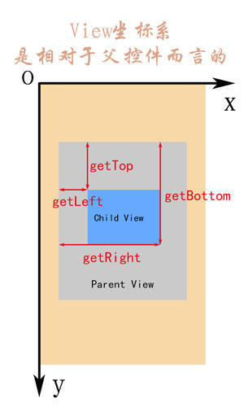

# 坐标系

## 屏幕坐标系

以屏幕左上角顶点为坐标系的原点。

1. 原点向右；X轴正方向
2. 原点向下； Y轴正方向

getRawX和getRawY获得的是Android坐标系的坐标

## View坐标系

View的位置由它的四个顶点来决定，分别对应View的四个属性:top,left,right,bottom；这些坐标都是相对于View的父容器来说的，因此它是相对坐标。

在android 3.0开始，View新增了额外几个参数：x,y,translationX和translationY。

- x，y左上角的顶点坐标

- translationX和translationY是View左上角相对于父容器的偏移量，默认一开始为0。

  当View有平移发生时，top与left表示的是原始左上角的位置信息，**不会发生改变**。此时变化的是translationX，translationY。

  > x = left + translationX；
  >
  > y = top + translationY；

