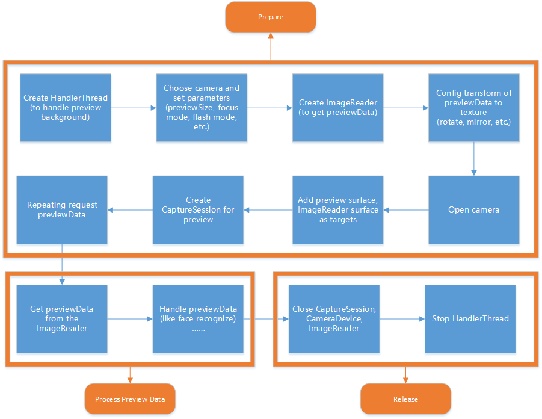

# Camera2

从AndroidV5.0(21)开始，Camera2 API加入，这些API大幅提高了安卓系统的拍照功能。

官方demo:https://github.com/googlearchive/android-Camera2Basic

官方文档:https://developer.android.google.cn/reference/android/hardware/camera2/package-summary?hl=en



## API分析

* **CameraManager** 

  摄像头管理器。这是一个全新的系统服务，专门用于检测系统摄像头、打开系统摄像头。可以通过`getSystemService(Context.CAMERA_SERVICE)`获取。

  另外，调用`CameraManager#getCameraCharacteristics(String cameraId)`方法即可获取指定摄像头的相关特性

* **CameraCharacteristics**

  摄像头特性。该对象通过CameraManager来获取，用于描述特定摄像头所支持的各种特性。类似与原来的CameraInfo 。

* **CameraDevice**

  代表系统摄像头。该类的功能类似于早期的Camera类。而每个 CameraDevice 自己会负责建立 CameraCaptureSession 以及建立 CaptureRequest

* **CameraCaptureSession**

  这是一个非常重要的API，当程序需要预览、拍照时，都需要先通过该类的实例创建Session。而且不管预览还是拍照，也都是由该对象的方法进行控制的，其中控制预览的方法为setRepeatingRequest()；控制拍照的方法为capture()。

  为了监听CameraCaptureSession的创建过程，以及监听CameraCaptureSession的拍照过程，Camera v2 API为CameraCaptureSession提供了StateCallback、CaptureCallback等内部类

* **CameraRequest和CameraRequest.Builder**

  当程序调用setRepeatingRequest()方法进行预览时，或调用capture()方法进行拍照时，都需要传入CameraRequest参数。CameraRequest代表了一次捕获请求，用于描述捕获图片的各种参数设置，比如对焦模式、曝光模式……总之，程序需要对照片所做的各种控制，都通过CameraRequest参数进行设置。CameraRequest.Builder则负责生成CameraRequest对象。

## demo分析

### 打开步骤

首先，在onResume里创建了HandleThread。

```
mBackgroundThread = new HandlerThread("CameraBackground");
mBackgroundThread.start();
mBackgroundHandler = new Handler(mBackgroundThread.getLooper());
```

同时打开相机camera。camera如何打开呢？通过CameraManager#openCamera方法

```
CameraManager manager = (CameraManager)getSystemService(Context.CAMERA_SERVICE);
try {
     if (!mCameraOpenCloseLock.tryAcquire(2500, TimeUnit.MILLISECONDS)) {
           throw new RuntimeException("Time out waiting to lock camera opening.");
     }
     manager.openCamera(mCameraId, mStateCallback, mBackgroundHandler);
     } catch (CameraAccessException e) {
     } catch (InterruptedException e) {
     }
```

这里主要是3个参数，backgroudHandler已经有了，而mStateCallback是一个是回调相机状态的匿名内部类

```
private final CameraDevice.StateCallback mStateCallback = new CameraDevice.StateCallback() {

        @Override
        public void onOpened(@NonNull CameraDevice cameraDevice) {
            mCameraOpenCloseLock.release();
            mCameraDevice = cameraDevice;
            createCameraPreviewSession();//创建session
        }

        @Override
        public void onDisconnected(@NonNull CameraDevice cameraDevice) {
            mCameraOpenCloseLock.release();
            cameraDevice.close();
            mCameraDevice = null;
        }

        @Override
        public void onError(@NonNull CameraDevice cameraDevice, int error) {
            mCameraOpenCloseLock.release();
            cameraDevice.close();
            mCameraDevice = null;
            Activity activity = getActivity();
            if (null != activity) {
                activity.finish();
            }
        }

    };
```

如何获取cameraId就是唯一需要考虑的。cameraId从哪里来呢？通过遍历manager#getCameraIdList

```
for (String cameraId : manager.getCameraIdList()) {
   
   ...
   mCameraId = cameraId;
   return;
}
```

接着相机打开成功后,调用`createCameraPreviewSession`

```
mPreviewRequestBuilder
           = mCameraDevice.createCaptureRequest(CameraDevice.TEMPLATE_PREVIEW);
mPreviewRequestBuilder.addTarget(surface);

mCameraDevice.createCaptureSession(Arrays.asList(surface),
                    new CameraCaptureSession.StateCallback() {

     @Override
     public void onConfigured(@NonNull CameraCaptureSession cameraCaptureSession) {
               // The camera is already closed
               if (null == mCameraDevice) {
                      return;
                }

               // When the session is ready, we start displaying the preview.
                mCaptureSession = cameraCaptureSession;
                try {
                    // Auto focus should be continuous for camera preview.
                    mPreviewRequestBuilder.set(CaptureRequest.CONTROL_AF_MODE,
                                  CaptureRequest.CONTROL_AF_MODE_CONTINUOUS_PICTURE);
                    // Flash is automatically enabled when necessary.
                    setAutoFlash(mPreviewRequestBuilder);

                     // Finally, we start displaying the camera preview.
                    mPreviewRequest = mPreviewRequestBuilder.build();
                    mCaptureSession.setRepeatingRequest(mPreviewRequest,
                                        mCaptureCallback, mBackgroundHandler);
                } catch (CameraAccessException e) {
                                e.printStackTrace();
                }
      }

      @Override
     public void onConfigureFailed(CameraCaptureSession cameraCaptureSession) {
            showToast("Failed");
      }
}, null);
```

通过`mCameraDevice#createCaptureRequest(CameraDevice.TEMPLATE_PREVIEW)`创建预览请求`CaptureRequest.Builder`。同时将添加目标surface，然后创建session。

当session准备就绪后，展示预览。最后通过setRepeatingRequest不断请求帧数据。其中第二个参数mCaptureCallback是用来处理拍照事件的


### 关闭步骤

关闭session，关闭device，关闭imageReader，停止backgroudThread

```
        try {
            mCameraOpenCloseLock.acquire();
            if (null != mSession) {
                mSession.close();
                mSession = null;
            }
            if (null != mDevice) {
                mDevice.close();
                mDevice = null;
            }
            if (null != imageReader) {
                imageReader.close();
                imageReader = null;
            }

        } catch (InterruptedException e) {
            throw new RuntimeException("Interrupted", e);
        } finally {
            mCameraOpenCloseLock.release();
        }
        
        
        mBackgroudThread.quitSafely();
        try {
            mBackgroudThread.join();
            mBackgroudThread = null;
            mBackgroundHandler = null;
        }catch (InterruptedException e){}
```


### ImageReader

Image类允许应用通过一个或多个ByteBuffers直接访问Image的像素数据， ByteBuffer包含在`Image.Plane`类中，同时包含了这些像素数据的配置信息。因为是作为提供raw数据使用的，Image不像Bitmap类可以直接填充到UI上使用。

因为Image的生产消费是跟硬件直接挂钩的，所以为了效率起见，Image如果不被使用了应该尽快的被销毁掉。比如说，当我们使用`ImageReader`从不用的媒体来源获取到Image的时候，如果Image的数量到达了`maxImages`，不关闭之前老的Image，新的Image就不会继续生产。

- close : 关掉当前帧for reuse。调用此方法后再调用其他Image的方法都会报`IllegalStateException` 
- getFormat : 获取当前Image的格式，format决定了Image需要提供的ByteBuffers数量和每个ByteBuffer的像素数量。这里还涉及到`Image.Plane`.
   Image.Plane : plane这里翻译为一个平面。通过作为一个数组返回，数组的数量由Image的格式决定，比如ImageFormat.JPEG返回的数组size就是1，ImageFormat.YUV_420_888返回的数字size就是3。一旦Image被关闭了，再去尝试获取plane的ByteBuffer将会失败。

| **Format**  | **Plane count** |
| ----------- | --------------- |
| JPEG        | 1               |
| YUV_420_888 | 3               |

在官方demo中，

```
mImageReader = ImageReader.newInstance(largest.getWidth(), largest.getHeight(),
                        ImageFormat.JPEG, 2);
mImageReader.setOnImageAvailableListener(
                        mOnImageAvailableListener, mBackgroundHandler);
```

然后在创建mPreviewRequestBuilder添加target->mIamgeReader#getSurface()。

```
private ImageReader.OnImageAvailableListener mOnImageAvailableListener = new ImageReader.OnImageAvailableListener() {
        @Override
        public void onImageAvailable(ImageReader reader) {
               //获取最新的一帧的Image
            Image image = reader.acquireLatestImage();
            //因为是ImageFormat.JPEG格式，所以 image.getPlanes()返回的数组只有一个，也就是第0个。
            ByteBuffer byteBuffer = image.getPlanes()[0].getBuffer();
            byte[] bytes = new byte[byteBuffer.remaining()];
            byteBuffer.get(bytes);
            //ImageFormat.JPEG格式直接转化为Bitmap格式。
            Bitmap temp = BitmapFactory.decodeByteArray(bytes, 0, bytes.length);
            //因为摄像机数据默认是横的，所以需要旋转90度。
            Bitmap newBitmap = BitmapUtil.rotateBitmap(temp, 90);
            //抛出去展示或存储。
            mOnGetBitmapInterface.getABitmap(newBitmap);
            //一定需要close，否则不会收到新的Image回调。
            image.close();
        }
    };
```

如果只是拍照或截取预览，这样的调用就足够了，当然如果是做实时美颜特效，这样是远远不够的，因为返回JPEG格式需要进行encode，时间必然会长，这时候就不能用JPEG了，我们需要用到前面提到的**ImageFormat.YUV_420_888**

我们只需要把YUV_420_888转化为ImageFormat.NV21就可以了。使用`YuvImage`就可以转化成Bitmap了。

### NV21 是啥？

`NV21` 是 `YUV420p` 的一种存储模式。存储顺序是先存 `Y`，再存 `U`，然后再 `VU` 交替存储。

### YUV 是啥？

YUV 是一种颜色编码方法，主要应用于电视系统和模拟视频领域。其中 YUV 代表三个分量，`Y` 代表**明亮度**，`U` 和 `V` 表示的是**色度**。

