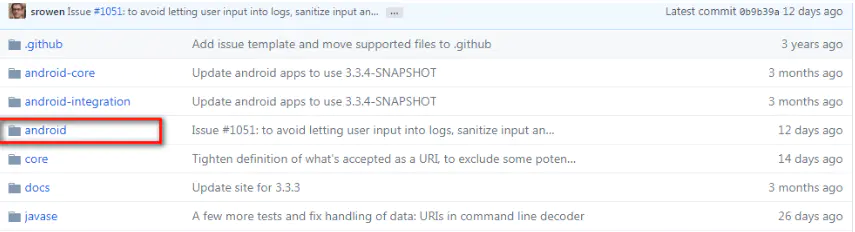
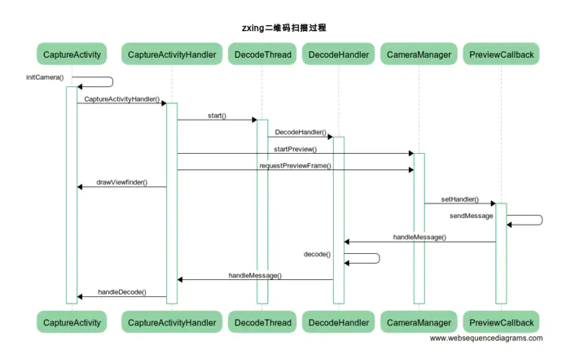

# 扫码服务

常见的扫码服务有zxing和zbar。zxing项目是谷歌推出的用来识别多种条形码的开源项目，主要是java代码。zbar则是基于c语言。


## 集成zxing

下载jar包:http://repo1.maven.org/maven2/com/google/zxing/core/3.3.3/

下载zxing库，直接已import module的形式导入下面的android工程



然后编译。编译的时候进行些修改。包括build.gradle

> ```bash
> 修改前
> apply plugin: 'com.android.application'
> 修改后
> apply plugin: 'com.android.library'
> ```

清单文件AndroidManifest.xml

在application标签加上`tools:replace=”icon,theme`,否则会报Execution failed for task ‘app:processDebugManifest’错误。同时去掉CaptureActivity的启动项。

build后会报错:Resource IDs cannot be used in a switch statement in Android library modules。在android项目的library module里不能使用资源ID作为switch语句的case值。为什么呢？因为switch里的case值必须是常数，而在library module的R文件里ID的值不是final类型的，但是主module的R文件里的ID值是final类型的，所以主module里可以用资源ID作为case值而library module却不能。那问题怎么解决呢？把switch-case转成if-else呗。接下来发现会少一个CameraConfigurationUtils类，这个就是刚才在android-core下的那一个类，把它拖到camera包下就好了。


## 源码分析

扫码过程基本分为两步走。一步是打开相机服务，第二步是对每一帧进行解码。基本流程如下



首先CaptureActivity 是主要的扫码界面,在onResume里面 1.初始化了CameraManager 初始化扫码框ViewfinderView。初始化SurfaceView。

```
 @Override
    protected void onResume() {
        super.onResume();
        cameraManager = new CameraManager(getApplication()); //1

        viewfinderView = (ViewfinderView) findViewById(R.id.viewfinder_content);
        viewfinderView.setCameraManager(cameraManager);

        SurfaceView surfaceView = (SurfaceView) findViewById(R.id.scanner_view);
        SurfaceHolder surfaceHolder = surfaceView.getHolder();
        if (hasSurface) {
            // The activity was paused but not stopped, so the surface still exists. Therefore
            // surfaceCreated() won't be called, so init the camera here.
            initCamera(surfaceHolder);
        } else {
            // Install the callback and wait for surfaceCreated() to init the camera.
            surfaceHolder.addCallback(this);
        }

    }
```

当SurfaceView create成功后会去初始化相机initCamera

```
@Override
  public void surfaceCreated(SurfaceHolder holder) {
    if (holder == null) {
      Log.e(TAG, "*** WARNING *** surfaceCreated() gave us a null surface!");
    }
    if (!hasSurface) {
      hasSurface = true;
      initCamera(holder);
    }
  }
```

在initCamera时,他又会创建了一个CaptureActivityHandler

```
private void initCamera(SurfaceHolder surfaceHolder) {
        if (surfaceHolder == null) {
            throw new IllegalStateException("No SurfaceHolder provided");
        }
        if (cameraManager.isOpen()) {
            Log.w(TAG, "initCamera() while already open -- late SurfaceView callback?");
            return;
        }
        try {
            cameraManager.openDriver(surfaceHolder);//先进行openDriver打开摄像头
            // Creating the handler starts the preview, which can also throw a RuntimeException.
            if (handler == null) {
                handler = new CaptureActivityHandler(this, decodeFormats, decodeHints, characterSet, cameraManager);
            }
        } catch (IOException ioe) {
            Log.w(TAG, ioe);
        } catch (RuntimeException e) {
            // Barcode Scanner has seen crashes in the wild of this variety:
            // java.?lang.?RuntimeException: Fail to connect to camera service
            Log.w(TAG, "Unexpected error initializing camera", e);
        }
    }
```

CaptureActivityHandler这个类继承自Handler，用来处理各种扫描解析的消息，在构造函数里做了一些事情。包括开启解码的线程并运行，开启预览。

```
 public CaptureActivityHandler(CaptureActivity activity,
                         Collection<BarcodeFormat> decodeFormats,
                         Map<DecodeHintType,?> baseHints,
                         String characterSet,
                         CameraManager cameraManager) {
    this.activity = activity;
    decodeThread = new DecodeThread(activity, decodeFormats, baseHints, characterSet,
        new ViewfinderResultPointCallback(activity.getViewfinderView()));
    decodeThread.start();
    state = State.SUCCESS;

    // Start ourselves capturing previews and decoding.
    this.cameraManager = cameraManager;
    cameraManager.startPreview();
    restartPreviewAndDecode();
  }
```

cameraManager#startPreview()实际是里面是调用了系统Camera类的startPreview()方法。而restartPreviewAndDecode方法就是不断发送解析消息给decodeThread进行解析

```
 private void restartPreviewAndDecode() {
    if (state == State.SUCCESS) {
      state = State.PREVIEW;
      cameraManager.requestPreviewFrame(decodeThread.getHandler(), R.id.decode);
      activity.drawViewfinder();
    }
  }

/**
   * A single preview frame will be returned to the handler supplied. The data will arrive as byte[]
   * in the message.obj field, with width and height encoded as message.arg1 and message.arg2,
   * respectively.
   *
   * @param handler The handler to send the message to.
   * @param message The what field of the message to be sent.
   */
  public synchronized void requestPreviewFrame(Handler handler, int message) {
    OpenCamera theCamera = camera;
    if (theCamera != null && previewing) {
      previewCallback.setHandler(handler, message);
      theCamera.getCamera().setOneShotPreviewCallback(previewCallback);
    }
  }
```

可以看到它是将decodeThread线程的handler和decode消息设置进previewCallback。previewCallback又是什么呢？

```
final class PreviewCallback implements Camera.PreviewCallback {

  private static final String TAG = PreviewCallback.class.getSimpleName();

  private final CameraConfigurationManager configManager;
  private Handler previewHandler;
  private int previewMessage;

  PreviewCallback(CameraConfigurationManager configManager) {
    this.configManager = configManager;
  }

  void setHandler(Handler previewHandler, int previewMessage) {
    this.previewHandler = previewHandler;
    this.previewMessage = previewMessage;
  }

  @Override
  public void onPreviewFrame(byte[] data, Camera camera) {
    Point cameraResolution = configManager.getCameraResolution();
    Handler thePreviewHandler = previewHandler;
    if (cameraResolution != null && thePreviewHandler != null) {
      Message message = thePreviewHandler.obtainMessage(previewMessage, cameraResolution.x,
          cameraResolution.y, data);
      message.sendToTarget();
      previewHandler = null;
    } else {
      Log.d(TAG, "Got preview callback, but no handler or resolution available");
    }
  }

}
```

PreviewCallback实现了Camera.PreviewCallback的onPreviewFrame接口。可以看到在回调方法onPreviewFrame中会将摄像头获取的数据byte数组，还有摄像头视觉的宽高封装到Message中发送给刚刚的DecodeThread去解析。

decodeThread它是一个thread。在该Thread的run函数中会新见一个消息队列，并用于解析条形码
其run函数如下

```
DecodeThread.java:

@Override
  public void run() {
    Looper.prepare();
    handler = new DecodeHandler(activity, hints);//在该子线程中新建一个消息队列，以接收数据并解析条形码的信息
    handlerInitLatch.countDown();
    Looper.loop();
  }
```

我们的解码过程其实是在在这个DecodeHandler里。decodeHandler会处理以下几种消息

```
@Override
  public void handleMessage(Message message) {
    if (message == null || !running) {
      return;
    }
    switch (message.what) {
      case R.id.decode:
        decode((byte[]) message.obj, message.arg1, message.arg2);
        break;
      case R.id.quit:
        running = false;
        Looper.myLooper().quit();
        break;
    }
  }
```

这个`decode`最终由算法部分来实现。


当然zxing里面还有很多其他细节，以及类。

- BeepManager 扫描成功后的手机震动和提示音管理器
- InactivityTimer 一段时间不操作(5分钟 ),关闭该应用(工具类)
- ViewfinderView SurferView相机预览界面(取景器矩形和部分透明,激光扫描仪点动画和结果)
- ViewfinderResultPointCallback SurferView相机预览回调
- CameraConfigurationManager 设置相机的参数信息类

