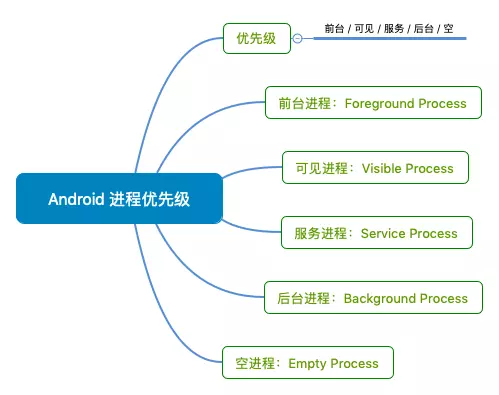

# 进程优先级

如果内存不足，需要为其他用户提供更紧急服务的进程又需要内存时，Android 可能会决定在某一时刻关闭某一进程。在被终止进程中运行的应用组件也会随之销毁。 当这些组件需要再次运行时，系统将为它们重启进程。

决定终止哪个进程时，Android 系统将权衡它们对用户的相对重要程度。例如，相对于托管可见 Activity 的进程而言，它更有可能关闭托管屏幕上不再可见的 Activity 的进程。 因此，是否终止某个进程的决定取决于该进程中所运行组件的状态。 下面，我们介绍决定终止进程所用的规则。

重要性层次结构一共有 5 级。以下列表按照重要程度列出了各类进程（第一个进程**最重要**）：

- 前台进程
- 可见进程
- 服务进程
- 后台进程
- 空进程



## LMK(LowMemoryKiller)

- 为什么引入 LMK ?

  进程的启动分冷启动和热启动，当用户退出某一个进程的时候，并不会真正的将进程退出，而是将这个进程放到后台，以便下次启动的时候可以马上启动起来，这个过程名为热启动，这也是Android 的设计理念之一。这个机制会带来一个问题，每个进程都有自己独立的内存地址空间，随着应用打开数量的增多, 系统已使用的内存越来越大，就很有可能导致系统内存不足。为了解决这个问题，系统引入 LowmemoryKiller (简称 lmk ) 管理所有进程，根据一定策略来 kill 某个进程并释放占用的内存，保证系统的正常运行。

- LMK 基本原理

  所有应用进程都是从 zygote 孵化出来的，记录在 AMS 中mLruProcesses 列表中，由 AMS 进行统一管理，AMS 中会根据进程的状态更新进程对应的 oom_adj 值，这个值会通过文件传递到 kernel 中去，kernel 有个低内存回收机制，在内存达到一定阀值时会触发清理 oom_adj 值高的进程腾出更多的内存空间

- LMK 杀进程标准

  minfree : 存放6个数值，单位内存页面数 ( 一个页面 4kb )

  > cat /sys/module/lowmemorykiller/parameters/minfree

得到的数值为：18432 , 23040 , 27648 , 32256 , 36864 , 46080

这 6 个数值分别代表 android 系统回收 6 种进程的阈值，这么看不方便查看，转换为 M 会更直观，这 6 个数值的单位为 page 1 page = 4 KB ,所以通过数值 * 4 / 1024 就能转换为M : 72 M , 90 M , 108 M , 126 M , 144 M , 180M

也就是说：

1.前台进程（foreground），2.可见进程（visible），3.次要服务（secondary server），4.后台进程（hidden），5.内容供应节点（content provider），6.空进程（empty）这6类进程进行回收的内存阈值分别为72M,90M,108M,126M,144M,180 M

当内存到 180 M的时候会将空进程进行回收，当内存到 144 M 的时候把空进程回收完以后开始对内容供应节点进行回收，并不是所有的内容供应节点都回收，而是通过判断它的优先级进行回收，优先级是用 oom_adj 的值来表示，值越大回收的几率越高

adj 查看:

```
cat /sys/module/lowmemorykiller/parameters/adj
```

查看进程 adj 值：

```
adb shell ps
```

值越低越不易被回收，0 代表就不会被回收。

内存阈值在不同的手机上不一样，一旦低于该值, Android 便开始按顺序关闭进程. 因此 Android 开始结束优先级最低的空进程，即当可用内存小于 180MB (46080)


## 方案

### Activity1像素保活法

原理：当手机关闭屏幕时，偷偷创建一个activity，然后让应用成为前台进程。接着当屏幕亮起时，关闭该activity

```
    @Override
    protected void onCreate(Bundle savedInstanceState) {
        super.onCreate(savedInstanceState);
        //设定一像素的activity
        Window window = getWindow();
        window.setGravity(Gravity.START | Gravity.TOP);
        WindowManager.LayoutParams params = window.getAttributes();
        params.x = 0;
        params.y = 0;
        params.height = 1;
        params.width = 1;
        window.setAttributes(params);
        //在一像素activity里注册广播接受者    接受到广播结束掉一像素
        br = new BroadcastReceiver() {
            @Override
            public void onReceive(Context context, Intent intent) {
                finish();
            }
        };
        registerReceiver(br, new IntentFilter("finish activity"));
        checkScreenOn("onCreate");
    }

同时注册监听广播Intent.ACTION_SCREEN_OFF,Intent.ACTION_SCREEN_ON来创建和关闭该activity
```

另外activity需要设置theme，背景透明

**缺点** 只有在锁屏的时候才提高优先级

```
 @Override
    public void onReceive(final Context context, Intent intent) {
        if (intent.getAction().equals(Intent.ACTION_SCREEN_OFF)) {    
           //屏幕关闭的时候接受到广播
            appIsForeground = IsForeground(context);
            try {
                Intent it = new Intent(context, OnePixelActivity.class);
                it.addFlags(Intent.FLAG_ACTIVITY_NEW_TASK);
                it.addFlags(Intent.FLAG_ACTIVITY_SINGLE_TOP);
                context.startActivity(it);
            } catch (Exception e) {
                e.printStackTrace();
            }
            //通知屏幕已关闭，开始播放无声音乐
            context.sendBroadcast(new Intent("_ACTION_SCREEN_OFF"));
        } else if (intent.getAction().equals(Intent.ACTION_SCREEN_ON)) {   
            //屏幕打开的时候发送广播  结束一像素
            context.sendBroadcast(new Intent("finish activity"));
            if (!appIsForeground) {
                appIsForeground = false;
                try {
                    Intent home = new Intent(Intent.ACTION_MAIN);
                    home.setFlags(Intent.FLAG_ACTIVITY_NEW_TASK);
                    home.addCategory(Intent.CATEGORY_HOME);
                    context.getApplicationContext().startActivity(home);
                } catch (Exception e) {
                    e.printStackTrace();
                }
            }
            //通知屏幕已点亮，停止播放无声音乐
            context.sendBroadcast(new Intent("_ACTION_SCREEN_ON"));
        }
    }
```


### 创建前台服务

```
class ForegroudService extends Service{
   public void onCreate(){
      super.onCreate()
      
      if(SDK_INT<18){
        startForeground(Service_id,new Notification())
      }else if(SDK_INT<vERSION_CODE.0){
        startForeground(Service_id,new Notification())
        startService(new Intent(this,InnerService.class))
      }else{
         //创建通知渠道
         //同时设置通知的重要性:None
      }
   }
   
   static class InnerService extends Service{
      public void onCreate(){
         startForeground(Service_id,new Notification())
         stopSelf()
      }
   }
}
```

注意如果开启 startForegroundService 前台服务，那么必须在 5 s内开启一个前台进程的服务通知栏,不会报 ANR

### 广播拉活(在 8.0 以下很受用)

在发生特定系统事件时，系统会发出广播，通过在 AndroidManifest 中静态注册对应的广播监听器，即可在发生响应事件时拉活。但是从android 7.0 开始，对广播进行了限制，而且在 8.0 更加严格。

以静态广播的形式注册

```
<receiver android:name=".receive.NotificationClickReceiver">
<intent-filter>
<action android:name="CLICK_NOTIFICATION"></action>
</intent-filter>
</receiver>
```

### 全家桶 拉活

有多个 app 在用户设备上安装，只要开启其中一个就可以将其他的app 也拉活。比如手机里装了手 Q、QQ 空间、兴趣部落等等，那么打开任意一个 app 后，其他的 app 也都会被唤醒。

### Service 机制拉活

将 Service 设置为 START_STICKY，利用系统机制在 Service 挂掉后自动拉活

只要 targetSdkVersion 不小于5，就默认是 START_STICKY。 但是某些 ROM 系统不会拉活。并且经过测试，Service 第一次被异常杀死后很快被重启，第二次会比第一次慢，第三次又会比前一次慢，一旦在短时间内 Service 被杀死 4-5 次，则系统不再拉起。

### 账号同步拉活（只做了解，不靠谱）

手机系统设置里会有 “帐户” 一项功能，任何第三方 APP 都可以通过此功能将数据在一定时间内同步到服务器中去。系统在将 APP 帐户同步时，会将未启动的 APP 进程拉活

### JobScheduler 拉活(靠谱，8.0 官方推荐)

JobScheduler 允许在特定状态与特定时间间隔周期执行任务。可以利用它的这个特点完成保活的功能,效果即开启一个定时器，与普通定时器不同的是其调度由系统完成。

注意 setPeriodic 方法 在 7.0 以上如果设置小于 15 min 不起作用，可以使用setMinimumLatency 设置延时启动，并且轮询

```
    public static void startJob(Context context) {
        try {
            mJobScheduler = (JobScheduler) context.getSystemService(
                    Context.JOB_SCHEDULER_SERVICE);
            JobInfo.Builder builder = new JobInfo.Builder(10,
                    new ComponentName(context.getPackageName(),
                            JobHandlerService.class.getName())).setPersisted(true);
            /**
             * I was having this problem and after review some blogs and the official documentation,
             * I realised that JobScheduler is having difference behavior on Android N(24 and 25).
             * JobScheduler works with a minimum periodic of 15 mins.
             *
             */
            if (Build.VERSION.SDK_INT >= Build.VERSION_CODES.N) {
                //7.0以上延迟1s执行
                builder.setMinimumLatency(KeepAliveConfig.JOB_TIME);
            } else {
                //每隔1s执行一次job
                builder.setPeriodic(KeepAliveConfig.JOB_TIME);
            }
            mJobScheduler.schedule(builder.build());

        } catch (Exception e) {
            Log.e("startJob->", e.getMessage());
        }
    }
```

### 推送拉活

根据终端不同，在小米手机（包括 MIUI）接入小米推送、华为手机接入华为推送。

### Native 拉活

Native fork 子进程用于观察当前 app 主进程的存亡状态。对于 5.0以上成功率极低。

### 后台循环播放一条无声文件

```
//如果选择流氓模式，就默认接收了耗电的缺点，但是保活效果很好。
if (mediaPlayer == null && KeepAliveConfig.runMode == RunMode.HIGH_POWER_CONSUMPTION) {
            mediaPlayer = MediaPlayer.create(this, R.raw.novioce);
            mediaPlayer.setVolume(0f, 0f);
            mediaPlayer.setOnCompletionListener(new MediaPlayer.OnCompletionListener() {
                @Override
                public void onCompletion(MediaPlayer mediaPlayer) {
                    Log.i(TAG, "循环播放音乐");
                    play();
                }
            });
            play();
        }
```

### 双进程守护 (靠谱)

两个进程相互绑定 (bindService），如果有其中一个进程被杀，那么另外一个进程就会将被杀的进程重新拉起