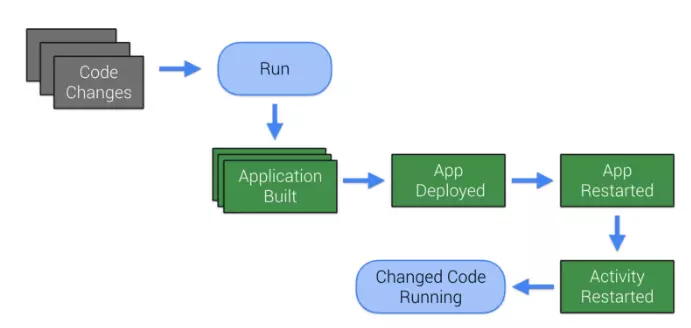
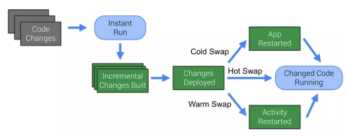
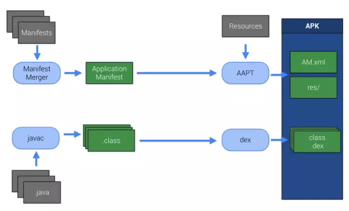
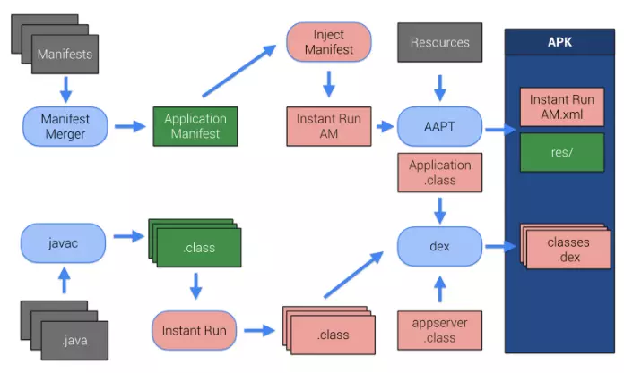
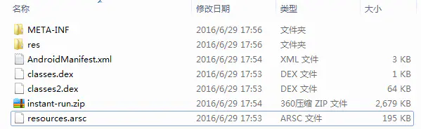

# Instant Run

Instant Run是android以后新增的一个运行机制，能够显著减少开发人员第二次及以后的构建和部署时间。

传统编译部署:



需要重装重启APP，会比较耗时。

Instant Run会避免这一情况



Instant Run主要分为三种类型，hot swap、warm swap和cold swap，Android Studio会根据代码的修改情况自动选择使用哪种swap类型，下面我们就来针对这三种swap类型详细地学习一下

- Hot swap ：代码的增量改变不需要重启app，甚至不需要重启当前的activity。修改一个现有方法中的代码时会采用hot swap
- Warm swap : app不需要重启，activity需要重启。修改或删除一个现有的资源文件时会采用Warm swap。
- cold swap ：app需要重启，但是不需要重新安装。采用cold swap情况有,比如添加，删除或修改一个字段和方法，添加一个类。manifest的修改需要冷插拔


## 原理

APK是manifest文件合并、打包，和res一起被AAPT合并到APK中，同样项目代码被编译成字节码，然后转换成.dex 文件，也被合并到APK中



在有Instant Run的环境下：一个新的App Server类会被注入到App中，与Bytecode instrumentation协同监控代码的变化。
同时会有一个新的Application类，它注入了一个自定义类加载器（Class Loader）,同时该Application类会启动我们所需的新注入的App Server。于是，Manifest会被修改来确保我们的应用能使用这个新的Application类。（这里不必担心自己继承定义了Application类，Instant Run添加的这个新Application类会代理我们自定义的Application类）
至此，Instant Run已经可以跑起来了，在我们使用的时候，它会通过决策，合理运用冷温热拔插来协助我们大量地缩短构建程序的时间。



###  1.第一次编译apk：

通过transform api把instant-run.jar和instant-run-bootstrap.jar打包到主dex中，然后会替换AndroidManifest.xml中的application配置，使用的是`bootstrapapplication`来代理我们的application，接着使用`asm`在每个类中添加`$change`字段，在每个方法前加入一段调用逻辑，最后把源代码编译成dex，然后存放到压缩包`instant-run.zip`中。



### 2.app运行期：

`bootstrapapplication`提供了2个方法，`attachBaseContext`和`onCreate`方法。在`attachBaseContext`方法中，

```
protected void attachBaseContext(Context context) {
       if (!AppInfo.usingApkSplits) {
            String apkFile = context.getApplicationInfo().sourceDir;
            long apkModified = apkFile != null ? new File(apkFile).lastModified() : 0L;
            createResources(apkModified);
            setupClassLoaders(context, context.getCacheDir().getPath(), apkModified);
       }
       createRealApplication();
       super.attachBaseContext(context);
       if (this.realApplication != null) {
            try {
                 Method attachBaseContext = ContextWrapper.class.getDeclaredMethod("attachBaseContext", new Class[] { Context.class });
                 attachBaseContext.setAccessible(true);
                 attachBaseContext.invoke(this.realApplication, new Object[] { context });
            } catch (Exception e) {
                 throw new IllegalStateException(e);
            }
      }
}
```

首先是获取资源`resource.ap_`的路径，

```
private void createResources(long apkModified) {
       FileManager.checkInbox();
       File file = FileManager.getExternalResourceFile();
       this.externalResourcePath = (file != null ? file.getPath() : null);
       if (Log.isLoggable("InstantRun", 2)) {
            Log.v("InstantRun", "Resource override is " + this.externalResourcePath);
       }
       if (file != null) {
            try {
                 long resourceModified = file.lastModified();
                 if (Log.isLoggable("InstantRun", 2)) {
                      Log.v("InstantRun", "Resource patch last modified: " + resourceModified);
                      Log.v("InstantRun", "APK last modified: " + apkModified
                           + " "
                           + (apkModified > resourceModified ? ">" : "<")
                           + " resource patch");
                 }
                 if ((apkModified == 0L) || (resourceModified <= apkModified)) {
                      if (Log.isLoggable("InstantRun", 2)) {
                            Log.v("InstantRun", "Ignoring resource file, older than APK");
                      }
                      this.externalResourcePath = null;
                 }
          } catch (Throwable t) {
                 Log.e("InstantRun", "Failed to check patch timestamps", t);
          }
     }
}
```

然后调用`setupClassLoader`方法将原有的BootClassLoader —> PathClassLoader改为BootClassLoader —> IncrementalClassLoader → PathClassLoader继承关系

```
private static void setupClassLoaders(Context context, String codeCacheDir, long apkModified) {
       List dexList = FileManager.getDexList(context, apkModified);
       Class server = Server.class;
       Class patcher = MonkeyPatcher.class;
       if (!dexList.isEmpty()) {
            if (Log.isLoggable("InstantRun", 2)) {
                 Log.v("InstantRun", "Bootstrapping class loader with dex list " + join('\n', dexList));
            }
            ClassLoader classLoader = BootstrapApplication.class.getClassLoader();
            String nativeLibraryPath;
            try {
                  nativeLibraryPath = (String) classLoader.getClass().getMethod("getLdLibraryPath", new Class[0]).invoke(classLoader, new Object[0]);
                  if (Log.isLoggable("InstantRun", 2)) {
                       Log.v("InstantRun", "Native library path: " + nativeLibraryPath);
                  }
            } catch (Throwable t) {
            Log.e("InstantRun", "Failed to determine native library path " + t.getMessage());
            nativeLibraryPath = FileManager.getNativeLibraryFolder().getPath();
      }
      IncrementalClassLoader.inject(classLoader, nativeLibraryPath, codeCacheDir, dexList); //inject方法是用来设置classloader的父子顺序的，使用IncrementalClassLoader来加载dex
      }
}
```

接着调用`createRealApplication`创建app真实的application，并获取真实application的生命周期。

```
private void createRealApplication() {
      if (AppInfo.applicationClass != null) {
           if (Log.isLoggable("InstantRun", 2)) {
                Log.v("InstantRun", "About to create real application of class name = " + AppInfo.applicationClass);
           }
           try {
               Class realClass = (Class) Class.forName(AppInfo.applicationClass);
               if (Log.isLoggable("InstantRun", 2)) {
                    Log.v("InstantRun", "Created delegate app class successfully : "
                    + realClass + " with class loader "
                    + realClass.getClassLoader());
               }
               Constructor constructor = realClass.getConstructor(new Class[0]);
               this.realApplication = ((Application) constructor.newInstance(new Object[0]));
               if (Log.isLoggable("InstantRun", 2)) {
                    Log.v("InstantRun", "Created real app instance successfully :" + this.realApplication);
               }
          } catch (Exception e) {
               throw new IllegalStateException(e);
          }
     } else {
          this.realApplication = new Application();
     }
}
```

看完`attachBaseContext`我们继续看`BootstrapApplication()`;

```
public void onCreate() {
      if (!AppInfo.usingApkSplits) {
           MonkeyPatcher.monkeyPatchApplication(this, this, this.realApplication, this.externalResourcePath);
           MonkeyPatcher.monkeyPatchExistingResources(this, this.externalResourcePath, null);// 1
      } else {
           MonkeyPatcher.monkeyPatchApplication(this, this, this.realApplication, null);
      }
      super.onCreate();
      if (AppInfo.applicationId != null) {
           try {
                boolean foundPackage = false;
                int pid = Process.myPid();
                ActivityManager manager = (ActivityManager) getSystemService("activity");
                List processes = manager.getRunningAppProcesses();
                boolean startServer = false;
                if ((processes != null) && (processes.size() > 1)) {
                      for (ActivityManager.RunningAppProcessInfo processInfo : processes) {
                           if (AppInfo.applicationId.equals(processInfo.processName)) {
                                 foundPackage = true;
                                 if (processInfo.pid == pid) {
                                       startServer = true;
                                       break;
                                 }
                           }
                      }
                      if ((!startServer) && (!foundPackage)) {
                           startServer = true;
                           if (Log.isLoggable("InstantRun", 2)) {
                                 Log.v("InstantRun", "Multiprocess but didn't find process with package: starting server anyway");
                           }
                      }
                } else {
                      startServer = true;
                }
                if (startServer) {
                      Server.create(AppInfo.applicationId, this);
                }
           } catch (Throwable t) {
                if (Log.isLoggable("InstantRun", 2)) {
                      Log.v("InstantRun", "Failed during multi process check", t);
                }
                Server.create(AppInfo.applicationId, this);
           }
      }
      if (this.realApplication != null) {
            this.realApplication.onCreate();
      }
}
```

而在onCreate方法中，依次执行`monkeyPatchApplication`（反射替换ActivityThread中的各种Application成员变量）、`monkeyPatchExistingResource`（反射替换所有存在的AssetManager对象）。最后会判断一个Server是否启动，没有启动则启动，Socket接收patch列表，并调用`realApplication#onCreate`方法。

```
public static void monkeyPatchExistingResources(Context context, String externalResourceFile, Collection activities) {
      if (externalResourceFile == null) {
            return;
      }
      try {
           AssetManager newAssetManager = (AssetManager) AssetManager.class.getConstructor(new Class[0]).newInstance(new Object[0]);
Method mAddAssetPath = AssetManager.class.getDeclaredMethod(
           "addAssetPath", new Class[] { String.class });
           mAddAssetPath.setAccessible(true);
           if (((Integer) mAddAssetPath.invoke(newAssetManager, new Object[] { externalResourceFile })).intValue() == 0) {
throw new IllegalStateException(
                "Could not create new AssetManager");
           }
           Method mEnsureStringBlocks = AssetManager.class.getDeclaredMethod("ensureStringBlocks", new Class[0]);
           mEnsureStringBlocks.setAccessible(true);
           mEnsureStringBlocks.invoke(newAssetManager, new Object[0]);
           if (activities != null) {
                for (Activity activity : activities) {
                      Resources resources = activity.getResources();
                      try {
                            Field mAssets = Resources.class.getDeclaredField("mAssets");
                            mAssets.setAccessible(true);
                            mAssets.set(resources, newAssetManager);
                      } catch (Throwable ignore) {
                            Field mResourcesImpl = Resources.class.getDeclaredField("mResourcesImpl");
                            mResourcesImpl.setAccessible(true);
                            Object resourceImpl = mResourcesImpl.get(resources);
                            Field implAssets = resourceImpl.getClass().getDeclaredField("mAssets");
                            implAssets.setAccessible(true);
                            implAssets.set(resourceImpl, newAssetManager);
                      }
                      Resources.Theme theme = activity.getTheme();
                      try {
                            try {
                                 Field ma = Resources.Theme.class.getDeclaredField("mAssets");
                                 ma.setAccessible(true);
                                 ma.set(theme, newAssetManager);
                            } catch (NoSuchFieldException ignore) {
                                 Field themeField = Resources.Theme.class.getDeclaredField("mThemeImpl");
                                 themeField.setAccessible(true);
                                 Object impl = themeField.get(theme);
                                 Field ma = impl.getClass().getDeclaredField("mAssets");
                                 ma.setAccessible(true);
                                 ma.set(impl, newAssetManager);
                            }
                                 Field mt = ContextThemeWrapper.class.getDeclaredField("mTheme");
                                 mt.setAccessible(true);
                                 mt.set(activity, null);
                                 Method mtm = ContextThemeWrapper.class.getDeclaredMethod("initializeTheme", new Class[0]);
                                 mtm.setAccessible(true);
                                 mtm.invoke(activity, new Object[0]);
                                 Method mCreateTheme = AssetManager.class.getDeclaredMethod("createTheme", new Class[0]);
                                 mCreateTheme.setAccessible(true);
                                 Object internalTheme = mCreateTheme.invoke(newAssetManager, new Object[0]);
                                 Field mTheme = Resources.Theme.class.getDeclaredField("mTheme");
                                 mTheme.setAccessible(true);
                                 mTheme.set(theme, internalTheme);
                         } catch (Throwable e) {
                                 Log.e("InstantRun", "Failed to update existing theme for activity " + activity, e);
                         }
                         pruneResourceCaches(resources);
                  }
           }
           Collection> references;
           if (Build.VERSION.SDK_INT >= 19) {
                 Class resourcesManagerClass = Class.forName("android.app.ResourcesManager");
                 Method mGetInstance = resourcesManagerClass.getDeclaredMethod("getInstance", new Class[0]);
                 mGetInstance.setAccessible(true);
                 Object resourcesManager = mGetInstance.invoke(null, new Object[0]);
                 try {
                      Field fMActiveResources = resourcesManagerClass.getDeclaredField("mActiveResources");
                      fMActiveResources.setAccessible(true);
                      <ArrayMap> arrayMap = (ArrayMap) fMActiveResources.get(resourcesManager);
                      references = arrayMap.values();
                 } catch (NoSuchFieldException ignore) {
                      Field mResourceReferences = resourcesManagerClass.getDeclaredField("mResourceReferences");
                      mResourceReferences.setAccessible(true);
                      references = (Collection) mResourceReferences.get(resourcesManager);
                 }
          } else {
                 Class activityThread = Class.forName("android.app.ActivityThread");
                 Field fMActiveResources = activityThread.getDeclaredField("mActiveResources");
                 fMActiveResources.setAccessible(true);
                 Object thread = getActivityThread(context, activityThread);
                 <HashMap> map = (HashMap) fMActiveResources.get(thread);
                 references = map.values();
          }
          for (WeakReference wr : references) {
                 Resources resources = (Resources) wr.get();
                 if (resources != null) {
                      try {
                            Field mAssets = Resources.class.getDeclaredField("mAssets");
                            mAssets.setAccessible(true);
                            mAssets.set(resources, newAssetManager);
                      } catch (Throwable ignore) {
                            Field mResourcesImpl = Resources.class.getDeclaredField("mResourcesImpl");
                            mResourcesImpl.setAccessible(true);
                            Object resourceImpl = mResourcesImpl.get(resources);
                            Field implAssets = resourceImpl.getClass().getDeclaredField("mAssets");
                            implAssets.setAccessible(true);
                            implAssets.set(resourceImpl, newAssetManager);
                      }
                      resources.updateConfiguration(resources.getConfiguration(), resources.getDisplayMetrics());
               }
        }
   } catch (Throwable e) {
        throw new IllegalStateException(e);
   }
}
```

monkeyPatchExistingResources的流程如下：

1.如果resource.ap_文件有改变，那么新建一个AssetManager对象newAssetManager，然后用newAssetManager对象替换所有当前Resource、Resource.Theme的mAssets成员变量。

2.如果当前的已经有Activity启动了，还需要替换所有Activity中mAssets成员变量

### 3.部署：

1. 首先生成对应的$override类，`instant-run`提供一个AppPatchesLoaderImpl类，记录修改的类列表，
2. 然后打包成patch，通过socket传递给app，
3. app的server接收到patch之后，分别按照handleColdSwapPatch、handleHotSwapPatch、handleResourcePatch对patch进行处理，
4. restart使patch生效。

而处理的步骤由Server的内部类SocketServerReplyThread完成

```
private class SocketServerReplyThread extends Thread {
    private final LocalSocket mSocket;

    SocketServerReplyThread(LocalSocket socket) {
        this.mSocket = socket;
    }

    public void run() {
        try {
            DataInputStream input = new DataInputStream(this.mSocket.getInputStream());
            DataOutputStream output = new DataOutputStream(this.mSocket.getOutputStream());
            try {
                handle(input, output);
            } finally {
                try {
                    input.close();
                } catch (IOException ignore) {
                }
                try {
                    output.close();
                } catch (IOException ignore) {
                }
            }
            return;
        } catch (IOException e) {
            if (Log.isLoggable("InstantRun", 2)) {
                Log.v("InstantRun", "Fatal error receiving messages", e);
            }
        }
    }

    private void handle(DataInputStream input, DataOutputStream output) throws IOException {
        long magic = input.readLong();
        if (magic != 890269988L) {
            Log.w("InstantRun", "Unrecognized header format " + Long.toHexString(magic));
            return;
        }
        int version = input.readInt();
        output.writeInt(4);
        if (version != 4) {
            Log.w("InstantRun", "Mismatched protocol versions; app is using version 4 and tool is using version " + version);
        } else {
            int message;
            for (; ; ) {
                message = input.readInt();
                switch (message) {
                    case 7:
                        if (Log.isLoggable("InstantRun", 2)) {
                            Log.v("InstantRun", "Received EOF from the IDE");
                        }
                        return;
                    case 2:
                        boolean active = Restarter.getForegroundActivity(Server.this.mApplication) != null;
                        output.writeBoolean(active);
                        if (Log.isLoggable("InstantRun", 2)) {
                            Log.v("InstantRun", "Received Ping message from the IDE; returned active = " + active);
                        }
                        break;
                    case 3:
                        String path = input.readUTF();
                        long size = FileManager.getFileSize(path);
                        output.writeLong(size);
                        if (Log.isLoggable("InstantRun", 2)) {
                            Log.v("InstantRun", "Received path-exists(" + path + ") from the " + "IDE; returned size=" + size);
                        }
                        break;
                    case 4:
                        long begin = System.currentTimeMillis();
                        path = input.readUTF();
                        byte[] checksum = FileManager.getCheckSum(path);
                        if (checksum != null) {
                            output.writeInt(checksum.length);
                            output.write(checksum);
                            if (Log.isLoggable("InstantRun", 2)) {
                                long end = System.currentTimeMillis();
                                String hash = new BigInteger(1, checksum)
                                        .toString(16);
                                Log.v("InstantRun", "Received checksum(" + path
                                        + ") from the " + "IDE: took "
                                        + (end - begin) + "ms to compute "
                                        + hash);
                            }
                        } else {
                            output.writeInt(0);
                            if (Log.isLoggable("InstantRun", 2)) {
                                Log.v("InstantRun", "Received checksum(" + path
                                        + ") from the "
                                        + "IDE: returning ");
                            }
                        }
                        break;
                    case 5:
                        if (!authenticate(input)) {
                            return;
                        }
                        Activity activity = Restarter
                                .getForegroundActivity(Server.this.mApplication);
                        if (activity != null) {
                            if (Log.isLoggable("InstantRun", 2)) {
                                Log.v("InstantRun",
                                        "Restarting activity per user request");
                            }
                            Restarter.restartActivityOnUiThread(activity);
                        }
                        break;
                    case 1:
                        if (!authenticate(input)) {
                            return;
                        }
                        List changes = ApplicationPatch
                                .read(input);
                        if (changes != null) {
                            boolean hasResources = Server.hasResources(changes);
                            int updateMode = input.readInt();
                            updateMode = Server.this.handlePatches(changes,
                                    hasResources, updateMode);
                            boolean showToast = input.readBoolean();
                            output.writeBoolean(true);
                            Server.this.restart(updateMode, hasResources,
                                    showToast);
                        }
                        break;
                    case 6:
                        String text = input.readUTF();
                        Activity foreground = Restarter
                                .getForegroundActivity(Server.this.mApplication);
                        if (foreground != null) {
                            Restarter.showToast(foreground, text);
                        } else if (Log.isLoggable("InstantRun", 2)) {
                            Log.v("InstantRun",
                                    "Couldn't show toast (no activity) : "
                                            + text);
                        }
                        break;
                }
            }
        }
    }
}
```

socket开启后，开始读取数据，当读到1时，获取代码变化的ApplicationPatch列表，然后调用handlePatches来处理代码的变化

```
private int handlePatches(List changes,
                          boolean hasResources, int updateMode) {
    if (hasResources) {
        FileManager.startUpdate();
    }
    for (ApplicationPatch change : changes) {
        String path = change.getPath();
        if (path.endsWith(".dex")) {
            handleColdSwapPatch(change);
            boolean canHotSwap = false;
            for (ApplicationPatch c : changes) {
                if (c.getPath().equals("classes.dex.3")) {
                    canHotSwap = true;
                    break;
                }
            }
            if (!canHotSwap) {
                updateMode = 3;
            }
        } else if (path.equals("classes.dex.3")) {
            updateMode = handleHotSwapPatch(updateMode, change);
        } else if (isResourcePath(path)) {
            updateMode = handleResourcePatch(updateMode, change, path);
        }
    }
    if (hasResources) {
        FileManager.finishUpdate(true);
    }
    return updateMode;
}
```

说明：本方法主要通过判断Change的内容，来判断采用什么模式（热部署、温部署或冷部署）

- 如果后缀为“.dex”,冷部署处理handleColdSwapPatch
- 如果后缀为“classes.dex.3”,热部署处理handleHotSwapPatch
- 其他情况,温部署，处理资源handleResourcePatch

**handleColdSwapPatch**:该方法把dex文件写到私有目录，等待整个app重启，重启之后，使用前面提到的IncrementalClassLoader加载dex即可

```
private static void handleColdSwapPatch(ApplicationPatch patch) {
    if (patch.path.startsWith("slice-")) {
        File file = FileManager.writeDexShard(patch.getBytes(), patch.path);
        if (Log.isLoggable("InstantRun", 2)) {
            Log.v("InstantRun", "Received dex shard " + file);
        }
    }
}
```

**handleHotSwapPatch**该方法将patch的dex文件写入到临时目录，然后使用DexClassLoader去加载dex。然后反射调用AppPatchesLoaderImpl类的load方法

```
private int handleHotSwapPatch(int updateMode, ApplicationPatch patch) {
    if (Log.isLoggable("InstantRun", 2)) {
        Log.v("InstantRun", "Received incremental code patch");
    }
    try {
        String dexFile = FileManager.writeTempDexFile(patch.getBytes());
        if (dexFile == null) {
            Log.e("InstantRun", "No file to write the code to");
            return updateMode;
        }
        if (Log.isLoggable("InstantRun", 2)) {
            Log.v("InstantRun", "Reading live code from " + dexFile);
        }
        String nativeLibraryPath = FileManager.getNativeLibraryFolder()
                .getPath();
        DexClassLoader dexClassLoader = new DexClassLoader(dexFile,
                this.mApplication.getCacheDir().getPath(),
                nativeLibraryPath, getClass().getClassLoader());
        Class aClass = Class.forName(
                "com.android.tools.fd.runtime.AppPatchesLoaderImpl", true,
                dexClassLoader);
        try {
            if (Log.isLoggable("InstantRun", 2)) {
                Log.v("InstantRun", "Got the patcher class " + aClass);
            }
            PatchesLoader loader = (PatchesLoader) aClass.newInstance();
            if (Log.isLoggable("InstantRun", 2)) {
                Log.v("InstantRun", "Got the patcher instance " + loader);
            }
            String[] getPatchedClasses = (String[]) aClass
                    .getDeclaredMethod("getPatchedClasses", new Class[0])
                    .invoke(loader, new Object[0]);
            if (Log.isLoggable("InstantRun", 2)) {
                Log.v("InstantRun", "Got the list of classes ");
                for (String getPatchedClass : getPatchedClasses) {
                    Log.v("InstantRun", "class " + getPatchedClass);
                }
            }
            if (!loader.load()) {
                updateMode = 3;
            }
        } catch (Exception e) {
            Log.e("InstantRun", "Couldn't apply code changes", e);
            e.printStackTrace();
            updateMode = 3;
        }
    } catch (Throwable e) {
        Log.e("InstantRun", "Couldn't apply code changes", e);
        updateMode = 3;
    }
    return updateMode;
}
```


## 总结

### 第一次编译apk：

1. 把Instant-Run.jar和instant-Run-bootstrap.jar打包到主dex中
2. 替换AndroidManifest.xml中的application配置
3. 使用asm工具，在每个类中添加$change，在每个方法前加逻辑
4. 把源代码编译成dex，然后存放到压缩包instant-run.zip中

### app运行期：

1. 获取更改后资源resource.ap_的路径
2. 设置ClassLoader。setupClassLoader：
    使用IncrementalClassLoader加载apk的代码，将原有的BootClassLoader → PathClassLoader改为BootClassLoader → IncrementalClassLoader → PathClassLoader继承关系。
3. createRealApplication：
    创建apk真实的application
4. monkeyPatchApplication
    反射替换ActivityThread中的各种Application成员变量
5. monkeyPatchExistingResource
    反射替换所有存在的AssetManager对
6. 调用realApplication的onCreate方法
7. 启动Server，Socket接收patch列表

### 有代码修改时

1. 生成对应的$override类
2. 生成AppPatchesLoaderImpl类，记录修改的类列表
3. 打包成patch，通过socket传递给app
4. app的server接收到patch之后，分别按照handleColdSwapPatch、handleHotSwapPatch、handleResourcePatch等待对patch进行处理
5. restart使patch生效

