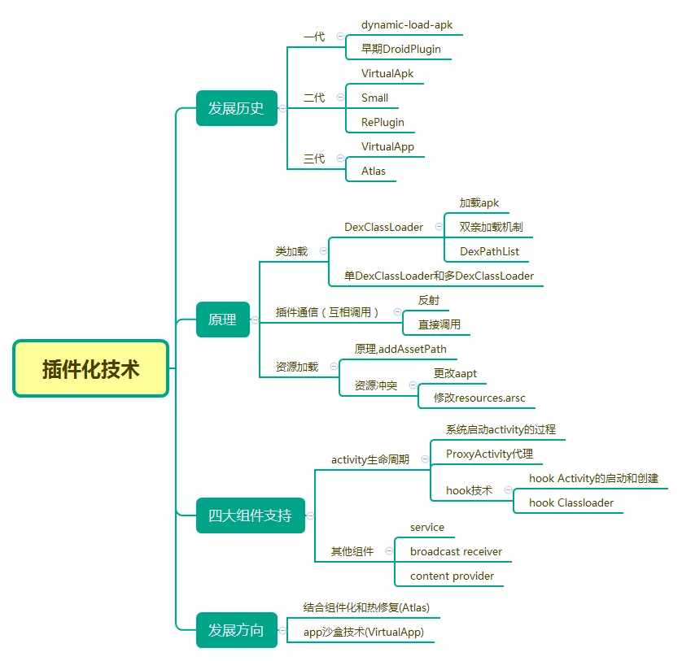

## 动态加载

动态加载分为两种技术，分别是热修复和插件化技术

传统开发中，一旦应用的代码被打包成apk文件，就不能修改源码。当程序发生崩溃，开发者只能通过发新版本才能解决崩溃。

另外大型APP，如支付宝，集成了多个应用(如饿了么，滴滴)的功能，如果全部安装应用，势必造成apk体积过大。

所以，动态加载方案成为热门

## 插件化历史

## 热修复

### 代码修复

一种是阿里的底层替换，一种是腾讯的类加载方案

底层替换限制多，但时效性最好，加载快

类加载时效差，需要重新启动才能生效，修复范围广，限制少

#### 底层替换

底层替换方案是在已经加载了的类中直接替换掉原有方法，是在原来类的基础上进行修改的，因而无法实现对与原有类进行方法和字段的增减，因为这样将破坏原有类的结构

一旦补丁类中出现了方法的增加和减少，就会导致这个类以及整个dex的方法数的变化。方法数的变化伴随着方法索引的变化，这样在访问方法时就无法正常地索引到正确的方法了。如果字段发生了增加和减少，和方法变化的情况一样，所有字段的索引都会发生变化，并且更严重的问题时，如果在程序运行中间某个类突然增加了一个字段，那么对于原先已经产生的这个类的实例，它们还是原来的结构，这是无法改变的，而新方法使用到这些老的实例对象时，访问新增字段就会产生不可预期的结果。

#### 类加载

原理时在app重新启动后让ClassLoader去加载新的类，因为app运行到一半的时候，所有需要发生变更的类已经被加载过了，在安卓中无法对一个类进行卸载。只有在下次重启的时候在还没有走到业务逻辑前抢先加载补丁中的新类，这样后续访问这个类时，就会Resolve为新类，从而达到热修复的目的。

### 资源修复

都是参考Instant Run的实现

Instant Run的实现分为两步

1. 构建一个新的AssetManager，并通过反射调用addAssetPath，把这个完整的新资源包加入到AssetManager中，这样就得到一个含有所有资源的`AssetManager`

2. 找到之前引用到原有AssetManager的地方，通过反射，把引用替换为AssetManager

### So修复

修复本质是对native方法的修复和替换

采用的是类似类修复反射注入方式，把补丁so库的路径插入到nativeLibraryDirectories数组的最前面，就能够加载so库的时候是补丁so库，而不是原来so库的目录，从而达到修复目的

