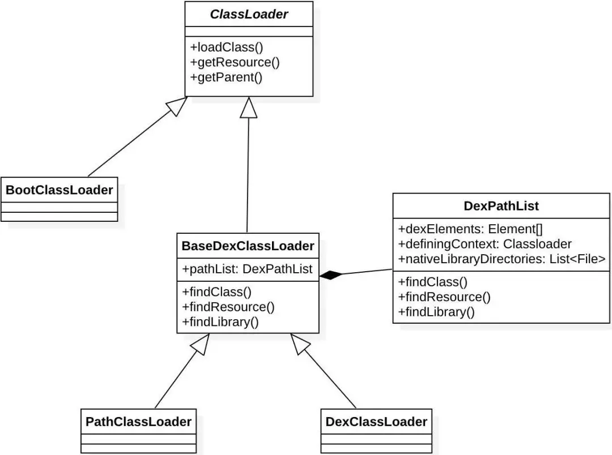

## 	ClassLoader

Java中的classLoader可以加载jar文件和Class文件。而在android中，无论DVM还是ART加载的都不是Class文件，而是dex文件。

Android中的classLoader类型和java中的classLoader类似，也分为两种类型，一种**系统类加载器和自定义加载器**。

## 系统类加载器

系统类加载器包含3种，BootClassLoader，PathClassLoader，DexClassLoader



### BootClassLoader

libcore/ojluni/src/main/java/java/lang/ClassLoader.java 的内部类

由java实现，会加载Activity，Service等系统SDK类。他的访问修饰符时默认的，只有同一个包中才可以访问。

并且它是单例的


### DexClassLoader

```
public class DexClassLoader extends BaseDexClassLoader {
    public DexClassLoader(String dexPath, String optimizedDirectory, String librarySearchPath, ClassLoader parent) {
        super((String)null, (File)null, (String)null, (ClassLoader)null);
        throw new RuntimeException("Stub!");
    }
}
```

参数

1. dexPath: dex文件路径
2. optimizedDirectory 解压的dex文件存储路径，必须是内部存储路径
3. librarySearchPath 包含C/C++库的路径集合
4. parent 父加载器

### PathClassLoader

libcore/dalvik/src/main/java/dalvik/system/

加载系统类和应用程序的类

```
public class PathClassLoader extends BaseDexClassLoader {
    public PathClassLoader(String dexPath, ClassLoader parent) {
        super((String)null, (File)null, (String)null, (ClassLoader)null);
        throw new RuntimeException("Stub!");
    }

    public PathClassLoader(String dexPath, String librarySearchPath, ClassLoader parent) {
        super((String)null, (File)null, (String)null, (ClassLoader)null);
        throw new RuntimeException("Stub!");
    }
}
```

继承自BaseDexClassLoader。

PathClassLoader默认了参数optimizedDirectory的值为`/data/dalvik-cache`

与DexClassLoader除了构造方法没有很大的区别。都是用来加载已经安装的apk的dex文件


## 加载过程

android同样遵守双亲委派模式。具体代码可见ClassLoader.java的LoadClass方法

```
    protected Class<?> loadClass(String name, boolean resolve)
        throws ClassNotFoundException
    {
            // First, check if the class has already been loaded
            Class<?> c = findLoadedClass(name);
            if (c == null) {
                try {
                    if (parent != null) {
                        c = parent.loadClass(name, false);
                    } else {
                        c = findBootstrapClassOrNull(name);
                    }
                } catch (ClassNotFoundException e) {
                    // ClassNotFoundException thrown if class not found
                    // from the non-null parent class loader
                }

                if (c == null) {
                    // If still not found, then invoke findClass in order
                    // to find the class.
                    c = findClass(name);
                }
            }
            return c;
    }
```

首先检查class A是否已经被加载，如果没有加载，就去判断父加载器是否存在，存在就调用父加载器的loadClass方法。否则调用findBootstrapClassOrNull。如果父加载器未加载，就调用findClass。

------

现在我们假设加载一个自定义的类。

通常应用程序 只有两种类加载器 **PathClassLoader**和**BootClassLoader**。

可以在activity中打印

```
activity.getClassLoader()    == PathClassLoader
activity.getClassLoader.getParent   ==  BootClassLoader
```

BootClassLoader前面说过加载的系统的SDK类，所以这个自定义的类由PathClassLoader加载。

重点的方法在落在`findClass`上。

PathClassLoader是没有这个方法，该方法由BaseDexClassLoader实现

```
 @Override
    protected Class<?> findClass(String name) throws ClassNotFoundException {
        List<Throwable> suppressedExceptions = new ArrayList<Throwable>();
        Class c = pathList.findClass(name, suppressedExceptions);
        if (c == null) {
            ClassNotFoundException cnfe = new ClassNotFoundException(
                    "Didn't find class \"" + name + "\" on path: " + pathList);
            for (Throwable t : suppressedExceptions) {
                cnfe.addSuppressed(t);
            }
            throw cnfe;
        }
        return c;
    }
```

可以看到方法中通过pathList来findClass。PathList是DexPathList的实例。

```
private final DexPathList pathList;
public BaseDexClassLoader(String dexPath, File optimizedDirectory,
        String librarySearchPath, ClassLoader parent) {
        super(parent);
        this.pathList = new DexPathList(this, dexPath, librarySearchPath, null);

        if (reporter != null) {
            reporter.report(this.pathList.getDexPaths());
        }
    }
```

他的findClass方法实现

```
    private Element[] dexElements;
    public Class<?> findClass(String name, List<Throwable> suppressed) {
        for (Element element : dexElements) {
            Class<?> clazz = element.findClass(name, definingContext, suppressed);
            if (clazz != null) {
                return clazz;
            }
        }

        if (dexElementsSuppressedExceptions != null) {
            suppressed.addAll(Arrays.asList(dexElementsSuppressedExceptions));
        }
        return null;
    }
```

遍历数组dexElements。调用Element的findClass方法

Element内部有成员DexFile，用于加载dex。他的findClass会调用 `loadClassBinaryName `

来调用Native方法。


概述流程

1. BaseDexClassLoader.findClass
2. DexPathList.findClass
3. 遍历DexElement数组，调用Element.findClass
4. 由Element的成员DexFile实现`loadClassBinaryName `