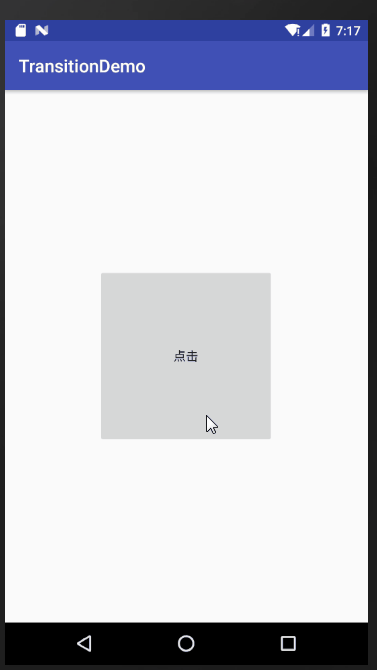

# 揭露动画

使用揭露动画非常简单，Android Sdk 中已经帮我们提供了一个工具类 ViewAnimationUtils 来创建揭露动画。ViewAnimationUtils里面只有一个静态方法 `createCircularReveal(View view, int centerX, int centerY, float startRadius, float endRadius)`，返回一个 Animator 动画对象

```
public final class ViewAnimationUtils {
    private ViewAnimationUtils() {}
    /**
     * ......
     * @param view The View will be clipped to the animating circle.
     * @param centerX The x coordinate of the center of the animating circle, relative to
     *                <code>view</code>.
     * @param centerY The y coordinate of the center of the animating circle, relative to
     *                <code>view</code>.
     * @param startRadius The starting radius of the animating circle.
     * @param endRadius The ending radius of the animating circle.
     */
    public static Animator createCircularReveal(View view,
            int centerX,  int centerY, float startRadius, float endRadius) {
        return new RevealAnimator(view, centerX, centerY, startRadius, endRadius);
    }
}
```

`ViewAnimationUtils.createCircularReveal()` 方法能够为裁剪区域添加动画以揭露或隐藏视图。我们主要使用 createCircularReveal 方法， 该方法有四个参数:

- 第一个参数是执行揭露动画的 View 视图
- 第二个参数是相对于视图 View 的坐标系，动画圆的中心的x坐标
- 第三个参数是相对于视图 View 的坐标系，动画圆的中心的y坐标
- 第四个参数是动画圆的起始半径
- 第五个参数动画圆的结束半径。

------

值得注意的是:显示揭露对象时并不是在动画监听方法的 `onAnimationEnd `里进行的。首先揭露对象要先于动画开始前显示，因为如果动画开始时，要揭露的对象处于隐藏状态，那么动画就不会有效果，因为隐藏状态是看不到效果的。所以不能 在动画结束的回调里才设置 View VISIBLE，这时动画已经结束了不会看到任何效果了。

从ImageView的中心揭露显示出一张图片，示例代码如下

```
 int x = mImageView.getWidth()/2;
 int y = mImageView.getHeight()/2;
 Animator animator = ViewAnimationUtils.createCircularReveal(mImageView,x,y,0,300);
 animator.setDuration(2000);
 animator.setInterpolator(new AccelerateDecelerateInterpolator());
 mImageView.setVisibility(View.VISIBLE);
 animator.start();
```

另外，如果想在view绘制时就开始执行揭露动画,需要在View树绘制回调中开始执行动画

```
mImageView.getViewTreeObserver().addOnPreDrawListener(new ViewTreeObserver.OnPreDrawListener() {
            @Override
            public boolean onPreDraw() {
                mImageView.getViewTreeObserver().removeOnPreDrawListener(this);//移除 避免多次执行
                animator.start();
                return true;
            }
        });
```

# SVG和VectorDrawable

SVG 即可缩放矢量图形 (Scalable Vector Graphics) ，是使用 XML 来描述二维图形和绘图程序的语言。

相较我们通常使用的png，jpg等格式的位图（Bitmap），SVG拥有体积相对较小，通过描述的形式记录形状，因此可以适应各种大小分辨率而不会失真。

而在Android中，我们不能直接使用原始的 .svg 格式图片，而是需要将其转化为 `VectorDrawable`，可以理解为一个XML格式的svg文件，即矢量图形在android中的原始资源。


# AnimatedVectorDrawable 

`VectorDrawable `用来支持矢量图，而 `AnimatedVectorDrawable`用来支持矢量图动画


# StateListAnimator 

我们可以用selector选择器给view设置不同状态下的背景效果。举一个实际的例子来说明，按下一个按钮button，这个时候button的大小变小。然后放手时button又恢复原来大小。一般的思路就是onTouch事件里，在action down和action up时添加相应代码。不过在 Api Level 21 之后，我们可以通过 StateListAnimator 来实现 Material Design 的按下效果，并且低版本没有崩溃


## 步骤

1. 在 res 中创建一个 animator 目录,在该目录下新建xml;标签是selector

2. 在xml中定义objectAnimator动画

   ```
   <selector xmlns:android="http://schemas.android.com/apk/res/android">
       <item android:state_pressed="true">
           <set>                 <!--存在多个 Animator ，可以使用 <set/> 标签将其包裹起-->
               <objectAnimator
                   android:interpolator="@android:anim/accelerate_interpolator"
                   android:duration="200"
                   android:propertyName="scaleX"
                   android:valueFrom="1"
                   android:valueTo="0.85"
                   android:valueType="floatType">
   
               </objectAnimator>
               <objectAnimator
                   android:interpolator="@android:anim/accelerate_interpolator"
                   android:duration="200"
                   android:propertyName="scaleY"
                   android:valueFrom="1"
                   android:valueTo="0.85"
                   android:valueType="floatType">
   
               </objectAnimator>
           </set>
       </item>
   
       <item>
           <set>
               <objectAnimator
                   android:interpolator="@android:anim/accelerate_interpolator"
                   android:duration="200"
                   android:propertyName="scaleX"
                   android:valueFrom="0.85"
                   android:valueTo="1"
                   android:valueType="floatType">
   
               </objectAnimator>
               <objectAnimator
                   android:interpolator="@android:anim/accelerate_interpolator"
                   android:duration="200"
                   android:propertyName="scaleY"
                   android:valueFrom="0.85"
                   android:valueTo="1"
                   android:valueType="floatType">
   
               </objectAnimator>
           </set>
       </item>
   </selector>
   
   ```

   

3. 用android:stateListAnimator给View引用`“@animator/XXX”`，或者`setStateListAnimator(AnimatorInflater.loadStateListAnimator(this,R.animator.XXX)) `方法

即可实现如下效果



# Lottie

Airbnb最近开源了一个名叫`Lottie`的动画库,它能够同时支持iOS,Android与ReactNative的开发。可以说,Lottie的出现,将极大地解放Android/iOS工程师于无尽的编写原生自定义动画的工作中。当我们的项目中用GIF实现一些复杂的视觉效果的时候,会遇到许多的问题.比如,GIF的文件过于庞大,并且对于不同分辨率设备的适配存在不便,并且Gif格式的色深问题是一个死穴。设计这些动画效果显然不是写代码的程序员应该负责的事情.那有没有什么办法,能让美工在AE软件上设计的动画直接用于移动端呢?有的,那就是使用`Lottie.`

能够将AE中的动画工程文件转换成通用的json格式描述文件，通过这个开源库，客户端只需要加载json文件，就可以实现复杂的动画效果。

可以参考Lottie的[github地址](https://github.com/airbnb/lottie-android)，也可以去看[官方文档](http://airbnb.io/lottie/android/android.html)。素材可以在[lottiefiles网站](https://lottiefiles.com/?page=1)中下载。


# 阻尼动画SpringAnimation

http://www.jcodecraeer.com/a/anzhuokaifa/androidkaifa/2017/0330/7757.html

它主要是为了让实现弹性动画变得更加方便，其实facebook在很久以前的[Rebound](http://facebook.github.io/rebound/)库就实现了这样的动画，而且效果非常好


# AlphaPlayer

字节跳动开源了一个视频动画特效的SDK，可以通过制作Alpha通道分离的视频素材，再在客户端通过openGL ES制作实现alpha通道和RGB通道的混合，实现在端上播放带透明通道的视频