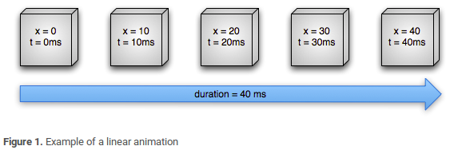
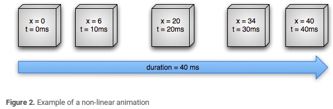

# 属性动画

属性动画是API 11新加入的特性，它对作用对象进行了扩展，属性动画可以对任何对象做动画，甚至没有对象。属性动画不再像View动画那样只能支持四种简单的变化。在一定时间间隔内，属性动画通过不断对值进行改变，并不断将该值赋给对象的属性，从而实现该对象在该属性上的动画效果。而不同于View动画只是改变了视觉效果

比较重要的属性动画类：`ValueAnimator`，`ObjectAnimator`和`AnimatorSet`。其中ObjectAnimator继承自ValueAnimator；AnimatorSet是动画集合，可以定义一组动画。

## 基本使用

如何使用属性动画呢？

1. 改变一个对象的translationY属性，让其沿着Y轴向上平移。

   ```
   ObjectAnimator.ofFloat(myObject,"translationY",-myObject.getHeight()).start();
   ```

   注意:需要myObject对象中有translationY这个成员。该动画在默认时间呢完成。

2. 改变一个对象的背景色属性，实现背景色在3秒内从0xFFFF8080到0xFF8080FF的渐变，动画会无限循环而且会有反转效果  

   ```
   ValueAnimator anim = ObjectAnimator.ofArgb(this,"backgroundColor"
                       ,0xFFFF8080,0xFF8080FF);
   anim.setDuration(3000);
   anim.setEvaluator(new ArgbEvaluator());
   anim.setRepeatCount(ValueAnimator.INFINITE);
   anim.setRepeatMode(ValueAnimator.REVERSE);
   anim.start();
   ```

3. 动画集合，5秒内对View的旋转，平移，缩放都进行改变

   ```
   AnimatorSet set = new AnimatorSet();
   set.playTogether(
      ObjectAnimator.ofFloat(myView,"rotationX",0,360),
      ObjectAnimator.ofFloat(myView,"translationX",0,90),
      ObjectAnimator.ofFloat(myView,"scaleX",1,0.5f)
   );
   set.setDuration(5*1000).start();
   
   或者
   set.play(animator1)
      .with(animator2)
      .before(animator3)
      .after(animator 4)
      .start();
   ```

### xml

除了代码实现外，还可以通过XML来定义，需要定义在res/animator/目录下。语法如下

```
<set xmlns:android="http://schemas.android.com/apk/res/android"
    android:ordering="[together/sequentially]">  
    
    <objectAnimator   对应objectAnimator
        android:propertyName="string"  
        android:duration="int"  
        android:valueFrom="[float|int|color]"
        android:valueTo="[float|int|color]"
        android:startOffset="int"  动画延迟时间
        android:repeatCount="int"   默认0, -1代表无限循环
        android:repeatMode="[restart|reverse]"
        android:valueType="[intType|floatType]"/> 


     <animator   对应ValueAnimator 但是没有propertyName属性
             ..../>
             
</set>
```

- android:ordering——together 同时播放；sequentially集合中的顺序播放
- android:startOffset——动画延迟时间
- android:propertyName—— 对象的属性名称
- android:valueType——propertyName属性的类型
- android:repeatCount——默认0, -1代表无限循环
- android:repeatMode——重复模式,**连续重复**或**逆向重复**

如何使用定义的属性动画呢？

```
Animator animator = AnimatorInflater.loadAnimator(context, R.animator.set_animation); 
// 载入XML动画 
animator.setTarget(view); // 设置动画对象 
animator.start();
```

## 插值器和估值器

初始值经过一段时间后，会变化为结束值。变化的速率，以及当前时间的数值离不开插值器和估值器

- TimeInterpolator：翻译为时间插值器，根据时间流逝的百分比来计算出当前属性值改变的百分比。
- TypeEvaluator：类型估值器，用于定义属性值计算方式的接口，有 int、float、color 类型，根据属性的起始、结束值和插值一起计算出当前时间的属性值

------



上图，在40ms内，x的属性从0匀速变化到40。



上面是一个非匀速动画，描述了一个 Object 的 X 属性运动动画，该对象的 X 坐标在 40ms 内从 0 移动到 40，每 10ms 刷新一次，移动4次，但是速率不同，开始和结束的速度要比中间部分慢，即先加速后减速。

------

ValueAnimator 会根据已经完成的动画时间计算得到一个 0 到 1 之间的分数，代表该动画的已完成动画百分比。 0 表示 0%，1 表示 100%，譬如上面图一线性匀速动画中总时间 t = 40 ms，t = 10 ms 的时候是 0.25。

当 ValueAnimator 计算完已完成动画分数后，它会调用当前设置的 TimeInterpolator， 去计算得到一个 interpolated（插值）分数，在计算过程中，已完成动画百分比会被加入到新的插值计算中。 如上图 2 非线性动画中，因为动画的运动是缓慢加速的，它的插值分数大约是 0.15，小于 t = 10ms 时的已完成动画分数 0.25。当插值分数计算完成后，ValueAnimator 会根据插值分数调用合适的 TypeEvaluator 去计算运动中的属性值。

上面图2非线性动画里，TimeInterpolator 使用了 AccelerateDecelerateInterpolator、
TypeEvaluator 使用了 IntEvaluator。所以这些类都是标准的API

```
public class AccelerateDecelerateInterpolator extends BaseInterpolator
        implements NativeInterpolatorFactory {
    public AccelerateDecelerateInterpolator() {
    }
    ......
    //这是我们关注重点，可以发现如下计算公式计算后（input即为时间因子）插值大约为0.15。
    public float getInterpolation(float input) {
        return (float)(Math.cos((input + 1) * Math.PI) / 2.0f) + 0.5f;
    }
    ......
}
```

接着 ValueAnimator 会根据插值分数调用合适的 TypeEvaluator（IntEvaluator） 去计算运动中的属性值，
如下，因为 startValue = 0，所以属性值：0+0.15*（40-0）= 6。

```
public class IntEvaluator implements TypeEvaluator<Integer> {
    public Integer evaluate(float fraction, Integer startValue, Integer endValue) {
        int startInt = startValue;
        return (int)(startInt + fraction * (endValue - startInt));
    }
}
```

自定义插值器需要实现TimeInterpolator，自定义估值算法需要实现TypeEvaluator。如果要对其他类型(非int，float，color)做动画，那么必须自定义类型估值算法

------

系统也为我们提供了一些插值器

| 类                               |                                               id |
| -------------------------------- | -----------------------------------------------: |
| AccelerateDecelerateInterpolator | @android:anim/accelerate_decelerate_interpolator |
| AccelerateInterpolator           |            @android:anim/accelerate_interpolator |
| AnticipateInterpolator           |            @android:anim/anticipate_interpolator |
| BounceInterpolator               |                @android:anim/bounce_interpolator |
| CycleInterpolator                |                 @android:anim/cycle_interpolator |
| DecelerateInterpolator           |            @android:anim/decelerate_interpolator |
| LinearInterpolator               |                @android:anim/linear_interpolator |
| OvershootInterpolator            |             @android:anim/overshoot_interpolator |

1. AccelerateDecelerateInterpolator 加速减速插补器（先慢后快再慢）
2. AccelerateInterpolator 加速插补器（先慢后快）
3. AnticipateInterpolator 向前插补器（先往回跑一点，再加速向前跑）
4. AnticipateOvershootInterpolator 向前向后插补器（先往回跑一点，再向后跑一点，再回到终点）
5. BounceInterpolator 反弹插补器（在动画结束的时候回弹几下，如果是竖直向下运动的话，就是玻璃球下掉弹几下的效果）
6. CycleInterpolator 循环插补器（按指定的路径以指定时间（或者是偏移量）的1/4、变速地执行一遍，再按指定的轨迹的相反反向走1/2的时间，再按指定的路径方向走完剩余的1/4的时间，最后回到原点。假如：默认是让a从原点往东跑100米。它会先往东跑100米，然后往西跑200米，再往东跑100米回到原点。可在代码中指定循环的次数）
7. DecelerateInterpolator 减速插补器（先快后慢）
8. LinearInterpolator 直线插补器（匀速）
9. OvershootInterpolator 超出插补器（向前跑直到越界一点后，再往回跑）
10. FastOutLinearInInterpolator MaterialDesign基于贝塞尔曲线的插补器 效果：依次 慢慢快
11. FastOutSlowInInterpolator MaterialDesign基于贝塞尔曲线的插补器 效果：依次 慢快慢

## 动画监听

属性动画提供了监听器用于监听动画的播放过程，主要两个接口：`AnimatorUpdateListener`和`AnimatorListener`

```
animator.addListener(new Animator.AnimatorListener() {
            @Override
            public void onAnimationStart(Animator animation) {

            }

            @Override
            public void onAnimationEnd(Animator animation) {
                
            }

            @Override
            public void onAnimationCancel(Animator animation) {

            }

            @Override
            public void onAnimationRepeat(Animator animation) {

            }
        });
```

它监听动画的开始，结束，取消以及重复播放。而`AnimatorUpdateListener`比较特殊，它监听整个动画过程。动画由许多帧组成。每播放一帧，onAnimationUpdate就会回调一次。

```
animator.addUpdateListener(new ValueAnimator.AnimatorUpdateListener() {
            @Override
            public void onAnimationUpdate(ValueAnimator animation) {
               
            }
        });
```

## 工作原理

属性动画的动画原理是不停的调用 setXXX 方法更新属性值，所有使用动画更新属性时的前提是 Object 必须声明有getXXX和setXXX方法。我们通常使用 ObjectAnimator 设置 View 已知的属性来生成动画，而一般 View 已知属性变化时都会主动触发重绘图操作，所以动画会自动实现；但是也有特殊情况，譬如作用 Object 不是 View，或者作用的属性没有触发重绘，或者我们在重绘时需要做自己的操作，那都可以通过如下方法手动设置

```java
ValueAnimator valueAnimator = ValueAnimator.ofInt(1,100);
valueAnimator.addUpdateListener(new ValueAnimator.AnimatorUpdateListener() {
            private IntEvaluator mEvaluator = new IntEvaluator();
            @Override
            public void onAnimationUpdate(ValueAnimator animation) {
               int currentValue = animation.getAnimatedValue();
               float fraction = animation.getAnimatedFraction();//获得当前进度的比例，0~1
               target.getLayoutParams().width = mEvaluator.evaluate(fraction
                           ,start,end);//调用估值器，计算出宽度
               target.requestLayout();
            });
valueAnimator.setDuration(3000).start();
```

## 扩展之ViewPropertyAnimator动画

我们应该明白了属性动画的推出已不再是针对于View而进行设计的了，而是一种对数值不断操作的过程，我们可以将属性动画对数值的操作过程设置到指定对象的属性上来，从而形成一种动画的效果。虽然属性动画给我们提供了ValueAnimator类和ObjectAnimator类，在正常情况下，基本都能满足我们对动画操作的需求，但ValueAnimator类和ObjectAnimator类本身并不是针对View对象的而设计的，而我们在大多数情况下主要都还是对View进行动画操作的，因此Google官方在Android 3.1系统中补充了ViewPropertyAnimator类，这个类便是专门为View动画而设计的。当然这个类不仅仅是为提供View而简单设计的，它存在以下优点

- 专门针对View对象动画而操作的类。
- 提供了更简洁的链式调用设置多个属性动画，这些动画可以同时进行的。
- 拥有更好的性能，多个属性动画是一次同时变化，只执行一次UI刷新（也就是只调用一次invalidate,而n个ObjectAnimator就会进行n次属性变化，就有n次invalidate）。
- 每个属性提供两种类型方法设置。
- 该类只能通过View的animate()获取其实例对象的引用

设置一组动画集合如下：

```
AnimatorSet set = new AnimatorSet();
set.playTogether( ObjectAnimator.ofFloat(btn,"alpha",0.5f),
        ObjectAnimator.ofFloat(btn,"rotation",360),
        ObjectAnimator.ofFloat(btn,"scaleX",1.5f),
        ObjectAnimator.ofFloat(btn,"scaleY",1.5f),
        ObjectAnimator.ofFloat(btn,"translationX",0,50),
        ObjectAnimator.ofFloat(btn,"translationY",0,50)
);
```

使用ViewPropertyAnimator设置代码如下：

```
btn.animate().alpha(0.5f).rotation(360).scaleX(1.5f).scaleY(1.5f)
              .translationX(50).translationY(50).setDuration(5000);
```

极大的简化了代码。