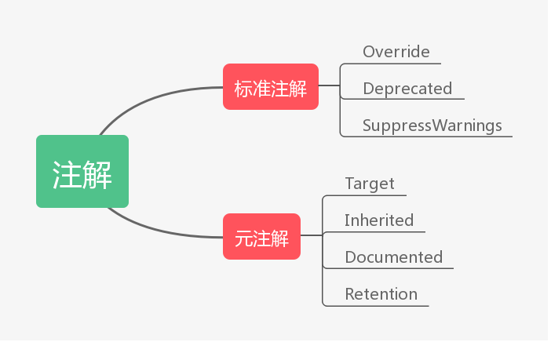

# 注解

注解是代码里的特殊标记，这些标记可以在编译，类加载，运行时被读取，并执行相应的处理。通过使用注解，开发人员可以在不改变原有逻辑的情况下，在源文件中嵌入一些补充的信息。代码分析工具，开发工具和部署工具可以通过这些补充信息进行验证，处理或者部署


## 注解分类

注解分为标准注解和元注解




### 标准注解

* override

  对覆盖超类中的方法进行标记。

* Deprecated

  对不鼓励使用或者已过时的方法添加注解

* SuppressWarning

  选择性的取消特定代码段中的警告


### 元注解

元注解是用于修饰注解的注解

- @Target 注解所修饰的对象范围
- @Inherited 表示注解的内容可以被子类继承
- @Documented 表示这个注解应该被JavaDoc工具记录
- @Retention 声明注解的保留策略


#### Target

其中，@Target 用于指明被修饰的注解最终可以作用的目标是谁，也就是指明，你的注解到底是用来修饰方法的？修饰类的？还是用来修饰字段属性的

我们可以通过以下的方式来为这个 value 传值：

```
  @Target(value = {ElementType.FIELD})
```

被这个 @Target 注解修饰的注解将只能作用在成员字段上，不能用于修饰方法或者类。其中，ElementType 是一个枚举类型，有以下一些值

- ElementType.TYPE：允许被修饰的注解作用在类、接口和枚举上
- ElementType.FIELD：允许作用在属性字段上
- ElementType.METHOD：允许作用在方法上
- ElementType.PARAMETER：允许作用在方法参数上
- ElementType.CONSTRUCTOR：允许作用在构造器上
- ElementType.LOCAL_VARIABLE：允许作用在本地局部变量上
- ElementType.ANNOTATION_TYPE：允许作用在注解上
- ElementType.PACKAGE：允许作用在包上


#### Retention 

@Retention 用于指明当前注解的生命周期

同样的，它也有一个 value 属性

```
  @Retention(value = RetentionPolicy.RUNTIME)
```

 RetentionPolicy 依然是一个枚举类型，它有以下几个枚举值可取

- RetentionPolicy.SOURCE：当前注解编译期可见，不会写入class 文件
- RetentionPolicy.CLASS：类加载阶段丢弃，会写入class 文件。运行时，不会保留在JVM中，会被丢弃
- RetentionPolicy.RUNTIME：永久保存，可以反射获取


## 定义注解

定义新的注解类型使用@interface关键字，例如

```
public @interface Test{}
```

定义成员。注解只有成员变量，没有方法。同时可以用default关键字为他们指定默认值，如下

```
public @interface Test{
   String name() default "czp";
   int age() default 23;
}
```

同时也可以用元注解修饰注解

```
@Retention(RetentionPolicy.RUNTIME)
public @interface Test{
   String name() default "czp";
   int age() default 23;
}
```


## 注解代替枚举

注解可以用来替代枚举。

通过`View.VISIBLE`的源码,我们可以发现`VISIBLE`,`INVISIBLE`和`GONE`是用注解来实现枚举的作用的

```
    @IntDef({VISIBLE, INVISIBLE, GONE})
    @Retention(RetentionPolicy.SOURCE)
    public @interface Visibility {}
    
    public static final int VISIBLE = 0x00000000;
    public static final int INVISIBLE = 0x00000004;
    public static final int GONE = 0x00000008;
```

