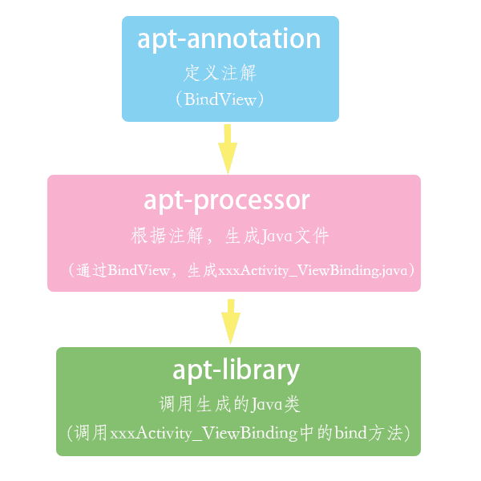

# 注解处理器

注解处理器APT是javac的一个工具，用来扫描和处理注解。就是在编译时期，通过注解生成.java文件。针对运行时，采用反射机制。针对编译时，注解会采用`AbstractProcessor`处理



## 定义注解

新建一个java library来专门存放注解，library名为annotations。同时新建一个注解

```
@Retention(RetentionPolicy.RUNTIME)
@Target(ElementType.FIELD)
public @interface BindView {
    int value();
}
```

## 注解处理器

再新建一个Java Library来存放注解处理器，library名为processor。同时配置processor库的build.gradle。

同时添加对annotations的依赖

```
apply plugin: 'java-library'

dependencies {
    implementation fileTree(dir: 'libs', include: ['*.jar'])
    implementation project(':annotations') 
}

sourceCompatibility = "1.7"
targetCompatibility = "1.7"
```

接着编写注解处理器ClassProcessor,继承自AbstractProcessor

```
public class ClassProcessor extends AbstractProcessor{

    @Override
    public synchronized void init(ProcessingEnvironment processingEnvironment) {
        super.init(processingEnvironment);
    }

    @Override
    public Set<String> getSupportedAnnotationTypes() {
        return super.getSupportedAnnotationTypes();
    }

    @Override
    public SourceVersion getSupportedSourceVersion() {
        return super.getSupportedSourceVersion();
    }

    @Override
    public boolean process(Set<? extends TypeElement> set, RoundEnvironment roundEnvironment) {
        return false;
    }
}
```

- init
  初始化。可以得到ProcessingEnviroment，ProcessingEnviroment提供很多有用的工具类Elements, Types 和 Filer和Messager等

- process

  相当于每个处理器的主函数main，

  可以在这里写扫描、评估和处理注解的代码，生成Java文件。输入参数RoundEnviroment可以让你查询出包含特定注解的被注解元素

- getSupportedAnnotationTypes
  指定这个注解处理器是注册给哪个注解的，这里说明是注解BindView

- getSupportedSourceVersion
  返回java版本。通常返回`SourceVersion.latestSupported()`

为了能使用注解处理器，需要用一个服务文件来注册它。首先再processor库的main目录下创建resources资源文件夹，接下来resources中再建立META-INF/services目录文件夹。最后再META-INF/services中创建javax.annotation.processing.Processor文件，这个文件中的内容时注解处理器的名称。这里我们的javax.annotation.processing.Processor文件内容为com.example.processor.ClassProcessor。

**当然可以使用auto-service**

在该Module下的build.gradle的dependencies中添加如下配置

```
implementation 'com.google.auto.service:auto-service:1.0-rc4'
```

作用是为注解处理器自动注册，它会生成META-INF文件夹。然后在ClassProcessor类上添加注解`@AutoService(Processor.class)`

```
@AutoService(Processor.class)
public class ClassProcessor extends AbstractProcessor{...}
```

另外可以添加依赖

```
implementation 'com.squareup:javapoet:1.9.0'
```

可以帮助生成java类

## apt插件

在编译完后会有很多不必要的文件，引入apt插件，可以只在编译时期去依赖注解处理器所在的函数库并进行工作，不会打包到apk中

app的build.gradle中添加依赖

```
dependencies {
    implementation project(':apt-annotation')
    annotationProcessor project(':apt-processor')
}
```

使用apt插件可以减少引入不必要的文件。官方(Android)提供了**annotationProcessor**来代替android-apt