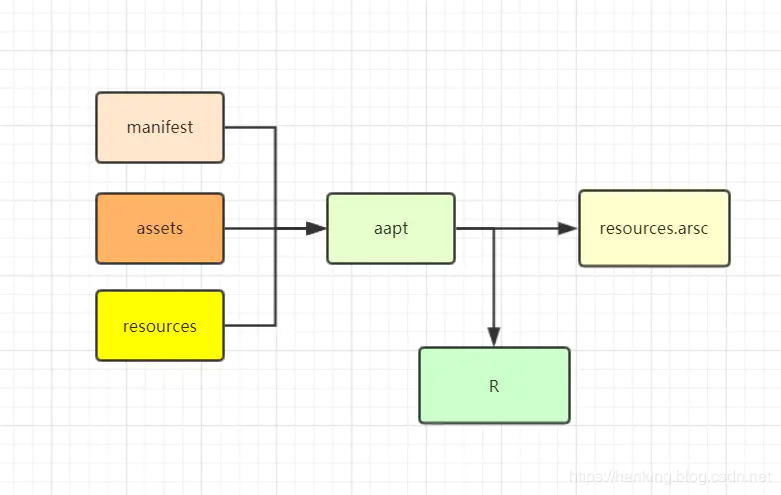
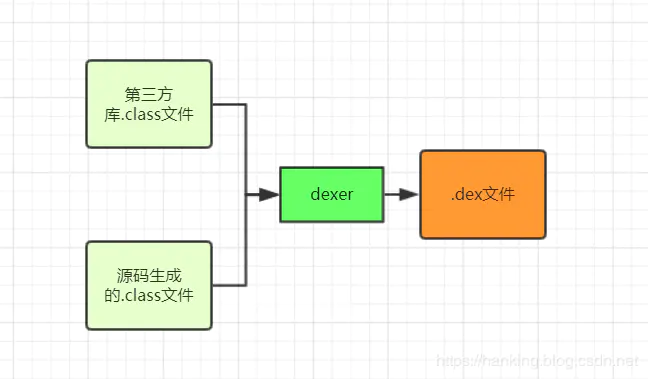

# APK

## 文件结构

一个APK包含以下文件

- META-INF目录：包含两个签名文件，以及一个manifest文件（MANIFEST.MF）
  * MANIFEST.MF**:包含导入jar运行时的信息，包括运行时启动哪个main class。package的版本号，build number。package的创建者信息，安全和允许证书信息等。**
  * **CERT.SF**: 包含所有文件列表信息以及文件的SHA-1摘要。
  * **CERT.RSA**: 包含CERT.SF文件的签名内容以及用于对该内容签名的公钥证书。
- assets目录 。 可以使用AssetManager获取
- res目录。 包含哪些没有被编译到resources.arsc的资源
- lib目录。 不同处理器的第三方依赖库
- resources.arsc文件。存储编译好的资源，包括项目工程中的res/values目录里的xml文件，它们都被编译成二进制格式，也包括一些路径，指向那些没有被编译的资源，比如layout文件和图片
- classes.dex。这个文件可以被Android的Dalvik/ART虚拟机解析
- AndroidManifest.xml。二进制格式的manifest文件，这个文件是必须的。


### aapt

aapt可以查看，创建，修改压缩文件，也可以将资源编译成二进制文件。

aapt资源打包工具生成R.java文件，和编译过的资源文件resources.arsc，R.java文件中存放的是各个资源的id，在java代码中通过R文件中的id来找到对应的资源。resources.arsc中放的是编译过的资源文件相关的信息：比如**xml文件的节点**（LinearLayout, RelativeLayout）**布局的属性**（ android:layout_width）**资源的id**





### dx

Android运行在Dalvik Virtual Machine上，和Java不同，Java运行在jvm上，Dalvik Virtual Machine上运行的不是.class文件，而是.dex文件。 可以使用android-sdk中的dexdump 工具来反编译dex文件。dexer工具可以把class文件转换成.dex文件。



主要命令

```
dx --dex --output=XYZ.dex class目录文件
```

#### 如何生成dex文件示例如下

1. 写个Test类，内容如下

   ```
   public class Test {
   
       public static void main(String[] args){
           System.out.println("hello world");
       }
   }
   ```

2. javac生成Test.class文件。然后编译class文件为dex文件

   ```
   dx --dex --output=Test.dex D:\JavaProject\out\production\JavaProject
   ```

   其中`D:\JavaProject\out\production\JavaProject`为Test.class所在的目录。例外dx需要配置下环境变量。

3. 接着执行dex文件。进入adb shell，创建dex存储目录

   ```
   mkdir /data/local/tmp/dalvik-cache
   export ANDROID_DATA=/data/local/tmp
   exit
   ```

4. 将dex文件push进dex存储目录

   ```
   adb push Test.dex /data/local/tmp/dalvik-cache/
   ```

5. 执行dex文件。最后一个参数为class名

   ```
   adb shell dalvikvm -cp /data/local/tmp/dalvik-cache/Test.dex Test
   ```

   


