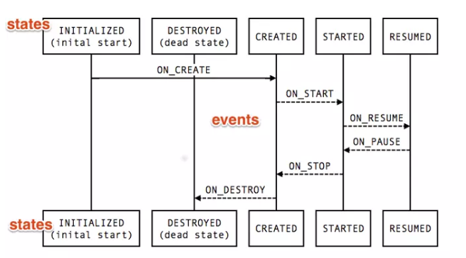

# Lifecycle

官网上的解释:The android.arch.lifecycle package provides classes and interfaces that let you build lifecycle-aware components—which are components that can automatically adjust their behavior based on the current lifecycle state of an activity or fragment.

官网上的意思是，很多时候我们需要在onstart中进行耗时的很耗时的操作时，这个时候可能activity已经停止了，这会出现状态的竞争

在真实的应用程序中，最终会有太多的调用来管理UI和其他组件以响应生命周期的当前状态。管理多个组件会在生命周期方法中放置大量代码，例如 onStart() 和 onStop()，这使得它们难以维护。

此外，无法保证组件在Activity或Fragment停止之前启动。如果我们需要执行长时间运行的操作（例如某些配置检查），则尤其如此onStart()。这可能导致竞争条件，其中onStop()方法在之前完成onStart()，使组件保持活动的时间大于其所需的时间


## LifecycleObserver

生命周期的观察者。在这里，它就是事件的接收器。而对于每一个不同的事件，则通过在实现类的方法中添加相应的注解`OnLifecycleEvent`来实现的

```
public class MyObserver implements LifecycleObserver {
    @OnLifecycleEvent(Lifecycle.Event.ON_CREATE)
    public void onCreate() {
        
    }

    @OnLifecycleEvent(Lifecycle.Event.ON_START)
    public void onStart() {
        
    }

    @OnLifecycleEvent(Lifecycle.Event.ON_RESUME)
    public void onResume() {
        
    }

    @OnLifecycleEvent(Lifecycle.Event.ON_PAUSE)
    public void onPause() {
        
    }

    @OnLifecycleEvent(Lifecycle.Event.ON_STOP)
    public void onStop() {
        
    }

    @OnLifecycleEvent(Lifecycle.Event.ON_DESTROY)
    public void onDestroy() {
        
    }
}
```

或者通过实现`DefaultLifecycleObserver`，不过需要依赖

```
implementation "androidx.lifecycle:lifecycle-common-java8:$lifecycle_version"
```

可以看下`DefaultLifecycleObserver`类的具体实现

```
interface FullLifecycleObserver extends LifecycleObserver {

    void onCreate(LifecycleOwner owner);

    void onStart(LifecycleOwner owner);

    void onResume(LifecycleOwner owner);

    void onPause(LifecycleOwner owner);

    void onStop(LifecycleOwner owner);

    void onDestroy(LifecycleOwner owner);
}

=========================================================================
public interface DefaultLifecycleObserver extends FullLifecycleObserver {}
```

## LifecycleOwner

其次需要实现**生命周期持有者的接口**，该接口的生命周期(Lifecycle对象)的改变会被其注册的观察者LifecycleObserver观察到，并触发其对应的事件。

activity和fragment均已经实现了LifecyclerOwner方法，它只有一个getLifecycle方法

```
public interface LifecycleOwner {
    Lifecycle getLifecycle();
}
```

**向 LifecycleOwner 注册 LifecycleObserver，建立起两者之间的连接**

```
 getLifecycle().addObserver(new MyObserver());
```

**mark 状态，"发送"事件**

我们需要在其生命周期的方法里，mark出生命周期的状态以使得其可以产生一个对应的事件发送到 LifecycleObserver 相应的方法上

```
public class MyActivity extends Activity implements LifecycleOwner {

    private LifecycleRegistry mLifecycleRegistry;

    @Override
    protected void onCreate(Bundle savedInstanceState) {
        super.onCreate(savedInstanceState);
        mLifecycleRegistry = new LifecycleRegistry(this);
        mLifecycleRegistry.markState(Lifecycle.State.CREATED);
    }

    @Override
    public void onStart() {
        super.onStart();
        mLifecycleRegistry.markState(Lifecycle.State.STARTED);
    }

    @NonNull
    @Override
    public Lifecycle getLifecycle() {
        return mLifecycleRegistry;
    }
}
```

新的SDK版本里，activity均已实现`LifecycleOwner`接口

```
private final LifecycleRegistry mLifecycleRegistry = new LifecycleRegistry(this);
    
@Override
public Lifecycle getLifecycle() {
    return mLifecycleRegistry;
}
```

## LifecycleRegistry

LifecycleRegistry是Lifecycle的子类

```
public class LifecycleRegistry extends Lifecycle {

    public void handleLifecycleEvent(@NonNull Lifecycle.Event event) {
        State next = getStateAfter(event);
        moveToState(next);
    }
    
    @MainThread
    public void markState(@NonNull State state) {
        setCurrentState(state);
    }
}
```

可以看下Lifecycle的定义。类似观察者模式的主题

**Lifecycle** 是一个类，它包含有关组件生命周期状态的信息（如活动或片段），并允许其他对象观察此状态。

**Lifecycle** 使用两个主要枚举来跟踪其关联组件的生命周期状态：

```
public abstract class Lifecycle {
    @MainThread  //添加将在LifecycleOwner更改状态时通知的LifecycleObserver。
    public abstract void addObserver(@NonNull LifecycleObserver observer);

    @MainThread //从观察者列表中删除给定的观察者。
    public abstract void removeObserver(@NonNull LifecycleObserver observer);

    @MainThread //返回生命周期的当前状态。
    public abstract State getCurrentState();

    @SuppressWarnings("WeakerAccess")
    public enum Event {

        ON_CREATE,//用于onCreate事件的常量LifecycleOwner。

        ON_START,

        ON_RESUME,

        ON_PAUSE,

        ON_STOP,

        ON_DESTROY,

        ON_ANY //一个Event可以用来匹配所有事件的常数。 
    }

    @SuppressWarnings("WeakerAccess")
    public enum State {

        DESTROYED,
        INITIALIZED, //LifecycleOwner的初始化状态。 
        CREATED, 
        STARTED,
        RESUMED;
                //比较此状态是否大于或等于给定值state。
        public boolean isAtLeast(@NonNull State state) {
            return compareTo(state) >= 0;
        }
    }
}
```

### Event(事件)

从框架和**Lifecycle**类调度的生命周期事件 。这些事件映射到活动和片段中的回调事件。

### State(状态)

**Lifecycle**对象跟踪的组件的当前状态 。



### 分发事件

在旧版本中，可以通过LifecycleRegistry的`handleLifecycleEvent`来分发Event事件。可以看到

```
private void moveToState(State next) {
        ···    
        mState = next;
       //如果正在分发状态或者没有注册Observer则终止分发
        if (mHandlingEvent || mAddingObserverCounter != 0) {
          ···
        }
        mHandlingEvent = true;
            //重点
        sync();
        mHandlingEvent = false;
    }

private boolean isSynced() {
        if (mObserverMap.size() == 0) {
            return true;
        }
        //#1 这里再次判断是否在分发状态 并且Observer的状态是否和要分发的状态一致
        State eldestObserverState = mObserverMap.eldest().getValue().mState;
        State newestObserverState = mObserverMap.newest().getValue().mState;
        return eldestObserverState == newestObserverState && mState == newestObserverState;
    }

  private void sync() {
        LifecycleOwner lifecycleOwner = mLifecycleOwner.get();
        ···
        while (!isSynced()) {
           ···
            
          // 获取最新的Observer的状态 当前状态在Observer状态前面 
            if (mState.compareTo(mObserverMap.eldest().getValue().mState) < 0) {
                backwardPass(lifecycleOwner);
            }
            Entry<LifecycleObserver, ObserverWithState> newest = mObserverMap.newest();
          //最新的Observer状态在Observer状态后面
            if (!mNewEventOccurred && newest != null
                    && mState.compareTo(newest.getValue().mState) > 0) {
                forwardPass(lifecycleOwner);
            }
        }
       ···
    }

 private void forwardPass(LifecycleOwner lifecycleOwner) {
        Iterator<Entry<LifecycleObserver, ObserverWithState>> ascendingIterator =
                mObserverMap.iteratorWithAdditions();
        while (ascendingIterator.hasNext() && !mNewEventOccurred) {
            Entry<LifecycleObserver, ObserverWithState> entry = ascendingIterator.next();
            //#3 
            ObserverWithState observer = entry.getValue();
            while ((observer.mState.compareTo(mState) < 0 && !mNewEventOccurred
                    && mObserverMap.contains(entry.getKey()))) {
                pushParentState(observer.mState);
                 // #2 获取到每个observer分发状态
                observer.dispatchEvent(lifecycleOwner, upEvent(observer.mState));
                popParentState();
            }
        }
    }
```

可以看`forwardPass`和`backwardPass`都是通过**ObserverWithState**分发事件。ObserverWithState是LifecycleRegistry里面的一个静态内部类

```
    static class ObserverWithState {
        //State 状态
        State mState;
        //#1
        LifecycleEventObserver mLifecycleObserver;

        ObserverWithState(LifecycleObserver observer, State initialState) {
            mLifecycleObserver = Lifecycling.lifecycleEventObserver(observer);
            mState = initialState;
        }

        void dispatchEvent(LifecycleOwner owner, Event event) {
            State newState = getStateAfter(event);
            mState = min(mState, newState);
            mLifecycleObserver.onStateChanged(owner, event);
            mState = newState;
        }
    }
```

**LifecycleEventObserver是继承自LifecycleObserver的接口 声明了onStateChanged()函数

### 标记状态

以前可以通过markState来标记状态。现在Activity通过创建ReportFragment

```
public class ComponentActivity extends Activity...{
    protected void onCreate(@Nullable Bundle savedInstanceState) {
        super.onCreate(savedInstanceState);
        ReportFragment.injectIfNeededIn(this);
    }
}
```

由ReportFragment来分发事件

```
public class ReportFragment extends Fragment {
    public static void injectIfNeededIn(Activity activity) {
        if (Build.VERSION.SDK_INT >= 29) {
            activity.registerActivityLifecycleCallbacks(
                    new LifecycleCallbacks());
        }
        android.app.FragmentManager manager = activity.getFragmentManager();
        if (manager.findFragmentByTag(REPORT_FRAGMENT_TAG) == null) {
            manager.beginTransaction().add(new ReportFragment(), REPORT_FRAGMENT_TAG).commit();
            manager.executePendingTransactions();
        }
    }
    
    
        @Override
    public void onStart() {
        super.onStart();
        dispatchStart(mProcessListener);
        dispatch(Lifecycle.Event.ON_START);
    }
}
```


完整实例参考

```
public class BoundLocationListener implements LifecycleObserver {

    private final Context mContext;
    private LocationManager mLocationManager;
    private final LocationListener mListener;

    public BoundLocationListener(LifecycleOwner lifecycleOwner,
                                 LocationListener listener, Context context) {
        mContext = context;
        mListener = listener;
        //想要观察 Activity 的声明周期，必须将其添加到观察者中。添加下面的代码
        //才能是 BoundLocationListener 实例监听到生命周期
        lifecycleOwner.getLifecycle().addObserver(this);
    }

    //可以使用  @OnLifecycleEvent 注解来监听 Activity 生命周期的变化
    // 可以使用下面的注解来添加 addLocationListener() 方法
    @OnLifecycleEvent(Lifecycle.Event.ON_RESUME)
    void addLocationListener() {
        mLocationManager =
                (LocationManager) mContext.getSystemService(Context.LOCATION_SERVICE);
        mLocationManager.requestLocationUpdates(LocationManager.GPS_PROVIDER, 0, 0, mListener);
        Log.d("BoundLocationMgr", "Listener added");

        // Force an update with the last location, if available.
        Location lastLocation = mLocationManager.getLastKnownLocation(
                LocationManager.GPS_PROVIDER);
        if (lastLocation != null) {
            mListener.onLocationChanged(lastLocation);
        }
    }

    // 可以使用下面的注解来移除 removeLocationListener() 方法
    @OnLifecycleEvent(Lifecycle.Event.ON_PAUSE)
    void removeLocationListener() {
        if (mLocationManager == null) {
            return;
        }
        mLocationManager.removeUpdates(mListener);
        mLocationManager = null;
        Log.d("BoundLocationMgr", "Listener removed");
    }
}
```

