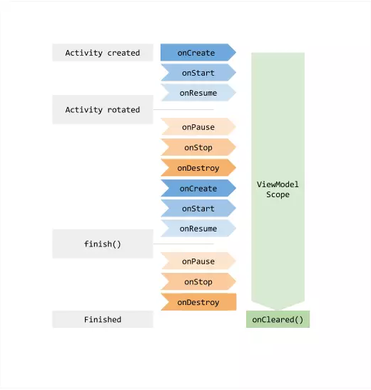

# ViewModel

ViewModel类是被设计用来以可感知生命周期的方式存储和管理 UI 相关数据，并且能够在旋转屏幕等Configuration Change发生时，仍能保持里面的数据。当UI组件恢复时，可以立刻向UI提供数据。

如果系统销毁或重新创建UI控制器，则存储在其中的所有临时的UI相关数据都将丢失。 举个例子，您的应用中的一个Activity可能包含用户列表。 当因配置更改重新创建Activity时，新Activity必须重新获取用户列表。 对于简单数据，活动可以使用onSaveInstanceState()方法并从onCreate()中的数据包中恢复其数据，但是此方法仅适用于可以序列化然后反序列化的少量数据，而不适用于潜在的大量数据,例如用户列表或位图。

另一个问题是UI控制器经常需要异步请求，需要一些时间才能获取结果。 UI控制器需要管理这些请求，确保在系统销毁自己时，清理这些请求以避免潜在的内存泄漏。 这种管理需要大量的维护代码，并且在因配置更改而重新创建UI控制器的时，可能不得不重新发出已经发出过的请求，这样会浪费许多资源。

UI控制器（如Activity和Fragment）主要用于显示UI数据，对用户操作做出响应，或处理与操作系统之间的通信（如权限请求）。 再让UI控制器负责从数据库或网络加载数据，会导致该类过度臃肿。 给UI控制器分配过多的工作，可能会导致一个类去单独处理应用程序的所有工作，而不是将工作委托给其他类。 给UI控制器分配过多的工作也使得测试工作变得更加困难。

将视图数据的所有权从UI控制器逻辑中分离出来，会让项目更简单，更高效。


## 生命周期



ViewModel 生命周期是贯穿整个 activity 生命周期，包括 Activity 因旋转造成的重创建，直到 Activity 真正意义上销毁后才会结束。既然如此，用来存放数据再好不过了。


## AndroidViewModel

添加依赖

```
 def lifecycle_version = "2.0.0"
 implementation "androidx.lifecycle:lifecycle-extensions:$lifecycle_version"
```

ViewModel的创建通过

```
MyViewModel model = ViewModelProviders.of(this).get(MyViewModel.class);
```

ViewModelProviders提供了4个of()方法获得`ViewModelProvider`对象。其他两个方法则通过ViewModelProvider 的静态内部类AndroidViewModelFactory创建，这是一个单例类

```
 @MainThread
 public static ViewModelProvider of(Fragment fragment,Factory factory) {
     Application application = checkApplication(checkActivity(fragment));
     if (factory == null) {
         factory = ViewModelProvider.AndroidViewModelFactory.getInstance(application);
     }
     return new ViewModelProvider(fragment.getViewModelStore(), factory);
 }
```

AndroidViewModelFactory工具类的作用就是通过反射创建需要的ViewModel

```
 @Override
 public <T extends ViewModel> T create(@NonNull Class<T> modelClass) {
     if (AndroidViewModel.class.isAssignableFrom(modelClass)) {
         try {
           return modelClass.getConstructor(Application.class).newInstance(mApplication);
          } catch (NoSuchMethodException e) {
                    ...
         }
      }
      return super.create(modelClass);
 }
```

我们发现这四个方法都调用了ViewModelProvider的构造函数`new ViewModelProvider(fragment.getViewModelStore(), factory)`，看下ViewModelProvider的构造函数

```
    public ViewModelProvider(@NonNull ViewModelStore store, @NonNull Factory factory) {
        mFactory = factory;
        this.mViewModelStore = store;
    }
```

第一个参数是一个ViewModelStore对象。ViewModelStore是一个存储ViewModel的类，具体则是通过HashMap实现的。它提供了3个方法：put()，get()和clear()。put()和get()方法用于存取ViewModel对象，clear()方法则用于清空缓存的ViewModel对象，该方法还会调用ViewModel的onCleared()方法来通知ViewModel对象不再被使用

```
public class ViewModelStore {

    private final HashMap<String, ViewModel> mMap = new HashMap<>();

    final void put(String key, ViewModel viewModel) {
        ViewModel oldViewModel = mMap.put(key, viewModel);
        if (oldViewModel != null) {
            oldViewModel.onCleared();
        }
    }

    final ViewModel get(String key) {
        return mMap.get(key);
    }

    /**
     *  Clears internal storage and notifies ViewModels that they are no longer used.
     */
    public final void clear() {
        for (ViewModel vm : mMap.values()) {
            vm.onCleared();
        }
        mMap.clear();
    }
}
```

综上所述，ViewModel的整体创建流程如下：
        -> `使用ViewModelProviders.of()方法创建一个ViewModelProvider对象` 

-> `使用ViewModelProvider内部的全局单例类AndroidViewModelFactory或自定义的Factory来反射创建ViewModel` 

-> `把创建的ViewModel存放到传入的ViewModelStore中`


新版本直接通过如下方式获取

```
ViewModelProvider.AndroidViewModelFactory.getInstance(requireActivity().application)
        .create(MyViewModel::class.java)
```


