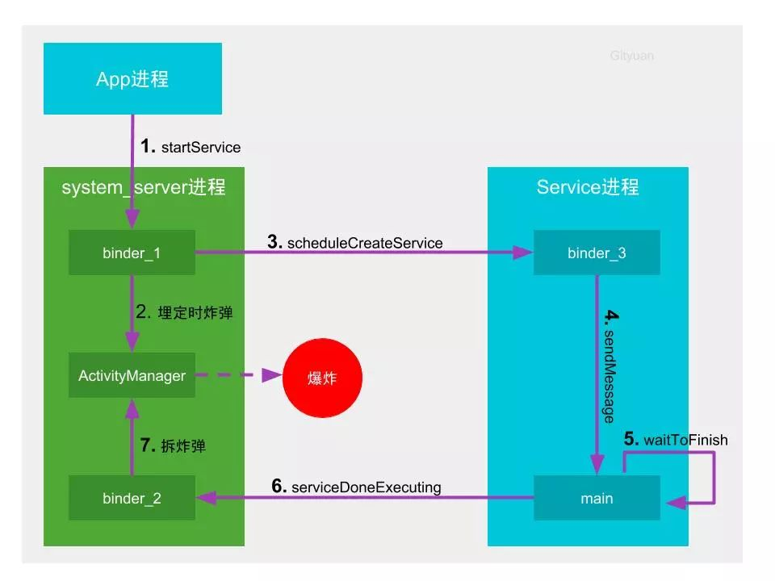
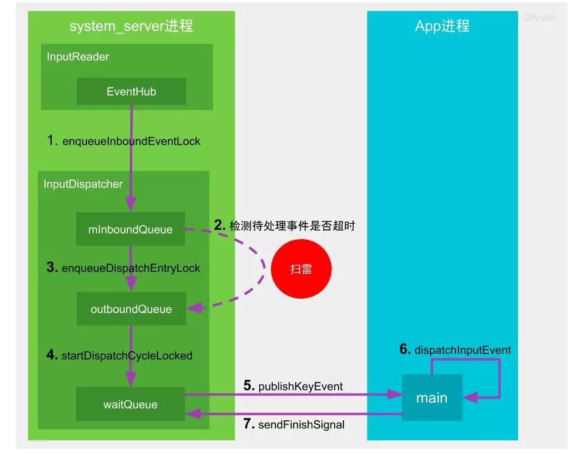

# ANR

在Android上，如果你的应用程序有一段时间响应不够灵敏，系统会向用户显示一个对话框，这个对话框称作“应用程序无响应”（ANR：Application Not Responding）对话框。用户可以选择“等待”而让程序继续运行，也可以选择“强制关闭”。因此，在程序里对响应性能的设计很重要，这样，系统不会显示ANR给用户。

## ANR类型

ANR的来源分为service，broadcast和input两种。

* KeyDispatchTimeout**

  input事件在5s内没有处理完成发生ANR

  日志：**Input event dispatching timed out**

* BroadcastTimeout

  广播onReceive在10s内没有处理完成发生ANR

  **Timeout of broadcast BroadcastRecord**

* ServiceTimeout

  前台Service的生命周期在`20s`内没有处理完成发生ANR

  **Timeout executing service**

### 组件类的ANR

ANR是一套监控Android应用响应是否及时的机制，可以把发生ANR比作是引爆炸弹，那么整个流程包含三部分组成：

1. 埋定时炸弹：中控系统(system_server进程)启动倒计时，在规定时间内如果目标(应用进程)没有干完所有的活，则中控系统会定向炸毁(杀进程)目标。
2. 拆炸弹：在规定的时间内干完工地的所有活，并及时向中控系统报告完成，请求解除定时炸弹，则幸免于难。
3. 引爆炸弹：中控系统立即封装现场，抓取快照，搜集目标执行慢的罪证(traces)，便于后续的案件侦破(调试分析)，最后是炸毁目标。

以service为例

### Input类型的ANR

与组件类Anr不同，Input类型的超时并非时间到了就一定会爆炸，而是处理后续上报事件的过程才会去检测是否爆炸。

**对于输入系统而言，即使某次事件执行时间超过预期的时间，只要后续没有再生成输入事件，那么也不会发生anr。只有当新一轮的输入事件来时，此时正在分发事件的窗口 迟迟无法释放资源给新的事件去分发，这是InputDispatcher才会根据超时时间，动态的判断是否需要提示anr。**

为了更好的理解input过程先来介绍两个重要线程的相关工作：

- `InputReader`线程负责通过EventHub(监听目录/dev/input)读取输入事件，一旦监听到输入事件则放入到`InputDispatcher`的mInBoundQueue队列，并通知其处理该事件；
- `InputDispatcher`线程负责将接收到的输入事件分发给目标应用窗口，分发过程使用到3个事件队列：
  - mInBoundQueue用于记录InputReader发送过来的输入事件；
  - outBoundQueue用于记录即将分发给目标应用窗口的输入事件；
  - waitQueue用于记录已分发给目标应用，且应用尚未处理完成的输入事件；

#### 第一轮事件

`InputReader`线程通过`EventHub`监听底层上报的输入事件，一旦收到输入事件则将其放至`mInBoundQueue`队列，并唤醒`InputDispatcher`线程

`InputDispatcher`开始分发输入事件，设置埋雷的起点时间。先检测是否有正在处理的事件mPendingEvent,如果没有则取出`mInBoundQueue`队头的事件，并将其赋值给`mPendingEvent`，且重置ANR的timeout。当应用窗口准备就绪，则将`mPendingEvent`转移到`outBoundQueue`队列。

当`outBoundQueue`不为空，且应用管道对端连接状态正常，则将数据从`outboundQueue`中取出事件，放入`waitQueue`队列

`InputDispatcher`通过socket告知目标应用所在进程可以准备开始干活

此时App的包工头(main线程)收到输入事件后，会层层转发到目标窗口来处理。包工头完成工作后，会通过socket向中控系统汇报工作完成，则中控系统会将该事件从`waitQueue`队列中移除

#### 第二轮

第二轮来时，如果`InputDispatcher`发现有事件正在处理，不会从`mInBoundQueue`取出新的事件,而是检查窗口是否就绪，若未就绪，就进入anr检测状态

## 如何定位

1.traces.txt

当APP不响应、响应慢了、或者WatchDog的监视没有得到回应时，系统就会dump出一个`traces.txt`文件，存放在文件目录:`/data/anr/traces.txt`，通过traces文件,我们可以拿到线程名、堆栈信息、线程当前状态、binder call等信息。
 通过adb命令拿到该文件：`adb pull /data/anr/traces.txt`

关键信息:

* **main**：main标识是主线程，如果是线程，那么命名成“Thread-X”的格式,x表示线程id,逐步递增。
*  **prio**：线程优先级,默认是5
*  **tid**：tid不是线程的id，是线程唯一标识ID
*  **group**：是线程组名称
*  **sCount**：该线程被挂起的次数
*  **dsCount**：是线程被调试器挂起的次数
*  **obj**：对象地址
* **self**：该线程Native的地址
*  **sysTid**：是线程号(主线程的线程号和进程号相同)
*  **nice**：是线程的调度优先级
*  **sched**：分别标志了线程的调度策略和优先级
*  **cgrp**：调度归属组
*  **handle**：线程处理函数的地址。
*  **state**：是调度状态
*  **schedstat**：从 `/proc/[pid]/task/[tid]/schedstat`读出，三个值分别表示线程在cpu上执行的时间、线程的等待时间和线程执行的时间片长度，不支持这项信息的三个值都是0；
*  **utm**：是线程用户态下使用的时间值(单位是jiffies）
*  **stm**：是内核态下的调度时间值
*  **core**：是最后执行这个线程的cpu核的序号。

总结一下这分析流程：首先我们搜索`am_anr`，找到出现ANR的时间点、进程PID、ANR类型、然后再找搜索`PID`，找前5秒左右的日志。过滤ANR IN 查看CPU信息，接着查看`traces.txt`，接着分析是否有耗时的message、binder调用，锁的竞争，CPU资源的抢占，找到java的堆栈信息定位代码位置，最后查看源码，分析与解决问题。这个过程基本能找到发生ANR的来龙去脉。

应用开发者应让主线程尽量只做UI相关的操作，避免耗时操作，比如过度复杂的UI绘制，网络操作，文件IO操作；避免主线程跟工作线程发生锁的竞争，减少系统耗时binder的调用，谨慎使用sharePreference，注意主线程执行provider query操作。简而言之，尽可能减少主线程的负载，让其空闲待命，以期可随时响应用户的操作

