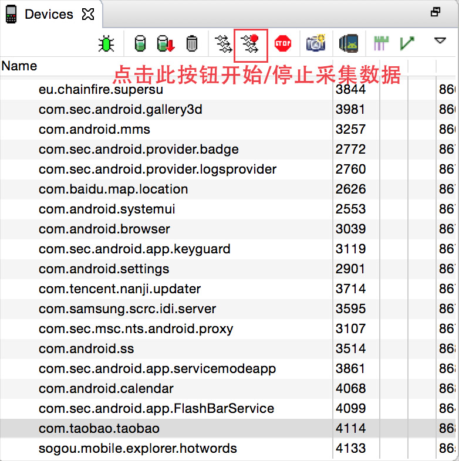
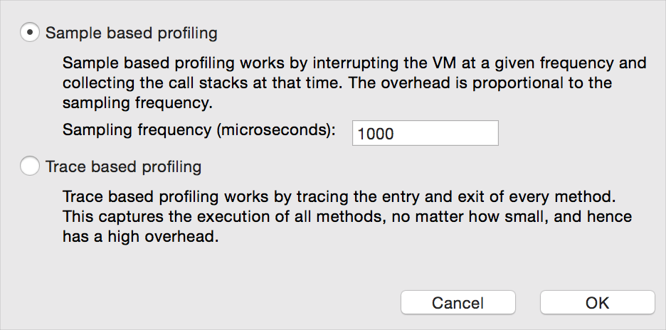
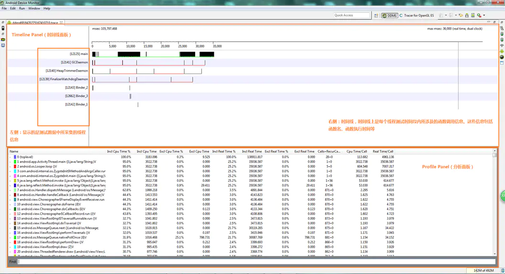
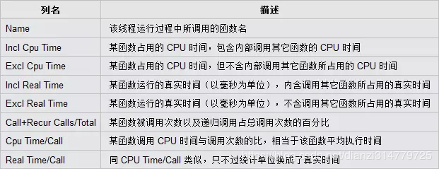

# TraceView

Traceview是android平台配备的一个很好的性能分析工具。它可以通过图形界面的方式让我们了解我们要跟踪的程序的性能，并且能具体到method。

我们可以通过TraceView来查看方法的耗时。

## 使用

* 开发者在一些关键代码段开始前调用Android SDK中Debug类的startMethodTracing函数并在关键代码段结束前调用stopMethodTracing函数。这两个函数运行过程中将采集运行时间内该应用所有线程注意只能是Java线程的函数执行情况并将采集数据保存到/mnt/sdcard/下的一个文件中。开发者然后需要用SDK中的Traceview工具来分析这些数据。

* 借助Android SDK中的DDMS工具。DDMS可采集系统中某个正在运行的进程的函数调用信息。对开发者而言此方法适用于没有目标应用源代码的情况。DDMS(SDK/tools/lib/x86/monitor.exe)工具中Traceview的使用如图所示。

  

在做性能分析的过程中基本都是采用DDMS工具中来启动TraceView这样简单易用随便哪个地方的代码都可以跟踪。在对android 4.4以上手机点击TraceView按钮的时候会出现2种方式的选择对话框如下所示

1. `Sample based profiling`以固定的频率像VM发送中断并搜集调用栈信息。低版本手机也是采用该方式来采集样本的默认是1毫秒采集一次。精确度和采集的频率有关间隔频率越小会越精确但运行也会相应的更慢。

2. `Trace based profiling`不论多小的函数都会跟踪整个函数的执行过程所以开销也会很大。运行起来会非常的慢不适合检测滑动性能。

   一般情况用第一种默认1000微妙的间隔就足够了。

## 面板

Traceview其UI划分为上下两个面板即:**时间轴面板Timeline Panel和分析面板Profile Panel**。

### 时间轴

X轴表示时间消耗，单位为毫秒（ms），Y轴表示各个线程，每个线程中的不同方法使用了不同的颜色来表示，颜色占用面积越宽，表示该方法占用CPU时间越长。

时间片面板可以放大/缩小，也可以指定区域放到最大，方便查看具体的过程，一般优先选择放大耗时严重的区域。

### 分析

参数通俗说明：

* name: 方法名 其中包括parent（调用此方法的方法）和children（方法中调用的方法）两部分，children中的self为此方法中去除调用的方法外执行的时间。

- Incl CPU Time(%):此方法占用cpu的时间（总比）
- Incl Real Time(%): 同上的真实时间
- Excl CPU Time(%): children中self的时间（总比）
- Excl Real Time(%): 同上的真实时间
- Calls+Recur Calls/Total：调用次数+递归回调次数/总调用次数
- Cpu Time/Call：每次调用的占用Cpu时间。
- RealTime/Call：每次调用的真实时间。

使用TraceView查看耗时，主要关注**Calls+Recur Calls/Total和Cpu Time/Call**这两个值，也就是关注调用次数多和耗时久的方法，然后优化这些方法的逻辑和调用次数，减少耗时。

注意：**RealTime与cputime区别为**：因为RealTime包括了CPU的上下文切换、阻塞、GC等，所以RealTime方法的实际执行时间要比CPU Time稍微长一点。