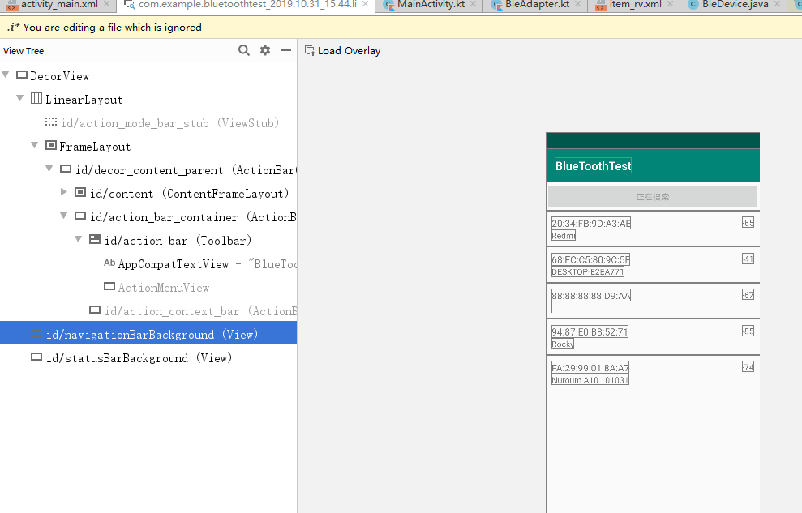
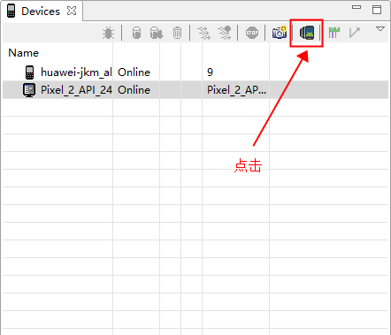

## 加载优化

布局加载通过LayoutInflater.from(this.mContext).inflate(resId, contentParent)来填充布局。 布局文件解析的时候是一个IO过程，这肯定是比较耗时的。再一个就是最后创建View的时候是通过反射的方式进行的。既然是反射性能肯定也是有影响的 。

 谷歌给我们提供了一个类`AsyncLayoutInflater`，它可以从侧面解决布局加载耗时的问题，AsyncLayoutInflater是在工作线程中加载布局，加载好后会回调到主线程，这样可以节省主线程的时间 

 它不包含在SDK中 需要单独引入

```
implementation 'com.android.support:asynclayoutinflater:28.0.0-alpha1'
```

示例

```
 new AsyncLayoutInflater(MainActivity.this).inflate(R.layout.activity_main, null,
                new AsyncLayoutInflater.OnInflateFinishedListener() {
            @Override
            public void onInflateFinished(@NonNull View view, int i, @Nullable ViewGroup viewGroup) {
                setContentView(view); //view以及加载完成
                //可以在这里findViewById相关操作
            }
        });
```

当然 也可以通过动态添加控件来实现优化，不过页面效果不太直观


## 优化布局标签

### include 重用

< include>标签可以在一个布局中引入另外一个布局，这个的好处显而易见。类似于我们经常用到的工具类，随用随调。便于统一修改使用


### merge 减少嵌套

尽量保持布局层级的扁平化。在这个大原则下我们要知道：

- 在不影响层级深度的情况下，使用LinearLayout而不是RelativeLayout。因为RelativeLayout会让子View调用2次onMeasure，LinearLayout 在有weight时，才会让子View调用2次onMeasure。Measure的耗时越长那么绘制效率就低。
- 如果非要是嵌套，那么尽量避免RelativeLayout嵌套RelativeLayout。

我们可以通过View Hierarchy工具看一下布局的层级。

在不使用merge时

```
layout1:
<FrameLayout>
   <include layout="@layout/layout2"/>
</FrameLayout>
==============================================
layout2:
<FrameLayout>
   <TextView />
</FrameLayout>
==============================================
实际效果
<FrameLayout>
   <FrameLayout>
      <TextView />
   </FrameLayout>
</FrameLayout>
```

而使用merge时

```
layout2:
<merge>
   <TextView />
</merge>
==============================================
实际
<FrameLayout>
   <TextView />
</FrameLayout>
```

注意点：

1. merge必须放在布局文件的根节点上
2. merge并不是一个ViewGroup，也不是一个View，它相当于声明了一些视图，等待被添加。对merge标签设置的所有属性都是无效的
3. 因为merge标签并不是View，所以在通过LayoutInflate.inflate方法渲染的时候， 第二个参数必须指定一个父容器，且第三个参数必须为true，也就是必须为merge下的视图指定一个父亲节点

### ViewStub按需加载

在开发中经常会遇到这样的情况，会在程序运行时动态根据条件来决定显示哪个View或某个布局。那么通常做法就是把用到的View都写在布局中，然后在代码中动态的更改它的可见性。但是它的这样仍然会创建View，会影响性能

```
<LinearLayout xmlns:android="http://schemas.android.com/apk/res/android"
android:layout_width="match_parent"
android:layout_height="match_parent"
android:orientation="vertical">

    <Button            //点击按钮时才加载下面的ViewStub布局
        android:id="@+id/button"
        android:layout_width="match_parent"
        android:layout_height="wrap_content"
        android:text="加载ViewStub" />

    <ViewStub  //这个布局现在还不会被添加到布局树中
        android:id="@+id/view_stub"
        android:layout_width="match_parent"
        android:layout_height="wrap_content"
        android:layout="@layout/test" />  //这里指定要加载的布局名字
        
</LinearLayout>
```

然后通过

```
View view = ((ViewStub)findViewById(R.id.view_stub)).inflate();  //加载出来用view接收
TextView tv = (TextView) view.findViewById(R.id.text_view); //然后可以用view访问它的子控件
tv.setText("ViewStub的使用");
```

记得一旦ViewStub可见或是被inflate了，ViewStub就不存在了，取而代之的是被inflate的Layout。


### Space控件

space控件在draw方法没有绘制任何东西，那么性能也就几乎没有影响


## 辅助工具

### Layout Inspector 

Layout Inspector是Android studio自带的视图层次结构分析工具（Android Studio 2.2及其之后版本）。Android Studio中的Layout Inspector允许您在运行时从Android Studio IDE中检查应用程序的视图层次结构。


Tools -> Layout Inspector。然后选择绑定的线程




### Hierarchy Viewer

 可以很方便可视化的查看屏幕上套嵌view结构，是查看你的view结构的实用工具 

启动Android Device Monitor。点击sdk的tools目录下monitor.bat。



会生成 View的层级图


