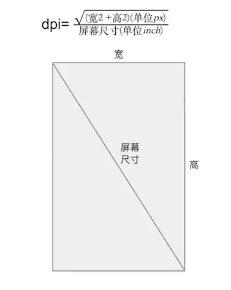
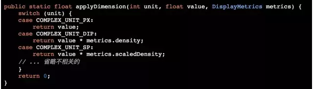

# 概念

###### 屏幕尺寸

指屏幕对角线的长度，单位是英寸。1 inch=2.54 cm

###### 屏幕分辨率

手机在横向和纵向上的像素点数总和，单位是像素。举个栗子，1080x1920，即宽度方向上有1080个像素点，在高度方向上有1920个像素点

###### 屏幕像素密度

每英寸像素点个数，单位dpi。为简便起见，Android 将所有屏幕密度分组为六种通用密度： 低、中、高、超高、超超高和超超超高



- ldpi（低）~120dpi
- mdpi（中）~160dpi
- hdpi（高）~240dpi
- xhdpi（超高）~320dpi
- xxhdpi（超超高）~480dpi
- xxxhdpi（超超超高）~640dpi

通常以dpi值120、160、240、320、480分别指代ldpi、mdpi、hdpi、xhdpi、xxhdpi。屏幕密度越大的手机显示的图像会越细腻

```
private void getDpi() {
    DisplayMetrics dm = getResources().getDisplayMetrics();
    Log.i("TAG", "density = " + dm.density);
    Log.i("TAG", "densityDpi = " + dm.densityDpi);
}
```

在一台屏幕密度为320dpi的Android手机上运行以上代码，得到结果

```
density = 2
densityDpi = 320         <- 这个就是屏幕密度

density = densityDpi/160
```

###### 密度无关像素 dp

android选择dpi值**160**作为**基准屏幕密度**，
这个基准屏幕密度人为建立起了dp与px间的关系：在dpi为160的Android设备上，1 dp = 1px

假设x为某UI控件以px为单位的大小，y为同一UI控件以dp为单位的大小，densityDpi表示屏幕密度，
则x与y的关系为：x = y * densityDpi / 160。


|  dpi   |   关系    |
| :----: | :-------: |
|  mdpi  |  1dp=1px  |
|  hdpi  | 1dp=1.5px |
| xhdpi  |  1dp=2px  |
| xxhdpi |  1dp=3px  |


## drawable 目录

**同一张图，在不同的drawable文件夹，同一个手机上会有什么表现呢?**

以一个144*144px的icon图标（放在drawable-xxxhdpi目录下），在xxhdpi密度的手机为例.

```
ImageView imageView = (ImageView)findViewById(R.id.img);
imageView.post(new Runnable() {
      @Override
      public void run() {
          Log.i("tag", "img: " + imageView.getWidth() + " " + imageView.getHeight());
      }
 });
```

结果是108

计算公式是

> 最终显示宽度 = 原始宽度 * （显示设备手机的dpi /图片放置的drawable文件夹对应dpi）

也就是如果对应文件夹里面没有图片的时候，显示默认图片大小不一致的原因。


在Bitmap.decodeResource() 源码，系统在加载 res 目录下的资源图片时，会根据图片存放的不同目录做一次分辨率的转换，而转换的规则是：
新图的高度 = 原图高度 * (设备的 dpi / 目录对应的 dpi )


**今日头条方案**

[今日头条的解决方案](https://mp.weixin.qq.com/s/d9QCoBP6kV9VSWvVldVVwA)

假设我们UI设计图是按屏幕宽度为360dp来设计的，那么在上述设备上，屏幕宽度其实为1080/(440/160)=392.7dp，也就是屏幕是比设计图要宽的。这种情况下， 即使使用dp也是无法在不同设备上显示为同样效果的。 同时还存在部分设备屏幕宽度不足360dp，这时就会导致按360dp宽度来开发实际显示不全的情况。

而且上述屏幕尺寸、分辨率和像素密度的关系，很多设备并没有按此规则来实现， 因此dpi的值非常乱，没有规律可循，从而导致使用dp适配效果差强人意

android中的dp在渲染前会将dp转为px，计算公式：**px = dp * (dpi / 160)**

今日头条的解决方案正是**基于通过修改density**值，把所有不同尺寸分辨率的手机的宽度dp值改成一个统一的值。  需要从UI那里知道设计图的尺寸
布局文件中dp的转换，最终都是调用` TypedValue#applyDimension(int unit, float value, DisplayMetrics metrics) `来进行转换




在Activity的onCreate中,setContentView之前添加代码

```
    private static float sNoncompatDensity;
    private static float sNoncompatScaledDensity;
    private static void setCustomDensity(Activity activity, final Application application){
        final DisplayMetrics appDisplayMetrics = application.getResources().getDisplayMetrics();
        if(sNoncompatDensity == 0){
            sNoncompatDensity = appDisplayMetrics.density;
            sNoncompatScaledDensity = appDisplayMetrics.scaledDensity;
            application.registerComponentCallbacks(new ComponentCallbacks() {
                @Override
                public void onConfigurationChanged(Configuration newConfig) {
                    if (newConfig!=null&&newConfig.fontScale>0){
                        //监听字体切换
                        sNoncompatScaledDensity = application.getResources().getDisplayMetrics().scaledDensity;
                    }
                }

                @Override
                public void onLowMemory() {

                }
            });
        }

        final float targetDensity = ((float) appDisplayMetrics.widthPixels)/360f;//360 为ui设计图 宽
            //我们可以通过计算之前scaledDensity和density的比获得现在的scaledDensity
        final float targetScaledDensity = targetDensity * (sNoncompatScaledDensity/sNoncompatDensity);
        final int targetDensitydpi = (int)(targetDensity * 160);

        appDisplayMetrics.density = targetDensity;
        appDisplayMetrics.scaledDensity = targetScaledDensity;
        appDisplayMetrics.densityDpi = targetDensitydpi;

        final DisplayMetrics actdisplayMetrics = activity.getResources().getDisplayMetrics();
        actdisplayMetrics.density = targetDensity;
        actdisplayMetrics.scaledDensity = targetScaledDensity;
        actdisplayMetrics.densityDpi = targetDensitydpi;
    }
```

