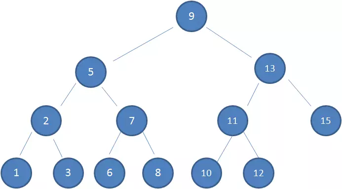
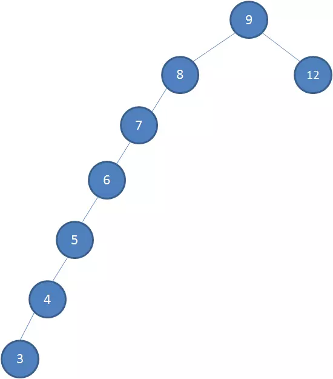
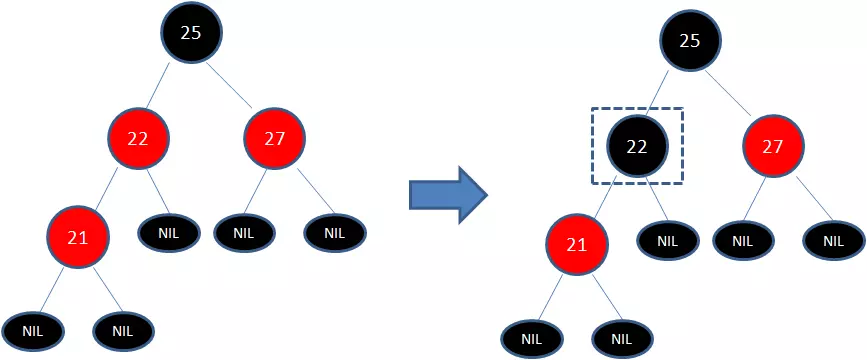
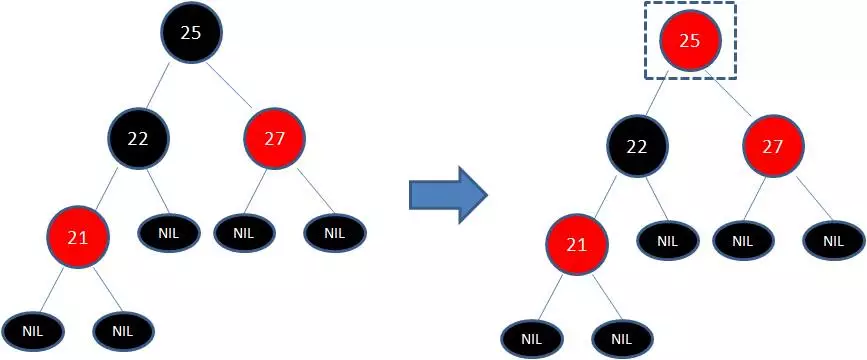
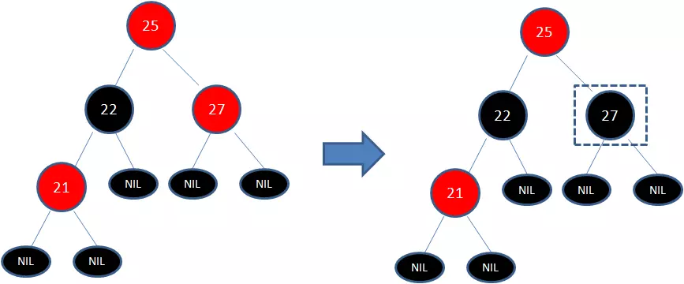
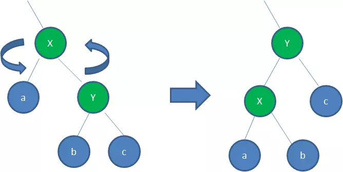
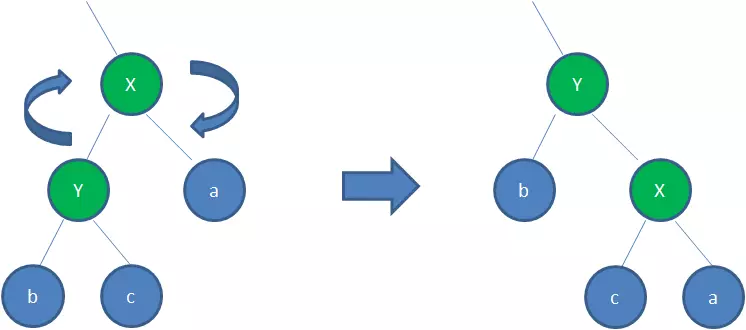

# 红黑树

要学习红黑树，首先来理解**二叉查找树**。

如图是一颗典型的二叉查找树。

我们可以看到这棵树的特点

1. **左子树**上所有结点的值均**小于或等于**它的根结点的值。
2. **右子树**上所有结点的值均**大于或等于**它的根结点的值。
3. 左、右子树也分别为二叉排序树

当我们查找一个数字为12的结点时，它最多需要3次。**查找所需的最大次数等同于树的高度**

然而，在一些极端情况下，这颗树会变成类似链表

虽然它也是一个二叉查找树，但是它的时间复杂度为O(n)。与遍历一样。

所以为了解决这一种插入新结点而导致的不平衡，红黑树应运而生。

## 红黑树特性

红黑树是一种自平衡的二叉查找树。它还有以下一些特性

1. 结点是红色或者黑色
2. 根节点是黑色
3. 每个叶子结点都是黑色的空结点(NIL结点)
4. 每个红色结点的两个子结点都是黑色。从叶子到根所在的路径上不能有连续的红色结点
5. 从任一节点到其每个叶子的所有路径都包含相同数目的黑色节点

每次新插入的时候都是红色结点。如果都是黑结点则无意义。

当我们插入结点时，红黑树的这些规则可能会被打破，这时候就需要做出一些调整来维持红黑树的特性。

这些调整有：

- 变色
- 左旋
- 右旋

###### 变色

举例，下图所表示的是红黑树的一部分，需要注意节点25并非根节点。

当插入结点21时。

因为节点21和节点22连续出现了红色，不符合规则4，所以把节点22从红色变成黑色

因为凭空多出的黑色节点打破了规则5，所以发生连锁反应，需要继续把节点25从黑色变成红色

此时结点25，27又是连续的红色，所以需要将27染成黑色。

**变颜色的情况：当前结点的父亲是红色，且它的祖父结点的另一个子结点也是红色(也就是叔叔结点)时变色。**

1. **把父结点设为黑色**，22变为黑色
2. **把叔叔结点也设为黑色** 27变为黑色
3. **把爷爷设为红色** 25变成红色
4. **改变要变换操作的结点**，上图中要操作的结点为25

###### 左旋

旋转红黑树的两个节点，使得父节点被自己的右孩子取代，而自己成为自己的左孩子。说起来很怪异，大家看下图

身为右孩子的Y取代了X的位置，而X变成了自己的左孩子

**需要左旋的情况：**

**当前父节点是红色，叔叔是黑色的时候，且当前结点是右子树，以父节点为中心做旋转**

###### 右旋

**顺时针**旋转红黑树的两个节点，使得父节点被自己的左孩子取代，而自己成为自己的右孩子。大家看下图

**右旋情况**

**当前父结点是红色，叔叔是黑色，且当前结点是左子树。右旋**

1. **把父节点变成黑色**
2. **爷爷结点变成红色**
3. **以祖父结点旋转**