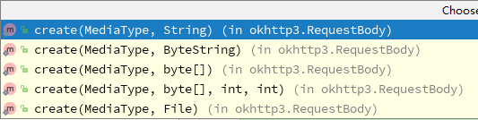

# okhttp基本用法

一个处理网络请求的开源项目,是安卓端最火热的轻量级框架,由移动支付Square公司贡献,用于替代HttpUrlConnection和HttpClient两种HTTP通信类。[github地址](https://github.com/square/okhttp)

###### 依赖

```
implementation("com.squareup.okhttp3:okhttp:3.13.1")
```

## 异步Get请求

```
Request.Builder builder = new Request.Builder().url("http://www.xxx.com").get();
Request request = builder.build();

OkHttpClient mOkHttpClient = new OkHttpClient();
Call mcall = mOkHttpClient.newCall(request);

mcall.enqueue(new Callback() {
     @Override
     public void onFailure(Call call, IOException e) {
                
     }

     @Override
     public void onResponse(Call call, Response response) throws IOException {
          String str = response.body().string();
     }
});
```

基本步骤，通过builder模式创建Request，接着创建OkhttpClient和Call对象。最后调用Call的异步方法。

注意:

- `response.body().string()`本质是输入流的读操作，所以它还是网络请求的一部分，所以这行代码必须放在子线程。而**onResponse**回调方法就是在子线程，非UI线程
- `response.body().string()`只能**调用一次**，在第一次时有返回值，第二次再调用时将会返回null。原因是：`response.body().string()`的本质是输入流的读操作，必须有服务器的输出流的写操作时客户端的读操作才能得到数据。而服务器的写操作只执行一次，所以客户端的读操作也只能执行一次，第二次将返回null

## 异步POST请求

创建 Post 请求的方式与 Get 方法类似，只是需要增加一个步骤，构造出一个请求参数对象RequestBody ，用于携带我们需要提交的数据。

```
 FormBody.Builder builder = new FormBody.Builder();
        builder.add("age", "18");
        FormBody formBody = builder.build();
        Request request = new Request.Builder()
                .url(url)
                .post(formBody)
                .build();
        client.newCall(request).enqueue(new Callback() {
            @Override
            public void onFailure(Call call, IOException e) {
            }
            @Override
            public void onResponse(Call call, Response response) throws IOException {
            }
        });
```

Request 的 post 方法所接收的参数是 RequestBody 对象，所以只要是 RequestBody 类及其子类都可以当做参数传入。

```
public Builder post(RequestBody body)
```

RequestBody 是一个抽象类，我们不能直接使用它，但是可以通过调用它的静态create方法来获取一个RequestBody对象，该方法会创建并返回一个 RequestBody 的匿名内部类实例。create有几个重载方法，最终都会调用



其中**MediaType**即互联网媒体类型；也叫做MIME类型，在Http协议消息头中，使用Content-Type来表示具体请求中的媒体类型信息。用于定义网络文件的类型和网页的编码，决定文件接收方将以什么形式、什么编码读取这个文件。常见的媒体格式类型有

- text/html——HTML格式
- text/pain——纯文本格式
- image/jpeg——jpg图片格式
- application/json——JSON数据格式
- application/octet-stream——二进制流数据（如常见的文件下载）
- application/x-www-form-urlencoded——<form encType="">中默认的encType，表单数据将以key/value的形式发送到服务端
- multipart/form-data——表单上传文件的格式


## 异步上传文件

上传文件本身也是POST请求，只需要创建一个RequestBody 的子类，包含文件的媒体类型以及文件路径

```
public static final MediaType MEDIA_TYPE_TEXT= MediaType.parse("text/pain;charset=utf-8");

Request request = new Request.Builder()
                .url(url)
                .post(RequestBody.create(MEDIA_TYPE_TEXT，file))
                .build();
 client.newCall(request).enqueue(new Callback(){...});
```

## 下载文件

onResponse回调的参数是response，一般情况下:

- 通过`response.body().string()`获取返回的字符串
- `response.body().bytes()`获得返回的二进制字节数组,可以转换为BItmap图片资源
- `response.body().byteStream() `返回的inputStream可以通过IO的方式写文件

```
mClient.newCall(request).enqueue(new Callback()){
     @Override
     public void onFailure(Call call, IOException e) {
     }
     @Override
     public void onResponse(Call call, Response response) throws IOException {
          InputSteam steam = response.body().byteSteam();
          FileOutputSteam fileOutSteam = null;
          
          File file = new File(filepath,"xxx.text");
          if(file!=null){
              fileOutSteam = new FileOutputSteam(file);
              byte[] buffer = new byte[2048];
              int len = 0;
              while((len = inputSteam.read(buffer))!=-1){
                  fileOutSteam.write(buffer,0,len);
              }
              fileOutSteam.flush();
          }
     }
}
```

## MultipartBody同时上传多种类型数据

```
        OkHttpClient client = new OkHttpClient();
        MultipartBody multipartBody = new MultipartBody.Builder()
                .setType(MultipartBody.FORM)
                .addFormDataPart("name", "zhangsan")
                .addFormDataPart("age", "20")
                .addFormDataPart("file", file.getName(),
                 RequestBody.create(MediaType.parse("application/octet-stream"), file))
                .build();
        
        Request request = new Request.Builder()
                .url(url)
                .post(multipartBody)
                .build();
                
        client.newCall(request).enqueue(new Callback() {
            @Override
            public void onFailure(Call call, IOException e) {
            }
            @Override
            public void onResponse(Call call, Response response) throws IOException {
            }
        });
```

通过`addFormDataPart`即上传键值对，又上传表单

## 超时和缓存

OkHttp可以设置连接，写入和读取的超时时间

```
 OkHttpClient.Builder builder = new OkHttpClient.Builder()
                .connectTimeout(5, TimeUnit.SECONDS)//设置超时时间
                .writeTimeOut(5,TimeUnit.SECONDS)
                .readTimeOut(5,TimeUnit.SECONDS)
                .retryOnConnectionFailure(true)
                .cache(new Cache(getExternalCacheDir().getAbsoluteFile(),cachesize));
```


