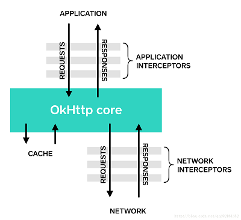

# 拦截器

OKHTTP的拦截器就是把所有的拦截器放在一个list，每次执行依次执行拦截器。

```
  Response getResponseWithInterceptorChain() throws IOException {
    // Build a full stack of interceptors.
    List<Interceptor> interceptors = new ArrayList<>();
    interceptors.addAll(client.interceptors());
    interceptors.add(retryAndFollowUpInterceptor);
    interceptors.add(new BridgeInterceptor(client.cookieJar()));
    interceptors.add(new CacheInterceptor(client.internalCache()));
    interceptors.add(new ConnectInterceptor(client));
    if (!forWebSocket) {
      interceptors.addAll(client.networkInterceptors());
    }
    interceptors.add(new CallServerInterceptor(forWebSocket));

    Interceptor.Chain chain = new RealInterceptorChain(interceptors, null, null, null, 0,
        originalRequest, this, eventListener, client.connectTimeoutMillis(),
        client.readTimeoutMillis(), client.writeTimeoutMillis());

    return chain.proceed(originalRequest);
  }
```

一共有7个拦截器。每个拦截器都是实现Interceptor接口。

基本的实现逻辑都是如下，我们可以自己设置应用拦截器和网络拦截器

```
    Interceptor appInterceptor = new Interceptor() {
        @Override
        public Response intercept(Chain chain) throws IOException {
            Request request = chain.request();
            HttpUrl url = request.url();
            String s = url.url().toString();
            
            //---------请求之前-----
            Log.d(TAG,"app interceptor:begin");
            Response  response = chain.proceed(request);
            Log.d(TAG,"app interceptor:end");
            
            
            //---------请求之后------------
            return response;
        }

    };
```




## Application interceptors应用程序拦截器

由开发者设置addInterceptor()，可以按照开发者的要求，添加一些公共参数

```
okHttpClientBuilder.addInterceptor(new Interceptor() {
    @Override
    public Response intercept(Chain chain) throws IOException {
        Request original = chain.request();
        Request.Builder requestBuilder = original.newBuilder()
                .header("platform", "platform")//平台
                .header("sysVersion", "sysVersion")//系统版本号
                .header("device", "device")//设备信息
                .header("screen", "screen")//屏幕大小
                .header("uuid", "uuid")//设备唯一码
                .header("version", "version")//app版本
                .header("apiVersion", "apiVersion")//api版本
                .header("token", "token")//令牌
                .header("channelId", "channelId")//渠道
                .header("networkType", "networkType");//网络类型
        Request request = requestBuilder.build();
        return chain.proceed(request);
    }
});
```


## retryAndFollowUpInterceptor

初始化streamAllocation。负责失败重试以及重定向。

```
public Response intercept(Chain chain) throws IOException {
    Request request = chain.request();
    RealInterceptorChain realChain = (RealInterceptorChain) chain;
    Call call = realChain.call();
    EventListener eventListener = realChain.eventListener();

    StreamAllocation streamAllocation = new StreamAllocation(client.connectionPool(),
        createAddress(request.url()), call, eventListener, callStackTrace);
    this.streamAllocation = streamAllocation;
    // 初始化StreamAllocation

    int followUpCount = 0;
    Response priorResponse = null;
    while (true) {  //死循环
      if (canceled) {  //退出标识
        streamAllocation.release(true);
        throw new IOException("Canceled");
      }

      Response response;
      boolean releaseConnection = true;
      try {
        response = realChain.proceed(request, streamAllocation, null, null);
        releaseConnection = false;
      } catch (RouteException e) {
         //发生路由异常，releaseConnection = false 不释放，重试
        if (!recover(e.getLastConnectException(), streamAllocation, false, request)) {
          throw e.getFirstConnectException();
        }
        releaseConnection = false;
        continue;
      } catch (IOException e) {
      
        // IO异常 也不释放，继续重试
        boolean requestSendStarted = !(e instanceof ConnectionShutdownException);
        if (!recover(e, streamAllocation, requestSendStarted, request)) throw e;
        releaseConnection = false;
        continue;
      } finally {
        // 如果为true 才释放streamAllocation
        if (releaseConnection) {
          streamAllocation.streamFailed(null);
          streamAllocation.release(true);
        }
      }

      // Attach the prior response if it exists. Such responses never have a body.
      if (priorResponse != null) {
        response = response.newBuilder()
            .priorResponse(priorResponse.newBuilder()
                    .body(null)
                    .build())
            .build();
      }

      Request followUp;
      try {
      
        //根据相应码 处理请求，返回request不为空进行重定向处理。
        followUp = followUpRequest(response, streamAllocation.route());
      } catch (IOException e) {
        streamAllocation.release(true);
        throw e;
      }

      if (followUp == null) {
        streamAllocation.release(true);
        return response;
      }

      closeQuietly(response.body());

      if (++followUpCount > MAX_FOLLOW_UPS) {
        streamAllocation.release(true);
        throw new ProtocolException("Too many follow-up requests: " + followUpCount);
      }

      if (followUp.body() instanceof UnrepeatableRequestBody) {
        streamAllocation.release(true);
        throw new HttpRetryException("Cannot retry streamed HTTP body", response.code());
      }

      if (!sameConnection(response, followUp.url())) {
        streamAllocation.release(false);
        streamAllocation = new StreamAllocation(client.connectionPool(),
            createAddress(followUp.url()), call, eventListener, callStackTrace);
        this.streamAllocation = streamAllocation;
      } else if (streamAllocation.codec() != null) {
        throw new IllegalStateException("Closing the body of " + response
            + " didn't close its backing stream. Bad interceptor?");
      }

      request = followUp;
      priorResponse = response;
    }
  }
```


## BridgeInterceptor 

```
/**
 * Bridges from application code to network code. First it builds a network request from a user
 * request. Then it proceeds to call the network. Finally it builds a user response from the network
 * response.
 */
```

主要将网络请求回来的响应转化为用户可用的响应。比如添加文件类型`Content-Type`等

## CacheInterceptor

根据用户设置的缓存策略，对请求值进行缓存


## ConnectInterceptor

负责建立连接，会建立TCP连接

```
public Response intercept(Chain chain) throws IOException {
    RealInterceptorChain realChain = (RealInterceptorChain) chain;
    Request request = realChain.request();
    StreamAllocation streamAllocation = realChain.streamAllocation();

    // We need the network to satisfy this request. Possibly for validating a conditional GET.
    boolean doExtensiveHealthChecks = !request.method().equals("GET");
    HttpCodec httpCodec = streamAllocation.newStream(client, chain, doExtensiveHealthChecks);
    RealConnection connection = streamAllocation.connection();

    return realChain.proceed(request, streamAllocation, httpCodec, connection);
  }
```


## 网络拦截器

可以添加日志

```
class LoggingInterceptor implements Interceptor {
        @Override
        public Response intercept(Interceptor.Chain chain) throws IOException {
            Request request1 = chain.request();

            long t1 = System.nanoTime();
            Log.d("tag",String.format("Sending request %s on %s%n%s",
                    request1.url(), chain.connection(), request1.headers()));

            Response response = chain.proceed(request1);

            long t2 = System.nanoTime();
            Log.d("tag",String.format("Received response for %s in %.1fms%n%s",
                    response.request().url(), (t2 - t1) / 1e6d, response.headers()));

            return response;
        }
    }

builder.addNetworkInterceptor(new LoggingInterceptor())
```


## CallServerInterceptor

使用HttpCodec 进行实际的网络读写IO操作。

