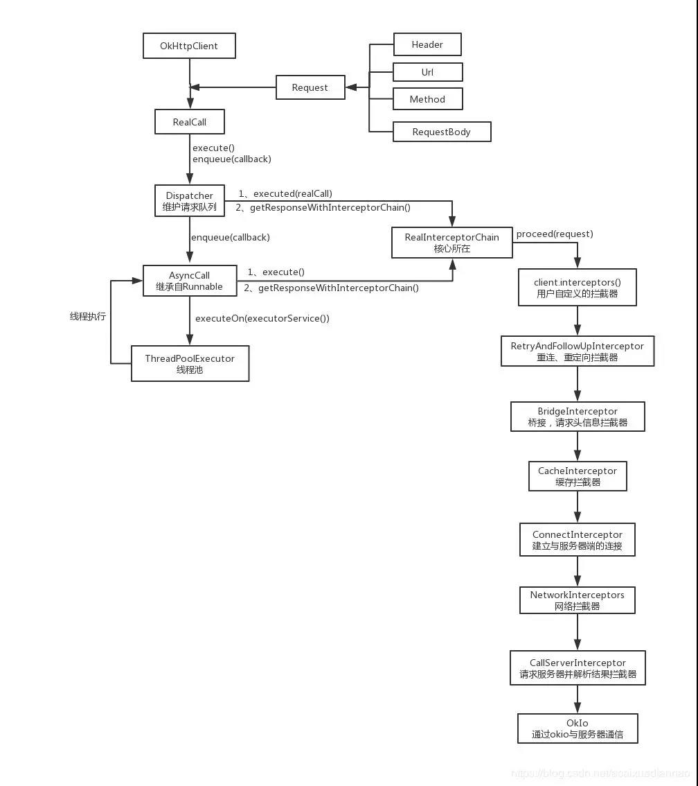
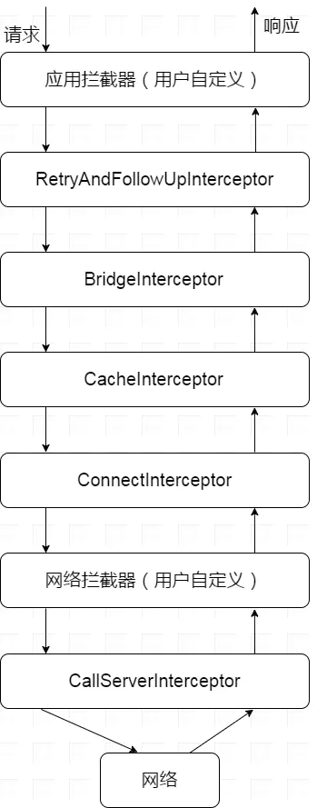

# 请求流程



使用OkHttp基本是四步

1. 创建OkHttpClient
2. 创建Request请求对象
3. 创建call对象
4. 同步调用execute(),异步调用enqueue

```
//1.
OkHttpClient mOkHttpClient = new OkHttpClient();
//2.
Request.Builder builder = new Request.Builder().url("http://www.xxx.com").get();
Request request = builder.build();
//3
Call mcall = mOkHttpClient.newCall(request);
//4
mcall.enqueue(new Callback() {
     @Override
     public void onFailure(Call call, IOException e) {
                
     }

     @Override
     public void onResponse(Call call, Response response) throws IOException {
          String str = response.body().string();
     }
});
```

**OkHttpClient**它是一个 `Call` 的工厂类，可以用它来生产 `Call`，从而通过 `Call` 来发起 HTTP Request 获取 Response。它的构建采用了 Builder 模式，提供了许多可供我们配置的参数

**Request**对应的就是我们 HTTP 请求中的 Request，可以对它的 url、method、header 等在 Builder 中进行配置


## Call

我们知道，当需要网络请求时需要调用OkHttpClient.newCall(request)

```
  @Override public Call newCall(Request request) {
    return RealCall.newRealCall(this, request, false /* for web socket */);
  }
```

然后RealCall.newRealCall的方法如下

```
static RealCall newRealCall(OkHttpClient client, Request originalRequest, boolean forWebSocket) {
    // Safely publish the Call instance to the EventListener.
    RealCall call = new RealCall(client, originalRequest, forWebSocket);
    call.transmitter = new Transmitter(client, call);
    return call;
}
```

实际是RealCall对象。

## 请求发起

OkHttp 的执行有两种方式，`enqueue` 及 `execute`，它们分别代表了异步请求与同步请求

###### 异步请求:

当调用enqueue方法时，是调用RealCall的enqueue方法

```
  @Override public void enqueue(Callback responseCallback) {
    synchronized (this) {
      if (executed) throw new IllegalStateException("Already Executed");
      executed = true;
    }
    captureCallStackTrace();
    eventListener.callStart(this);
    client.dispatcher().enqueue(new AsyncCall(responseCallback));
  }
```

可以看到最后调用了 `client.dispatcher().enqueue` 方法，构建了一个 `AsyncCall` 对象后交给了 `client.dispatcher` 进行任务的分派。AsyncCall是一个 NamedRunnable


## Dispatcher 任务调度

刚才说到异步是调用的dispatcher的enqueue(new AsyncCall(responseCallback))方法

```
 synchronized void enqueue(AsyncCall call) {
    if (runningAsyncCalls.size() < maxRequests && runningCallsForHost(call) < maxRequestsPerHost) {
      runningAsyncCalls.add(call);
      executorService().execute(call);
    } else {
      readyAsyncCalls.add(call);
    }
  }
```

最主要的是**readyAsyncCalls.add(call)**。readyAsyncCalls是什么呢？

```
  /** 将要运行的异步请求队列 */
  private final Deque<AsyncCall> readyAsyncCalls = new ArrayDeque<>();

  /** 正在运行的异步请求队列 */
  private final Deque<AsyncCall> runningAsyncCalls = new ArrayDeque<>();

  /** 正在运行的同步请求队列 */
  private final Deque<RealCall> runningSyncCalls = new ArrayDeque<>();
```

当正在运行的异步请求队列中的数量小于64，并且正在运行的请求主机数小于5时，把请求加载到runningAsyncCalls中并在线程池中执行，否则就加入到readyAsyncCall中进行缓存等待。

`executorService().execute`开始执行这个AsyncCall。而AsyncCall的execute方法就是它的run方法，实现如下

```
@Override protected void execute() {
      boolean signalledCallback = false;
      try {
        Response response = getResponseWithInterceptorChain();
        if (retryAndFollowUpInterceptor.isCanceled()) {
          signalledCallback = true;
          responseCallback.onFailure(RealCall.this, new IOException("Canceled"));
        } else {
          signalledCallback = true;
          responseCallback.onResponse(RealCall.this, response);
        }
      } catch (IOException e) {
        if (signalledCallback) {
          // Do not signal the callback twice!
          Platform.get().log(INFO, "Callback failure for " + toLoggableString(), e);
        } else {
          eventListener.callFailed(RealCall.this, e);
          responseCallback.onFailure(RealCall.this, e);
        }
      } finally {
        client.dispatcher().finished(this);
      }
    }
```

可以看到通过getResponseWithInterceptorChain()获得响应，最后调用finished方法。

## finish方法

无论是同步还是异步，最终都会调用finished方法

```
   /** Used by {@code AsyncCall#run} to signal completion. */
  void finished(AsyncCall call) {
    finished(runningAsyncCalls, call, true);
  }

  /** Used by {@code Call#execute} to signal completion. */
  void finished(RealCall call) {
    finished(runningSyncCalls, call, false);
  }
  
 private <T> void finished(Deque<T> calls, T call, boolean promoteCalls) {
    int runningCallsCount;
    Runnable idleCallback;
    synchronized (this) {
      if (!calls.remove(call)) throw new AssertionError("Call wasn't in-flight!");
      if (promoteCalls) promoteCalls();
      runningCallsCount = runningCallsCount();
      idleCallback = this.idleCallback;
    }

    if (runningCallsCount == 0 && idleCallback != null) {
      idleCallback.run();
    }
  }
```

会将call请求移除。如果是异步的话还会调用promoteCalls方法

```
private void promoteCalls() {
    if (runningAsyncCalls.size() >= maxRequests) return; // Already running max capacity.
    if (readyAsyncCalls.isEmpty()) return; // No ready calls to promote.

    for (Iterator<AsyncCall> i = readyAsyncCalls.iterator(); i.hasNext(); ) {
      AsyncCall call = i.next();

      if (runningCallsForHost(call) < maxRequestsPerHost) {
        i.remove();
        runningAsyncCalls.add(call);
        executorService().execute(call);
      }

      if (runningAsyncCalls.size() >= maxRequests) return; // Reached max capacity.
    }
  }
```

主要就是去除readyAsyncCalls取出下一个请求，加入runninigAsyncCalls中 然后交由线程池处理


## 拦截器

同步和异步最终都会调用`getResponseWithInterceptorChain`方法

```
  Response getResponseWithInterceptorChain() throws IOException {
    // Build a full stack of interceptors.
    List<Interceptor> interceptors = new ArrayList<>();
    interceptors.addAll(client.interceptors());//Application拦截器
    interceptors.add(retryAndFollowUpInterceptor);//重定向和失败后重新请求拦截器
    interceptors.add(new BridgeInterceptor(client.cookieJar()));//网桥拦截器，顾名思义client和Server之前的桥梁
    interceptors.add(new CacheInterceptor(client.internalCache()));//缓存处理拦截器
    interceptors.add(new ConnectInterceptor(client));//Socket层的握手链接
    if (!forWebSocket) {
      interceptors.addAll(client.networkInterceptors());//网络烂拦截器
    }
    interceptors.add(new CallServerInterceptor(forWebSocket));//client和Server之前的读写操作

    Interceptor.Chain chain = new RealInterceptorChain(interceptors, null, null, null, 0,
        originalRequest, this, eventListener, client.connectTimeoutMillis(),
        client.readTimeoutMillis(), client.writeTimeoutMillis());

    return chain.proceed(originalRequest);
  }
}
```

其基本的调用流程如下



