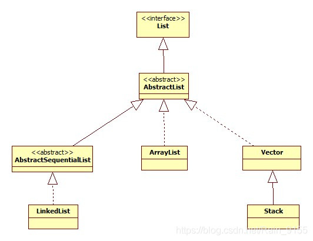
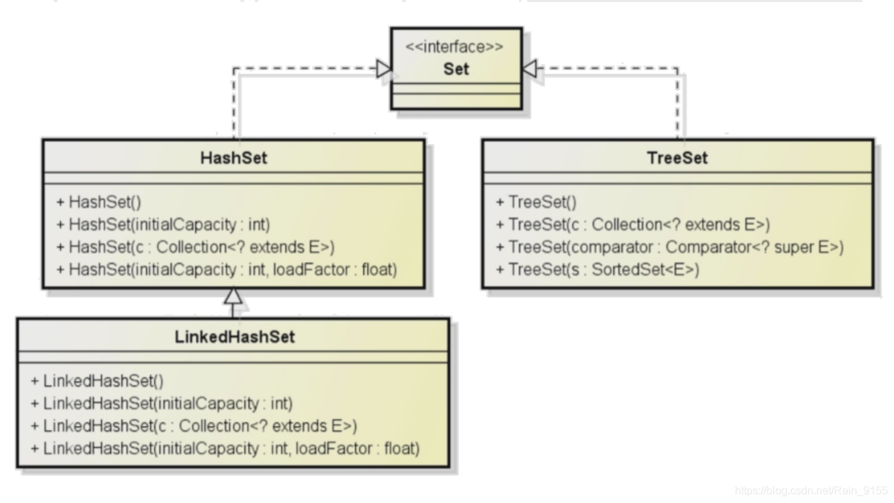

# Collection

## 分类

Set 接口继承 Collection，但不允许重复，使用自己内部的一个排列机制。

List 接口继承 Collection，允许重复，以元素安插的次序来放置元素，不会重新排列。 

Queue接口，队列，有阻塞队列与非阻塞队列的区别。

## List

- ArrayList
  非线程安全的，内部基于数组实现。
  扩容操作：默认空数组，第一次添加单条数据时，初始化大小为10的数组，一次扩容1.5倍。若用addAll 添加数据，超出1.5倍按实际大小扩容，不足按1.5倍扩。
  其中 插入扩容移除操作时，涉及到对数组的拷贝，较影响性能。
- LinkedList
  非线程安全的，内部基于双向链表实现。
  链式存储结构，将不连续的内存连续起来，方便允许插入和删除，只需要改变指针指向的位置。不允许随意存取。
- Vector
  方法前用synchronized关键字保证线程安全，内部基于数组实现。
  扩容操作：默认初始化一个大小为10，扩容容量为0的数组。
  若扩容容量小于等于0，一次扩容2倍，否则按扩容容量扩容。

## Set

- HashSet
  内部用HashMap实现，添加的元素作为key，value为固定的Object。
- LinkedHashSet
  继承自HashSet，内部用LinkedHashMap实现。保证有序访问。
- TreeSet
  内部用TreeMap实现，添加的元素作为key，value为固定的Object。可以保证元素是有序的

## Queue

- AbstractQueue

  - PriorityQueue 非阻塞队列
    根据比较器**排序**的优先级队列，内部用数组实现。

    扩容机制：默认初始化一个大小为11的数组，若队列大小小于64，一次扩容+2，否则1.5倍扩。
    入队时，保证队首数据是最小的，根据siftUp方法向上筛选。出队时，取出队首数据，根据siftDown方法向下筛选，选出新的队首数据。

  - ConcurrentLinkedQueue 非阻塞队列
    基于单链表实现，链表用volatile修饰。CAS机制保证线程安全。
    CAS: compare and swap 比较再交换。当预期值相同时，再修改为新值。原子操作。

- BlockingQueue 阻塞队列

  - ArrayBlockingQueue
    有界阻塞队列，内部用数组实现，必须指定数组大小。通过ReentrantLock实现线程安全访问，Condition实现等待阻塞机制。
  - LinkedBlockingQueue
    内部基于单链表实现，默认容量为Integer.MAX_VALUE。
  - PriorityBlockingQueue
    内部基于数组实现，有优先级的无界阻塞队列。内部实现与扩容机制跟PriorityQueue差不多。
  - SynchronousQueue
    内部只有一个元素的队列。
  - DelayQueue
    内部基于PriorityQueue实现，根据时间排序的队列。take取数据时，若未到出队时间，则阻塞。

- Deque

  定义双端队列接口 既能从头部添加又能从尾部添加，也可以从两端取。

  - LinkedList
    非线程安全的非阻塞式双端队列
  - LinkedBlockingDeque
    阻塞式双端队列

###### 方法add/offer

add 添加一个元素，offer添加一个元素，成功返回true

###### 方法poll/peek/remove

poll:移除并返问队列头部的元素

peek:返回队列头部的元素

remove:移除并返回队列头部的元素     如果队列为空，则抛出一个NoSuchElementException异常

# Map

## HashMap

HashMap和HashTable一样，底层都是基于hash的算法，都是数组加链表的数据结构，HashMap是非线程安全的，所以它效率高，它可以接收null键和值。而HashTable的是线程安全的

可以通过Collections.synchronizeMap()方法来让HashMap具有多线程能力

## LinkedHashMap

LinkedHashMap继承自HashMap，在此基础上，添加了**双向链表头结点header** 和 **标志位accessOrder** ，所以LinkedHashMap就是**HashMap + 双向链表**，它拥有HashMap的所有特性，同时额外维护了一个双向链表用于保持迭代顺序，HashMap中有一个init方法，会在构造函数执行完后调用，LinkedHashMap重写了该方法，完成了双向链表头结点的初始化

## ConcurrentHashMap

在**并发环境**下，HashMap是非线程安全的，这时可以用**ConcurrentHashMap**来替代HashTable，ConcurrentHashMap是HashMap在并发环境下的一个实现，它不像HashTable在读写数据时直接锁住整个数组，它采用**分段锁**，在读写数据时**只锁住你要读写的那一部分数据**，所以ConcurrentHashMap可以**支持多个线程**执行并发写操作及任意数量线程的读操作，所以并发效率远远**超过**HashTable