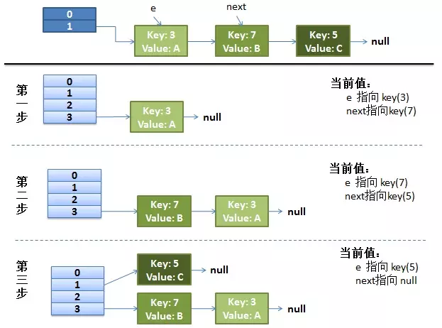

# HashMap

> 哈希冲突
>
> **如果两个不同的元素，通过哈希函数得出的实际存储地址相同怎么办**？也就是说，当我们对某个元素进行哈希运算，得到一个存储地址，然后要进行插入的时候，发现已经被其他元素占用了，其实这就是所谓的**哈希冲突**，也叫**哈希碰撞**。前面我们提到过，哈希函数的设计至关重要，好的哈希函数会尽可能地保证 计算简单和散列地址分布均匀,但是，我们需要清楚的是，数组是一块连续的固定长度的内存空间，再好的哈希函数也不能保证得到的存储地址绝对不发生冲突。那么哈希冲突如何解决呢？哈希冲突的解决方案有多种:开放定址法（发生冲突，继续寻找下一块未被占用的存储地址），再散列函数法，链地址法，而HashMap即是采用了**链地址法**，也就是**数组+链表**的方式。


HashMap的主干是一个Entry数组。Entry是HashMap的基本组成单元，每个Entry包含一个key-value键值对

```
//HashMap的主干数组，可以看到就是一个Entry数组，初始值为空数组{}，主干数组的长度一定是2的次幂。
//至于为什么这么做，后面会有详细分析。
transient Entry<K,V>[] table = (Entry<K,V>[]) EMPTY_TABLE;
```

Entry是HashMap中的一个静态内部类。代码如下

```
    static class Entry<K,V> implements Map.Entry<K,V> {
        final K key;
        V value;
        Entry<K,V> next;//存储指向下一个Entry的引用，单链表结构
        int hash;//对key的hashcode值进行hash运算后得到的值，存储在Entry，避免重复计算

        /**
         * Creates new entry.
         */
        Entry(int h, K k, V v, Entry<K,V> n) {
            value = v;
            next = n;
            key = k;
            hash = h;
        } 
```

HashMap的结构是数组加链表


数组是HashMap的主体，链表则是主要为了解决**哈希冲突**而存在的，如果定位到的数组位置不含链表（当前entry的next指向null）,那么查找，添加等操作很快，仅需一次寻址即可；如果定位到的数组包含链表，对于添加操作，其时间复杂度为O(n)，首先遍历链表，存在即覆盖，否则新增；对于查找操作来讲，仍需遍历链表，然后通过key对象的equals方法逐一比对查找。所以，性能考虑，**HashMap中的链表出现越少，性能才会越好**


## 构造函数

HashMap有4个构造器，其中最重要的是

```
public HashMap(int initialCapacity, float loadFactor) {
　　　　　//此处对传入的初始容量进行校验，最大不能超过MAXIMUM_CAPACITY = 1<<30(230)
        if (initialCapacity < 0)
            throw new IllegalArgumentException("Illegal initial capacity: " +
                                               initialCapacity);
        if (initialCapacity > MAXIMUM_CAPACITY)
            initialCapacity = MAXIMUM_CAPACITY;
        if (loadFactor <= 0 || Float.isNaN(loadFactor))
            throw new IllegalArgumentException("Illegal load factor: " +
                                               loadFactor);

        this.loadFactor = loadFactor;
        threshold = initialCapacity;
　　　　　
        init();//init方法在HashMap中没有实际实现，不过在其子类如 linkedHashMap中就会有对应实现
    }
```

其中`initialCapacity`为初始桶的容量；

`loadFactor`为**负载因子**。如果初始桶为16，等到满16个元素才扩容，某些桶里可能就有不止一个元素了。默认加载因子为0.75，也就是说大小为16的HashMap，到了第13个元素，就会扩容成32

在常规构造器中，没有为数组table分配内存空间，**而是在执行put操作的时候才真正构建table数组**

## put方法

```
final V putVal(int hash, K key, V value, boolean onlyIfAbsent,
               boolean evict) {
    Node<K,V>[] tab; Node<K,V> p; int n, i;
    if ((tab = table) == null || (n = tab.length) == 0)
        // 如果table数组还没初始化，就调用resize方法初始化数组
        n = (tab = resize()).length;
    // 根据key计算出来的哈希值进行取模运算，得到要插入的元素的索引，后面会详细讲解
    if ((p = tab[i = (n - 1) & hash]) == null)
        // 如果该索引所在的元素数据是空，就创建一个节点，并且把数据传进去
        tab[i] = newNode(hash, key, value, null);
    else {
        // 如果该索引所在的元素数据不是空的，也就是发生了哈希碰撞，就执行以下逻辑
        Node<K,V> e; K k;
        if (p.hash == hash &&
            ((k = p.key) == key || (key != null && key.equals(k))))
            // 如果该索引的元素的key和要插入的元素的key是相同的，就赋值给e
            e = p;
        else if (p instanceof TreeNode)
            // 如果该索引的元素的数据结构是树，就调用putTreeVal方法，使用红黑树插入数据，并且赋值给e
            e = ((TreeNode<K,V>)p).putTreeVal(this, tab, hash, key, value);
        else {
            // 如果该索引的元素的数据结构是链表，就执行以下逻辑
            // 执行循环
            for (int binCount = 0; ; ++binCount) {
                if ((e = p.next) == null) {
                    // 如果链表中不存在要插入的元素，就创建一个节点，并且插入到链表
                    p.next = newNode(hash, key, value, null);
                    if (binCount >= TREEIFY_THRESHOLD - 1)
                        // 如果binCount大于等于TREEIFY_THRESHOLD减1，也就是binCount大于等于7，链表的长度大于等于8，就把链表转化为红黑树
                        treeifyBin(tab, hash);
                    break;
                }
                if (e.hash == hash &&
                    ((k = e.key) == key || (key != null && key.equals(k))))
                    // 如果链表中存在要插入的元素，就跳出循环
                    break;
                // 把e赋值给p，继续执行循环
                p = e;
            }
        }
        if (e != null) {
            // 如果这时候的e不为空，说明要插入的元素已经存在该HashMap，就执行以下逻辑
            V oldValue = e.value;
            if (!onlyIfAbsent || oldValue == null)
                // 如果值是空，就把值赋值给那个元素
                e.value = value;
            afterNodeAccess(e);
            // 返回旧值
            return oldValue;
        }
    }
    // modCount的值加1
    ++modCount;
    // size的值加1
    if (++size > threshold)
        // 如果这时候的size大于HashMap所能容量的最大数据量的节点个数，就调用resize方法，进行扩容
        resize();
    afterNodeInsertion(evict);
    return null;
}
```

###### put的基本流程概述

首先，如果table数组没有初始化，就调用resize初始化数组。

然后获取key的hash值，进行取模获取在数组中的位置下表。

接着，数组中该位置是否有元素，没有元素创建节点。

如果有元素的话

1. 如果该索引的元素的key和要插入的元素的key是相同的，就赋值给e
2. 如果该索引的元素的数据结构是树，就调用putTreeVal方法，使用红黑树插入数据，并且赋值给e
3. 如果该索引的元素的数据结构是链表，插入。最后，链表的长度大于等于8，就把链表转化为红黑树

判断下该元素的值是否为空，如果是空，就把值赋值给它，并且返回旧值

判断数组的大小是否大于HashMap所能容纳的最大数据量的节点个数，如果是，就扩容，然后返回空

------


inflateTable这个方法用于为主干数组table在内存中分配存储空间

```
private void inflateTable(int toSize) {
        int capacity = roundUpToPowerOf2(toSize);//capacity一定是2的次幂
        /**此处为threshold赋值，取capacity*loadFactor和MAXIMUM_CAPACITY+1的最小值，
        capaticy一定不会超过MAXIMUM_CAPACITY，除非loadFactor大于1 */
        threshold = (int) Math.min(capacity * loadFactor, MAXIMUM_CAPACITY + 1);
        table = new Entry[capacity];
        initHashSeedAsNeeded(capacity);
    }
```

该方法`roundUpToPowerOf2`可以确保capacity为大于或等于toSize的最接近toSize的二次幂

比如toSize=13,则capacity=16;to_size=16,capacity=16;to_size=17,capacity=32.

接着会调用hash函数，再进一步调用`indexFor`获取实际的存储位置

```
    static int indexFor(int h, int length) {
        return h & (length-1);//这个方法实际就是取余
    }
```

比如h=18，则h=10010，length=16，length-1=01111。则h&(length-1) = 2


再来看看addEntry的实现

```
void addEntry(int hash, K key, V value, int bucketIndex) {
    if ((size >= threshold) && (null != table[bucketIndex])) {
         resize(2 * table.length);//当size超过临界阈值threshold，并且即将发生哈希冲突时进行扩容
         hash = (null != key) ? hash(key) : 0;
         bucketIndex = indexFor(hash, table.length);
    }

    createEntry(hash, key, value, bucketIndex);
}
```

## 扩容

**当发生哈希冲突并且size大于阈值的时候，需要进行数组扩容，扩容时，需要新建一个长度为之前数组2倍的新的数组，然后将当前的Entry数组中的元素全部传输过去，扩容后的新数组长度为之前的2倍，所以扩容相对来说是个耗资源的操作**

`resize`方法

```
void resize(int newCapacity) {
        Entry[] oldTable = table;
        int oldCapacity = oldTable.length;
        if (oldCapacity == MAXIMUM_CAPACITY) {
            threshold = Integer.MAX_VALUE;
            return;
        }

        Entry[] newTable = new Entry[newCapacity];
        transfer(newTable, initHashSeedAsNeeded(newCapacity));
        table = newTable;
        threshold = (int)Math.min(newCapacity * loadFactor, MAXIMUM_CAPACITY + 1);
    }
```

如果数组进行扩容，数组长度发生变化，而存储位置 index = h&(length-1),index也可能会发生变化，需要重新计算index，我们先来看看transfer这个方法

```
void transfer(Entry[] newTable, boolean rehash) {
     int newCapacity = newTable.length;
　　//for循环中的代码，逐个遍历链表，重新计算索引位置，将老数组数据复制到新数组中去（数组不存储实际数据，所以仅仅是拷贝引用而已）
     for (Entry<K,V> e : table) {
         while(null != e) {
            Entry<K,V> next = e.next;
            if (rehash) {
                e.hash = null == e.key ? 0 : hash(e.key);
            }
            int i = indexFor(e.hash, newCapacity);
            //将当前entry的next链指向新的索引位置,newTable[i]有可能为空，有可能也是个entry链，如果是entry链，直接在链表头部插入。
            e.next = newTable[i];
            newTable[i] = e;
            e = next;
         }
     }
 }
```


## get方法

```
 public V get(Object key) {
　　　　 //如果key为null,则直接去table[0]处去检索即可。
        if (key == null)
            return getForNullKey();
        Entry<K,V> entry = getEntry(key);
        return null == entry ? null : entry.getValue();
 }
```

get方法通过key值返回对应value，如果key为null，直接去table[0]处检索。我们再看一下getEntry这个方法

```
final Entry<K,V> getEntry(Object key) {
            
        if (size == 0) {
            return null;
        }
        //通过key的hashcode值计算hash值
        int hash = (key == null) ? 0 : hash(key);
        //indexFor (hash&length-1) 获取最终数组索引，然后遍历链表，通过equals方法比对找出对应记录
        for (Entry<K,V> e = table[indexFor(hash, table.length)];
             e != null;
             e = e.next) {
            Object k;
            if (e.hash == hash && 
                ((k = e.key) == key || (key != null && key.equals(k))))
                return e;
        }
        return null;
    }    
```

get方法的实现相对简单，key(hashcode)–>hash–>indexFor–>最终索引位置，找到对应位置table[i]，再查看是否有链表，遍历链表，通过key的equals方法比对查找对应的记录。

## HashMap 线程不安全

在java7中在多线程环境下，扩容时会造成环形链

```
    for (Entry<K,V> e : table) {
         while(null != e) {
            Entry<K,V> next = e.next;                                //S1
            if (rehash) {
                e.hash = null == e.key ? 0 : hash(e.key);
            }
            int i = indexFor(e.hash, newCapacity);
            e.next = newTable[i];                                    //S2
            newTable[i] = e;                                         //S3
            e = next;                                                //S4
         }
     }
```

### 正常扩容过程




新链表扩容后，table[3] 位置存放的是k7,k3，与原先的是链表顺序是相反的


### 多线程下

假设有两个线程,其中一个线程挂起

```
    Entry<K,V> next = e.next; //  假设线程一执行到这里就被调度挂起了
    int i = indexFor(e.hash, newCapacity);
    e.next = newTable[i];
    newTable[i] = e;
    e = next;
```

此时 e指向k3，next指向k7

另一个线程 完美执行完

newTable[3]处 存放着k7,k3的链表


此时挂起的线程唤醒，开始实现自己的扩容步骤。

虽然e指向k3，next指向k7。因为内存不可见的关系

他们的k3的next变成了null，k7的next变成了k3


#### 第一遍循环

e.next = newTable[i] 即 k3.next = null

newTable[i]处存放k3

e重新指向next，也就是e指向k7

第一遍执行结果 newTable[i]处存放k3

#### 第二遍循环

next 指向了k7的next，可就是k3

e.next = newTable[i]  也就是k7的next变成了k3

newTable[i] 存放k7

e重新指向next，也就是k3

第一遍执行结果 newTable[i]处存放k7 ->k3

#### 第三遍循环

此时k3的next = null，所以next指针为null

e.next = newTable[i] 坏就坏在这一步，原来e.next=null，现在k3的next指向了k7，

而k7的next又指向k3形成了闭环

newTable[i] 存放k3


### 改进

在JDK 8 用 head 和 tail 来保证链表的顺序和之前一样


## 遍历

```
       HashMap<Integer,Integer> map = new HashMap<>();

        Iterator<Map.Entry<Integer,Integer>> it = map.entrySet().iterator();
        
        while(it.hasNext()) {
            Map.Entry<Integer,Integer> entry = it.next();
            
            System.out.println("key = "+entry.getKey()+" value=" + entry.getValue());
        }
```

或者

```
        for (Map.Entry<Integer,Integer> entry: map.entrySet()) {
            System.out.println("key = "+entry.getKey()+" value=" + entry.getValue());
        }
```

