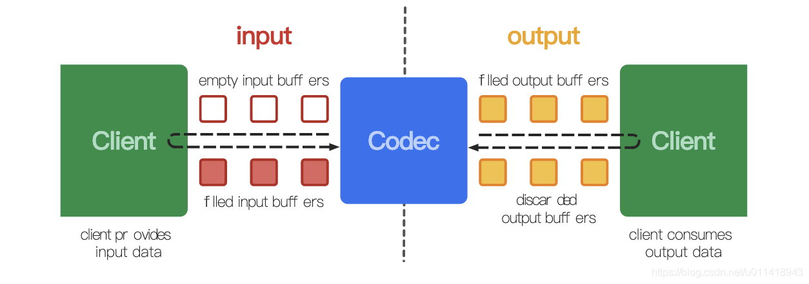
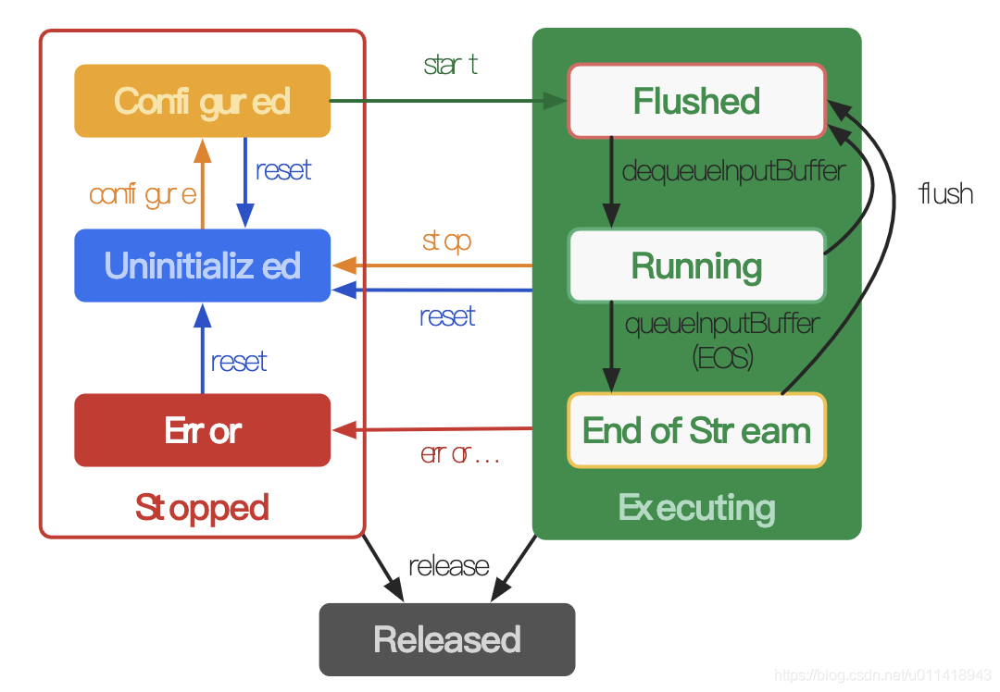

# MediaCodec

MediaCodec 是 从API 16 后引入的处理音视频编解码的类，它可以直接访问 Android 底层的多媒体编解码器，通常与MediaExtractor, MediaSync, MediaMuxer, MediaCrypto, MediaDrm, Image, Surface, 以及AudioTrack一起使用；

## 数据交换




可以看到，MediaCodec 的数据分为两个部分，从数据的输入到编解码后的数据的输出：

- **input** ： MediaCodec 会通过getInputBuffer(int bufferId) 去拿到一个空的 ByteBuffer , 用来给客户端去填入数据(比如解码，编码的数据)，MediaCodec 会用这些数据进行解码/编码处理
- **output** ： MediaCodec 会把解码/编码的数据填充到一个空的 buffer 中，然后把这个填满数据的buffer给到客户端，之后需要释放这个 buffer，MediaCodec 才能继续填充数据。

MediaCodec 内部使用异步的方式对 input 和 output 进行数据处理，MediaCodec 会把 input 的数据处理好给到 output，共用户去渲染；注意！output 的数据必须释放，不然会影响下一次的数据填充。


## 数据格式

它的生命周期可以分为三个：**Stopped，Executing 和 Released**

而 Stopped 和 Executing 都有各自的生命周期：

* Stopped：Error、Uninitialized 和 Configured

  当调用 MediaCodec 时，此时会处于 Uninitialized 状态，当调用 configure 之后，就会处于 Configured 状态；然后调用 start() 进入 Executing 状态，接着就可以处理数据了。

* Executing：Flushed、Running 和 End of Stream

  当调用 start() 就会进入 Executing 下的 Flushed 状态，此时会拿到所有的 buffers，当第一帧数据从 dequeueInoutBuffer 队列流出时，就会进入 Running 状态，大部分时间都在这个状态处理数据，**当队列中有 end-of-stream 标志时，就会进入 End of Stream 状态，此时不再接收 input buffer，但是会继续生成 output buffer，直到 output 也接收到 end-of-stream 标志**。你可以使用 flush() 重新回到 Flushed 状态。

  

可以使用 stop() 方法回到 Uninitialized 状态；当不再使用 MediaCodec ，还需要使用 release() 去释放该资源。


## MediaCodec 的主要 API 如下：

- getInputBuffers：获取需要编码数据的输入流队列，返回的是一个ByteBuffer数组 ，已弃用
- queueInputBuffer：输入流入队列
- dequeueInputBuffer：从输入流队列中取数据进行编码操作
- getOutputBuffers：获取编解码之后的数据输出流队列，返回的是一个ByteBuffer数组 ，已弃用
- dequeueOutputBuffer：从输出队列中取出编码操作之后的数据
- releaseOutputBuffer：处理完成，释放ByteBuffer数据


### 同步

官网上，同步的编码步骤基本逻辑如下

```
MediaCodec codec = MediaCodec.createByCodecName(name);
 codec.configure(format, …);
 MediaFormat outputFormat = codec.getOutputFormat(); // option B
 codec.start();
 for (;;) {
  int inputBufferId = codec.dequeueInputBuffer(timeoutUs);
  if (inputBufferId >= 0) {
    ByteBuffer inputBuffer = codec.getInputBuffer(…);
    // fill inputBuffer with valid data
    …
    codec.queueInputBuffer(inputBufferId, …);
  }
  
  int outputBufferId = codec.dequeueOutputBuffer(…);
  if (outputBufferId >= 0) {
    ByteBuffer outputBuffer = codec.getOutputBuffer(outputBufferId);
    MediaFormat bufferFormat = codec.getOutputFormat(outputBufferId); // option A
    // bufferFormat is identical to outputFormat
    // outputBuffer is ready to be processed or rendered.
    …
    codec.releaseOutputBuffer(outputBufferId, …);
  } else if (outputBufferId == MediaCodec.INFO_OUTPUT_FORMAT_CHANGED) {
    // Subsequent data will conform to new format.
    // Can ignore if using getOutputFormat(outputBufferId)
    outputFormat = codec.getOutputFormat(); // option B
  }
 }
 
 codec.stop();
 codec.release();
```

